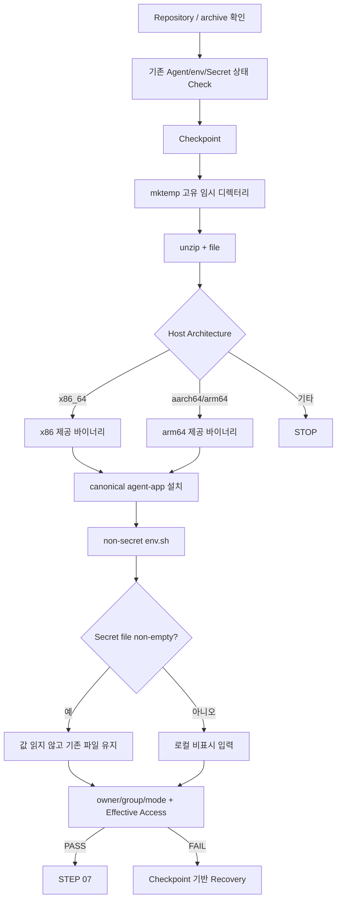

# B1-1 모듈 04 — STEP 06 에이전트(Agent) 준비

> [← 모듈 04 목차](README.md) · [다음: STEP 07 →](02-agent-runtime.md) · [전체 입문자 가이드](../../BEGINNER-GUIDE.md)

<a id="step-06"></a>
## STEP 06 — 제공 Agent archive·환경변수·Secret 준비

## ① 왜 하는가

공식 B1-1은 제공 Agent를 **일반 계정으로 실제 실행**하고, 지정된 환경변수·키 파일·로그 경로를 만족한 뒤 Boot Sequence 5단계를 통과해야 합니다. 이때 CPU 아키텍처와 맞지 않는 실행 파일을 설치하면 `Exec format error`처럼 실행 자체가 불가능하고, 환경변수나 Secret 파일의 경로·권한이 틀리면 다음 STEP의 Boot 검증이 실패합니다.

따라서 이 STEP은 단순히 ZIP을 풀고 파일을 복사하는 단계가 아니라 **현재 상태 확인 → 체크포인트(Checkpoint) → 아키텍처 확인 → 제공 파일 검사 → 실행 파일 설치 → 비밀값이 없는 환경파일 구성 → Secret을 로컬에서만 준비 → 값 노출 없는 권한·접근 검증 → 필요 시 최소 복구(Recovery)** 순서로 진행합니다.

> Secret의 실제 값은 이 가이드, 채팅, GitHub, Evidence에 적지 않습니다. 이 STEP에서는 **경로·존재 여부·비어 있지 않은지·소유권·권한·실제 접근 가능 여부만** 확인합니다. Secret 값이 공식 요구와 일치하는지는 값을 출력해서 비교하지 않고 STEP 07의 제공 Agent Boot 동작으로 확인합니다.

## ② 무엇을 하는가

1. B1-1 Repository root와 `agent-app.zip` 존재 여부, 현재 CPU 아키텍처를 확인합니다.
2. 기존 `/opt/agent-app/bin/agent-app`, `env.sh`, `t_secret.key`가 있으면 출처와 상태를 먼저 확인하고 체크포인트를 남깁니다.
3. 고정 `/tmp` 폴더를 지우는 대신 `mktemp -d`로 이번 실행만의 고유 임시 디렉터리를 만듭니다.
4. `unzip -l`, `file`로 제공 archive 내부 실행 파일과 CPU 형식을 확인합니다.
5. `x86_64` 또는 `aarch64/arm64`에 맞는 제공 바이너리만 선택해 R01 기준 이름 `/opt/agent-app/bin/agent-app`으로 설치합니다.
6. 공식 환경변수를 담은 비밀값 없는 `env.sh`를 만들고 `agent-admin:agent-core`, `0640`으로 관리합니다.
7. R01의 `AGENT_PROCESS_NAME=agent-app`은 이후 `monitor.sh`의 정확한 프로세스 식별을 돕기 위한 내부 운영값이며, 공식 Mission의 필수 환경변수를 대체하지 않습니다.
8. 기존 Secret 파일이 비어 있지 않으면 **내용을 읽거나 덮어쓰지 않고 유지**합니다. 파일이 없거나 비어 있을 때만 공식 Mission 원본을 보며 로컬 터미널에서 비표시 입력으로 준비합니다.
9. Secret 파일은 `agent-admin:agent-core`, `0660`으로 맞추고 admin/dev는 읽기·쓰기가 가능, test는 읽기·쓰기가 불가인지 확인합니다.
10. 실패하면 기존 바이너리·env.sh 백업과 Secret의 기존 존재 여부를 기준으로 최소 복구합니다.

## ③ 이번 단계에서 알아야 할 용어

- **아카이브(Archive)** — 여러 파일을 하나의 묶음으로 보관한 파일입니다. 이번 미션의 제공 파일은 ZIP 형식입니다.
- **ELF(Executable and Linkable Format)** — Linux에서 사용하는 대표적인 실행 파일 형식입니다.
- **CPU 아키텍처(CPU Architecture)** — `x86_64`, `aarch64`처럼 CPU 명령어 계열을 구분하는 값입니다.
- **실행 파일(Binary / Executable)** — CPU가 실행할 수 있도록 빌드된 프로그램 파일입니다.
- **기준 파일명(Canonical Name)** — 이후 명령과 검증이 같은 대상을 가리키도록 R01에서 고정해 사용하는 이름입니다. 여기서는 `agent-app`입니다.
- **환경변수(Environment Variable)** — 프로그램 외부에서 실행 경로·포트 같은 설정을 전달하는 이름/값 쌍입니다.
- **비밀정보(Secret)** — 공개 저장소·채팅·로그·Evidence에 노출하면 안 되는 민감 값입니다.
- **xtrace** — Bash의 `set -x`로 켜지는 명령 추적 기능입니다. Secret을 다루는 구간에서는 꺼져 있어야 합니다.
- **파일 모드(File Mode)** — owner/group/others가 파일을 읽고 쓰고 실행할 수 있는 권한 비트입니다.
- **체크포인트(Checkpoint)** — 변경 전 상태와 복구용 경로를 기록하는 지점입니다.
- **유효 접근(Effective Access)** — mode/ACL 모양이 아니라 실제 사용자 신분으로 최종 접근 가능한 상태입니다.

## ④ 필요한 핵심 개념



핵심 분리는 다음과 같습니다.

```text
환경 설정(env.sh)
→ 경로·포트 등 비밀값이 아닌 실행 설정
→ Git에 실제 Runtime 파일을 올리지 않고 로컬 시스템에서 관리

Secret 파일(t_secret.key)
→ 실제 민감 값
→ 값 출력·채팅 전송·Evidence 저장 금지
→ 존재/크기/소유권/권한/접근 동작만 검증
```

또한 다음 둘은 다른 검증입니다.

```text
file agent-app
→ 현재 CPU와 호환되는 형식인지 정적 확인

STEP 07 Agent Boot
→ 실제로 실행되고 Boot 조건을 통과하는지 동적 확인
```

## ⑤ 실행할 명령어 또는 코드

### 📍 실행 위치(Context)

```text
Host       : OrbStack Ubuntu 24.04 또는 WSL2 Ubuntu 24.04
Terminal   : Ubuntu Bash
Repository : $HOME/codyssey/codyssey-basic-system-monitor
권한       : 일반 사용자 + 필요한 줄에서만 sudo
venv       : 해당 없음
```

### A. Repository·archive·필수 경로 확인 — 읽기 전용

```bash
pwd
git branch --show-current
git status --short
test -f agent-app.zip && echo '[PASS] agent-app.zip exists' || echo '[STOP] agent-app.zip missing'
uname -m
command -v unzip
command -v file
sudo test -d /opt/agent-app/bin && echo '[PASS] bin directory exists' || echo '[STOP] bin directory missing'
sudo test -d /opt/agent-app/api_keys && echo '[PASS] api_keys directory exists' || echo '[STOP] api_keys directory missing'
```

`agent-app.zip`이 없거나 STEP 05에서 준비한 `bin`, `api_keys` 디렉터리가 없으면 archive 설치를 진행하지 않습니다.

### B. 기존 Agent/env/Secret 상태 체크포인트

```bash
export AGENT_HOME=/opt/agent-app
AGENT_BIN="$AGENT_HOME/bin/agent-app"
ENV_FILE="$AGENT_HOME/env.sh"
KEY_FILE="$AGENT_HOME/api_keys/t_secret.key"
STAMP="$(date +%Y%m%d%H%M%S)"
AGENT_META_BEFORE="/tmp/b1-1-agent-before.${STAMP}.txt"
AGENT_CHECKPOINT="/tmp/b1-1-agent-checkpoint.${STAMP}.txt"
BIN_BAK="${AGENT_BIN}.b1-1-r01.${STAMP}.bak"
ENV_BAK="${ENV_FILE}.b1-1-r01.${STAMP}.bak"

BIN_EXISTED=no
ENV_EXISTED=no
KEY_EXISTED=no

{
    for f in "$AGENT_BIN" "$ENV_FILE" "$KEY_FILE"; do
        echo "===== PATH: $f ====="
        if sudo test -e "$f"; then
            sudo stat -c '%U %G %a %s %n' "$f"
        else
            echo '[MISSING]'
        fi
    done
} | tee "$AGENT_META_BEFORE" >/dev/null

if sudo test -e "$AGENT_BIN"; then
    BIN_EXISTED=yes
    sudo cp -a "$AGENT_BIN" "$BIN_BAK"
fi

if sudo test -e "$ENV_FILE"; then
    ENV_EXISTED=yes
    sudo cp -a "$ENV_FILE" "$ENV_BAK"
fi

if sudo test -e "$KEY_FILE"; then
    KEY_EXISTED=yes
fi

printf 'STAMP=%s\nBIN_EXISTED=%s\nENV_EXISTED=%s\nKEY_EXISTED=%s\nAGENT_META_BEFORE=%s\nBIN_BAK=%s\nENV_BAK=%s\n' \
  "$STAMP" "$BIN_EXISTED" "$ENV_EXISTED" "$KEY_EXISTED" \
  "$AGENT_META_BEFORE" "$BIN_BAK" "$ENV_BAK" \
  > "$AGENT_CHECKPOINT"

printf '[CHECKPOINT] %s\n' "$AGENT_CHECKPOINT"
```

> 이 체크포인트는 Secret **내용을 읽지 않습니다.** 기존 Secret은 별도 복사본을 만들지 않고 존재 여부와 `stat` 메타데이터만 기록합니다. 기존 `agent-app`이나 `env.sh`가 다른 서비스에서 온 파일처럼 출처가 불분명하면 덮어쓰기 전에 STOP합니다.

### C. 고유 임시 디렉터리에서 archive 검사

```bash
AGENT_INSPECT_DIR="$(mktemp -d /tmp/b1-1-agent-inspect.XXXXXX)"
printf '[INFO] inspect dir: %s\n' "$AGENT_INSPECT_DIR"

unzip -l agent-app.zip
unzip -q agent-app.zip -d "$AGENT_INSPECT_DIR"
find "$AGENT_INSPECT_DIR" -maxdepth 3 -type f -exec file -- {} \;
```

고정 `/tmp/b1-1-agent-inspect`를 먼저 `rm -rf`하는 방식 대신 `mktemp -d`를 사용하므로 다른 실행의 임시 파일을 실수로 지우는 위험을 줄입니다.

### D. Host CPU에 맞는 제공 바이너리 선택

```bash
ARCH="$(uname -m)"
AGENT_SOURCE=''

case "$ARCH" in
    x86_64)
        AGENT_SOURCE="$AGENT_INSPECT_DIR/agent-app-linux-x86"
        ;;
    aarch64|arm64)
        AGENT_SOURCE="$AGENT_INSPECT_DIR/agent-app-linux-arm64"
        ;;
    *)
        echo "[STOP] unsupported architecture: $ARCH"
        ;;
esac

if [ -n "$AGENT_SOURCE" ] && [ -f "$AGENT_SOURCE" ]; then
    printf '[INFO] selected: %s\n' "$AGENT_SOURCE"
    file "$AGENT_SOURCE"
else
    echo '[STOP] expected Agent binary was not found'
    find "$AGENT_INSPECT_DIR" -maxdepth 3 -type f -print
fi
```

정상 해석:

```text
uname -m = x86_64
→ 선택 파일의 file 결과에 x86-64 계열이 보여야 함

uname -m = aarch64 또는 arm64
→ 선택 파일의 file 결과에 ARM aarch64 계열이 보여야 함
```

`ARCH`가 지원 대상이 아니거나 예상 파일이 없다면 다른 파일을 임의로 rename하여 강행하지 않습니다.

### E. canonical `agent-app` 설치

아래 설치는 D 단계의 `AGENT_SOURCE`가 실제 존재하고 `file` 결과가 Host CPU와 맞는 것을 눈으로 확인한 뒤에만 실행합니다.

```bash
if [ -n "$AGENT_SOURCE" ] && [ -f "$AGENT_SOURCE" ]; then
    sudo install -o agent-admin -g agent-core -m 0750 \
      "$AGENT_SOURCE" \
      "$AGENT_BIN"
else
    echo '[STOP] Agent install skipped because source is invalid'
fi

sudo stat -c '%U %G %a %s %n' "$AGENT_BIN" 2>/dev/null || true
sudo file "$AGENT_BIN" 2>/dev/null || true
```

`agent-app`이라는 canonical 이름은 R01에서 이후 `pgrep -x agent-app`과 설치 경로를 일관되게 만들기 위한 운영 기준입니다. 제공 archive 자체를 수정하거나 원본 ZIP의 파일명을 바꾸는 것이 아닙니다.

### F. 비밀값이 없는 `env.sh` 작성

```bash
sudo tee "$ENV_FILE" >/dev/null <<'EOF'
# B1-1 R01 non-secret runtime environment
export AGENT_HOME="/opt/agent-app"
export AGENT_PORT="15034"
export AGENT_UPLOAD_DIR="/opt/agent-app/upload_files"
export AGENT_KEY_PATH="/opt/agent-app/api_keys/t_secret.key"
export AGENT_LOG_DIR="/var/log/agent-app"
# R01 helper used by monitor.sh; not a replacement for official required envs.
export AGENT_PROCESS_NAME="agent-app"
EOF

sudo chown agent-admin:agent-core "$ENV_FILE"
sudo chmod 0640 "$ENV_FILE"
sudo bash -n "$ENV_FILE"
sudo stat -c '%U %G %a %n' "$ENV_FILE"
```

환경변수 자체를 실제 `agent-admin` 신분으로 source할 수 있는지도 비밀값을 출력하지 않고 검사합니다.

```bash
sudo runuser -u agent-admin -- bash -c '
  source /opt/agent-app/env.sh
  test "$AGENT_HOME" = "/opt/agent-app" &&
  test "$AGENT_PORT" = "15034" &&
  test "$AGENT_UPLOAD_DIR" = "/opt/agent-app/upload_files" &&
  test "$AGENT_KEY_PATH" = "/opt/agent-app/api_keys/t_secret.key" &&
  test "$AGENT_LOG_DIR" = "/var/log/agent-app" &&
  test "$AGENT_PROCESS_NAME" = "agent-app"
' && echo '[PASS] env.sh is readable and expected variables are set' \
  || echo '[FAIL] env.sh variable check'
```

### G. Secret 파일 준비 — 값은 채팅/화면 출력 금지

먼저 기존 파일이 비어 있지 않은지 **내용을 읽지 않고** 확인합니다.

```bash
if sudo test -s "$KEY_FILE"; then
    echo '[INFO] existing Secret file is non-empty; value was not read or overwritten'
else
    echo '[INFO] Secret file is missing or empty; prepare it locally from the official Mission source'
fi
```

기존 파일이 비어 있지 않으면 이 STEP에서는 그대로 유지합니다. 없거나 비어 있을 때만 **공식 Mission 원본을 사용자가 직접 보면서 로컬 Ubuntu 터미널에서** 다음 비표시 입력 절차를 수행합니다. Secret 값을 이 채팅에 보내지 않습니다.

```bash
sudo -v
set +x
read -rsp 'Enter B1-1 mission test key locally: ' B1_SECRET; echo

if [ -n "$B1_SECRET" ]; then
    printf '%s\n' "$B1_SECRET" \
      | sudo tee "$KEY_FILE" >/dev/null
else
    echo '[STOP] empty Secret was not written'
fi

unset B1_SECRET
```

- `sudo -v`는 Secret 입력 전에 sudo 인증을 미리 갱신해 입력 직후 예상하지 않은 sudo Password 질문이 섞이는 일을 줄입니다.
- `set +x`는 Bash xtrace를 끕니다. 이 구간에서 다시 `set -x`하지 않습니다.
- `read -s`는 입력 문자를 터미널에 표시하지 않습니다.
- Secret은 명령행 인자로 넣지 않으므로 shell history에 실제 값이 명령 문자열로 저장되지 않습니다.
- 입력이 끝나면 `unset B1_SECRET`으로 현재 셸 변수에서 제거합니다.

Secret 파일의 owner/group/mode를 맞춥니다.

```bash
sudo chown agent-admin:agent-core "$KEY_FILE"
sudo chmod 0660 "$KEY_FILE"
```

### H. Secret 값 없이 존재·권한·유효 접근 검증

```bash
sudo test -s "$KEY_FILE" \
  && echo '[PASS] Secret file exists and is non-empty' \
  || echo '[FAIL] Secret file missing or empty'

sudo stat -c '%U %G %a %n' "$KEY_FILE"
```

`agent-admin`과 `agent-dev`는 core 구성원으로서 읽기·쓰기가 가능해야 합니다.

```bash
for u in agent-admin agent-dev; do
    sudo runuser -u "$u" -- test -r "$KEY_FILE" \
      && sudo runuser -u "$u" -- test -w "$KEY_FILE" \
      && echo "[PASS] $u can read/write Secret file" \
      || echo "[FAIL] $u Secret file access"
done
```

`agent-test`는 읽거나 쓸 수 없어야 합니다.

```bash
if ! sudo runuser -u agent-test -- test -r "$KEY_FILE" \
   && ! sudo runuser -u agent-test -- test -w "$KEY_FILE"; then
    echo '[PASS] agent-test is blocked from Secret file'
else
    echo '[FAIL] agent-test can access Secret file'
fi
```

> 여기서도 `cat`, `head`, `tail`, `grep`으로 Secret 내용을 읽지 않습니다. 정확한 Secret 내용 검증은 값을 노출하는 별도 비교 명령이 아니라 STEP 07 제공 Agent의 Boot Sequence 결과로 확인합니다.

### I. 임시 archive 검사 디렉터리 정리 — 선택

같은 Bash 세션에서 `AGENT_INSPECT_DIR` 값이 유지되고 있을 때만 다음 안전 검사를 거쳐 정리합니다.

```bash
case "${AGENT_INSPECT_DIR:-}" in
    /tmp/b1-1-agent-inspect.*)
        rm -rf -- "$AGENT_INSPECT_DIR"
        echo '[INFO] temporary inspect directory removed'
        ;;
    *)
        echo '[STOP] temporary path does not match the expected pattern; nothing removed'
        ;;
esac
```

고정 경로를 무조건 삭제하지 않고, `mktemp`가 만든 예상 패턴과 일치할 때만 해당 임시 디렉터리를 제거합니다.

### J. 실패 시 Recovery — 기존 파일을 추측하지 않고 체크포인트 기준

먼저 체크포인트를 확인합니다. Secret 내용은 들어 있지 않습니다.

```bash
cat "$AGENT_CHECKPOINT"
cat "$AGENT_META_BEFORE"
```

#### 기존 Agent binary가 있었던 경우

`BIN_EXISTED=yes`이고 백업 파일이 실제 존재할 때만 이전 실행 파일을 복원합니다.

```bash
sudo test -f "$BIN_BAK" && sudo cp -a "$BIN_BAK" "$AGENT_BIN"
sudo stat -c '%U %G %a %s %n' "$AGENT_BIN"
```

#### 기존 env.sh가 있었던 경우

`ENV_EXISTED=yes`이고 백업 파일이 실제 존재할 때만 복원합니다.

```bash
sudo test -f "$ENV_BAK" && sudo cp -a "$ENV_BAK" "$ENV_FILE"
sudo stat -c '%U %G %a %n' "$ENV_FILE"
```

#### 이번 STEP에서 처음 만든 파일을 철회해야 하는 경우

체크포인트가 `BIN_EXISTED=no` 또는 `ENV_EXISTED=no`였고 **이번 실패한 STEP에서 새로 만든 파일임이 명확한 경우에만** 정확한 대상 파일 하나를 제거하는 것을 검토합니다.

```bash
sudo rm -f "$AGENT_BIN"
sudo rm -f "$ENV_FILE"
```

두 명령은 체크포인트를 확인한 Recovery 상황에서만 사용합니다. `/opt/agent-app` 전체를 `rm -rf`하지 않습니다.

#### Secret Recovery 원칙

- `KEY_EXISTED=yes`이고 시작할 때 이미 비어 있지 않았던 Secret은 이 STEP에서 내용 자체를 읽거나 덮어쓰지 않았으므로 그대로 유지합니다.
- Secret의 기존 내용을 별도 백업 파일로 복제하지 않습니다.
- `KEY_EXISTED=no`였고 이번 STEP에서 새 Secret을 만들었지만 전체 작업을 철회해야 한다면 체크포인트와 정확한 경로를 확인한 뒤 **해당 Secret 파일 하나만** 제거할 수 있습니다.

```bash
sudo rm -f "$KEY_FILE"
```

이 명령 역시 `KEY_EXISTED=no`가 확인된 Recovery 상황에서만 사용합니다. Secret을 삭제하기 전에 값을 출력하거나 다른 파일로 복사하지 않습니다.

Recovery 후에는 A·E·F·H의 **경로/형식/권한/유효 접근 검사**를 다시 수행합니다.

## ⑥ 명령어와 코드에 입문자가 이해할 수 있는 주석

### 사전 확인과 체크포인트

- `test -f agent-app.zip`
  - 현재 Repository root에 제공 archive 파일이 실제 존재하는지 확인합니다.
- `uname -m`
  - Host CPU 아키텍처를 확인해 어떤 제공 바이너리를 선택할지 결정합니다.
- `stat -c '%U %G %a %s %n'`
  - owner, group, 숫자 mode, byte 크기, 파일명을 출력합니다. Secret 파일에서도 **내용이 아니라 메타데이터만** 확인합니다.
- `cp -a`
  - 기존 Agent binary와 non-secret `env.sh`를 덮어쓰기 전에 속성을 보존해 로컬 백업합니다.
  - Secret 파일은 별도 복사하지 않습니다.

### archive 검사

- `mktemp -d /tmp/b1-1-agent-inspect.XXXXXX`
  - 충돌 가능성이 낮은 고유 임시 디렉터리를 만듭니다. `XXXXXX`는 실제 실행 시 임의 문자로 바뀝니다.
- `unzip -l agent-app.zip`
  - 압축을 풀지 않고 archive 내부 파일 목록을 확인합니다.
- `unzip -q ... -d ...`
  - `-q`는 불필요한 진행 출력을 줄이고, `-d`는 압축을 풀 대상 디렉터리를 지정합니다.
- `find ... -maxdepth 3 -type f`
  - 임시 디렉터리 아래 최대 3단계에서 일반 파일만 찾습니다.
- `-exec file -- {} \;`
  - 찾은 파일 하나씩 `file` 명령에 전달해 형식과 CPU 계열을 확인합니다.
  - `--`는 이후 경로가 옵션처럼 해석되는 일을 막는 구분자입니다.

### CPU 선택

- `ARCH="$(uname -m)"`
  - 명령 치환으로 `uname -m` 결과를 `ARCH` 변수에 저장합니다.
- `case "$ARCH" in ... esac`
  - 아키텍처별로 선택할 제공 바이너리 경로를 분기합니다.
- `x86_64`
  - x86-64 계열 제공 바이너리를 사용합니다.
- `aarch64|arm64`
  - ARM 64-bit 계열 제공 바이너리를 사용합니다.
- 알 수 없는 아키텍처
  - 임의 바이너리 실행 대신 STOP합니다.

### Agent 설치

- `install -o agent-admin -g agent-core -m 0750`
  - 파일 복사와 동시에 owner=`agent-admin`, group=`agent-core`, mode=`750`으로 설치합니다.
- `0750`
  - owner는 `rwx`, group은 `r-x`, others는 권한이 없습니다.
- `/opt/agent-app/bin/agent-app`
  - R01의 canonical 실행 경로입니다. 이 소유권/파일명 정책은 R01 운영 기준이며 공식 제공 archive 원본을 바꾸지 않습니다.

### env.sh

- `tee "$ENV_FILE" <<'EOF'`
  - 여러 줄의 비밀값 없는 환경 설정을 root 권한으로 파일에 기록합니다.
  - `'EOF'`처럼 delimiter를 quote하면 here-document 내부 `$...`를 현재 셸이 먼저 확장하지 않습니다.
- `chmod 0640`
  - owner는 읽기/쓰기, group은 읽기, others는 권한 없음입니다.
- `bash -n "$ENV_FILE"`
  - 환경파일을 source하기 전에 Bash 문법 오류가 없는지 확인합니다.
- `runuser -u agent-admin -- bash -c ...`
  - 실제 Agent 실행 계정 관점에서 env.sh를 읽고 기대한 비밀값 없는 변수들이 설정되는지 검사합니다.

### Secret 입력·검증

- `sudo test -s "$KEY_FILE"`
  - 파일이 존재하고 크기가 0보다 큰지 확인합니다. 내용은 읽지 않습니다.
- `sudo -v`
  - sudo 인증 상태를 미리 갱신합니다. Secret 입력 후 sudo Password prompt와 혼동되는 일을 줄입니다.
- `set +x`
  - Bash 명령 추적(xtrace)을 비활성화합니다. Secret 처리 구간에서는 `set -x`를 사용하지 않습니다.
- `read -rsp ... B1_SECRET`
  - `-r`은 backslash를 특별 처리하지 않고, `-s`는 입력을 화면에 표시하지 않으며, `-p`는 로컬 prompt를 보여 줍니다.
  - 입력값은 현재 셸 변수에만 잠시 존재하며 채팅으로 전송하지 않습니다.
- `printf '%s\n' "$B1_SECRET" | sudo tee "$KEY_FILE" >/dev/null`
  - Secret을 한 줄 파일로 기록하되 `tee`가 값을 화면에 다시 출력하지 않게 합니다.
  - 실제 값은 명령 문자열 자체가 아니라 표준입력으로 전달됩니다.
- `unset B1_SECRET`
  - 입력 후 현재 셸의 임시 변수에서 값을 제거합니다.
- `chmod 0660`
  - owner와 group은 읽기/쓰기, others는 권한 없음입니다.
- `runuser ... test -r/-w`
  - Secret 내용을 읽지 않고 각 역할 계정의 실제 읽기/쓰기 가능 여부만 확인합니다.

### 임시 디렉터리 정리

- `case "${AGENT_INSPECT_DIR:-}" in /tmp/b1-1-agent-inspect.*)`
  - 변수 값이 이번 STEP에서 만든 예상 `/tmp` 패턴과 일치하는지 먼저 확인합니다.
- `rm -rf -- "$AGENT_INSPECT_DIR"`
  - 확인된 임시 디렉터리만 제거합니다. `$AGENT_HOME`, Repository, `/tmp` 전체에는 사용하지 않습니다.

### 재실행 안전성

이 STEP 전체는 **🔴 DO NOT RERUN BLINDLY**입니다.

```text
pwd / git / uname / command -v / test / stat 조회       → 🟢 SAFE TO RERUN
체크포인트·고유 임시 디렉터리 생성                      → 🟢 SAFE TO RERUN
archive unzip/file 검사                                  → 🟢 새 mktemp 경로에서 SAFE
기존 binary/env 로컬 백업                                → 🟡 출처 확인 후
Agent binary install                                     → 🔴 Architecture + Checkpoint 확인 후
env.sh overwrite                                         → 🔴 기존 파일 출처 + Checkpoint 확인 후
기존 non-empty Secret 유지                               → 🟢 값은 읽지 않음
Secret 신규 입력/쓰기                                    → 🔴 공식 원본·xtrace off·로컬 입력 확인 후
chown/chmod Secret                                       → 🟡 현재 파일과 STEP 05 정책 확인 후
runuser test / stat / file / bash -n 검증                → 🟢 SAFE TO RERUN
임시 디렉터리 rm -rf                                     → 🔴 mktemp 패턴 확인 후
Recovery cp/rm                                           → 🔴 Checkpoint의 EXISTED 상태 확인 후
```

> **STOP 기준:** `agent-app.zip` 없음, Host CPU 아키텍처 미지원, 예상 제공 바이너리 없음, `file` 결과와 Host CPU 불일치, 기존 Agent/env 파일 출처 불명, `env.sh` 문법/변수 검사 실패, Secret 파일이 비어 있음, Secret owner/group/mode가 요구와 다름, admin/dev가 Secret에 필요한 접근을 못 함, `agent-test`가 Secret을 읽거나 쓸 수 있음 중 하나라도 발생하면 STEP 07로 진행하지 않습니다.

## ⑦ 예상되는 정상 결과

- Repository root에 제공 `agent-app.zip`이 존재합니다.
- `uname -m`과 선택한 Agent 바이너리의 `file` 아키텍처가 일치합니다.
- `/opt/agent-app/bin/agent-app`이 존재하고 R01 기준 owner=`agent-admin`, group=`agent-core`, mode=`750`입니다.
- `env.sh`가 존재하고 owner=`agent-admin`, group=`agent-core`, mode=`640`이며 Bash 문법 검사를 통과합니다.
- 공식 환경변수 경로와 포트가 `agent-admin` 관점에서 정상적으로 source됩니다.
- R01 helper `AGENT_PROCESS_NAME=agent-app`도 설정되어 있습니다.
- Secret 파일은 비어 있지 않으며 owner=`agent-admin`, group=`agent-core`, mode=`660`입니다.
- Secret 값은 출력·채팅·Evidence에 노출되지 않습니다.
- `agent-admin`, `agent-dev`는 Secret 파일에 읽기·쓰기가 가능하고 `agent-test`는 읽기·쓰기가 불가능합니다.

## ⑧ 그 결과가 의미하는 것

제공 Agent를 실행하기 위한 **정적 준비(static preparation)**가 완료된 것입니다. 즉 CPU에 맞는 실행 파일, 실행 경로, 비밀값이 아닌 환경변수, Secret 파일의 위치와 최소 권한까지 준비되었습니다.

그러나 이 단계만으로는 Agent가 정상이라는 뜻이 아닙니다. Secret의 실제 내용 적합성, 일반 계정 실행, Boot Sequence 5/5, `Agent READY`, TCP `15034` LISTEN은 **STEP 07의 실제 실행 결과**로만 판정합니다.

## ⑨ 자주 발생하는 오류와 해결 방법

- `agent-app.zip` 없음 → Repository root와 Git 상태를 확인. 임의의 외부 Agent 파일로 대체하지 않음.
- `mktemp` 실패 → `/tmp` 사용 가능 여부와 디스크/권한을 확인하고 고정 경로 `rm -rf` 방식으로 우회하지 않음.
- 예상 `agent-app-linux-*` 파일이 없음 → `unzip -l`과 `find ... file` 결과를 다시 확인. 이름을 추측해 다른 파일을 설치하지 않음.
- `Exec format error` → `uname -m`과 설치된 `file /opt/agent-app/bin/agent-app` 결과를 다시 비교. 다른 아키텍처 바이너리 실행 금지.
- 기존 `agent-app` 출처를 모름 → 덮어쓰기 중단. 체크포인트 메타데이터와 환경 출처를 먼저 확인.
- `env.sh` 검사 FAIL → Secret과 무관한 환경 파일이므로 Bash 문법과 정확한 경로/포트 값을 수정한 뒤 재검증.
- 기존 Secret 파일이 이미 non-empty → 내용을 `cat`하여 확인하지 않음. owner/group/mode와 Effective Access만 확인하고 STEP 07 Boot로 정확성 판단.
- Secret 파일이 empty → 값을 채팅에 보내지 말고 공식 Mission 원본을 보고 로컬 non-echo 입력으로 다시 준비.
- Secret 입력 중 문자가 화면에 보임 → 즉시 입력 중단, `set +x`와 `read -s` 사용 여부를 확인하고 새 로컬 입력으로 재시도. 화면에 노출된 값을 Evidence로 사용하지 않음.
- `agent-test`가 Secret을 읽음 → STEP 05의 `agent-test` core membership, `api_keys` mode/ACL, Secret 파일 mode를 순서대로 확인. Secret 내용은 읽지 않음.
- admin/dev가 Secret을 못 씀 → core membership, 상위 `api_keys` traversal/mode/ACL, Secret group/mode를 확인.
- 복구 필요 → `/opt/agent-app` 전체 삭제 금지. `AGENT_CHECKPOINT`의 `BIN_EXISTED`, `ENV_EXISTED`, `KEY_EXISTED`와 백업 경로를 확인해 파일 하나씩 복구.

## ⑩ 완료 확인

- [ ] STEP 05 사용자/그룹/ACL Gate 통과
- [ ] Repository root와 `agent-app.zip` 존재 확인
- [ ] Host CPU 아키텍처 확인
- [ ] 기존 Agent/env/Secret 메타데이터 Checkpoint 저장
- [ ] 기존 binary/env가 있었다면 로컬 백업 경로 확인
- [ ] 기존 Secret은 내용 복사 없이 존재 여부만 기록
- [ ] `mktemp -d` 고유 임시 디렉터리에서 archive 검사
- [ ] `unzip -l` archive 목록 확인
- [ ] `file`로 제공 바이너리 CPU 형식 확인
- [ ] Host CPU와 선택 바이너리 일치
- [ ] canonical `/opt/agent-app/bin/agent-app` 설치
- [ ] Agent binary owner/group/mode 확인
- [ ] non-secret `env.sh` 작성
- [ ] `env.sh` owner/group/mode 및 Bash 문법 확인
- [ ] 공식 환경변수 경로/포트가 `agent-admin`으로 source 가능
- [ ] `AGENT_PROCESS_NAME`이 R01 helper임을 구분
- [ ] 기존 non-empty Secret은 값 읽기/덮어쓰기 없이 유지
- [ ] Secret 신규 입력 시 `set +x` + non-echo 로컬 입력
- [ ] Secret 파일 non-empty 확인 — 값 출력 없음
- [ ] Secret owner=`agent-admin`, group=`agent-core`, mode=`660`
- [ ] admin/dev Secret read/write 가능
- [ ] agent-test Secret read/write 차단
- [ ] Secret 값이 GitHub/채팅/Evidence에 노출되지 않음
- [ ] 임시 디렉터리 정리 시 mktemp 패턴 검증
- [ ] 실패 시 Checkpoint 기반 최소 Recovery 절차를 이해함
- [ ] **아직 Boot 5/5 / Agent READY / 15034 LISTEN을 PASS로 기록하지 않음**

---

## 다음 이동

[← 모듈 04 목차](README.md) · [다음: STEP 07 →](02-agent-runtime.md) · [전체 입문자 가이드](../../BEGINNER-GUIDE.md)
