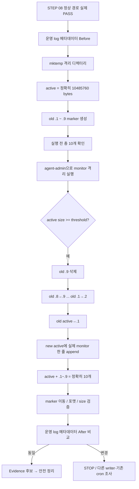

# B1-1 모듈 05 — STEP 09 로그 회전(Log Rotation) 격리 검증

> [← STEP 08](01-monitor-install.md) · [모듈 05 목차](README.md) · [다음: 모듈 06 →](../06-cron-health-tests/README.md) · [전체 입문자 가이드](../../BEGINNER-GUIDE.md)

<a id="step-09"></a>
## STEP 09 — monitor.log 10MB / 총 10개 로그 회전 격리 검증

## ① 왜 하는가

공식 B1-1은 `monitor.log`가 계속 커져 디스크를 고갈시키지 않도록 **10MB / 10개 파일**의 로그 용량 관리 정책을 구현하고 실제 동작을 설명할 수 있어야 합니다. 현재 R01 Reference `monitor.sh`는 별도 `logrotate` 설정이 아니라 Bash 내부의 `rotate_log_if_needed()` 함수로 이 정책을 구현합니다.

운영 경로 `/var/log/agent-app`의 실제 로그를 10MB까지 인위적으로 키우거나 기존 회전 파일을 삭제해서 시험하면 실제 증빙과 운영 기록을 손상시킬 수 있습니다. 따라서 이 STEP은 **STEP 08 정상 실행 Gate 재확인 → 운영 로그 메타데이터 기준선 → `mktemp` 고유 격리 디렉터리 → 정확한 회전 경계와 기존 `.1~.9` 마커 구성 → 실제 설치된 `monitor.sh`를 `agent-admin`으로 격리 실행 → `.1~.9` 이동 관계와 총 개수 검증 → 새 active 로그 포맷 검증 → 운영 로그 불변 확인 → 증빙 수집 후 범위 제한 정리** 순서로 수행합니다.

> 공식 문서의 표현은 **10MB / 10개**입니다. 현재 R01 Reference 구현은 그 정책을 코드에서 `MAX_LOG_BYTES=10485760`, `MAX_TOTAL_LOG_FILES=10`으로 구체화합니다. `10485760` byte는 10 MiB에 해당하며, 이것은 **R01 구현 세부값**이지 공식 요구 문구를 다른 단위로 바꾸는 것이 아닙니다.

## ② 무엇을 하는가

1. STEP 08의 정상 경로가 실제로 성공했고, Agent 1개와 TCP `15034`가 계속 정상인지 다시 확인합니다.
2. Repository Reference와 `/opt/agent-app/bin/monitor.sh` 설치본이 같은지 확인합니다.
3. 실제 `/var/log/agent-app/monitor.log`의 크기와 수정 시각만 저장하여 격리 시험 전후 비교 기준으로 사용합니다.
4. 고정 `/tmp/b1-1-log-test`를 지우지 않고 `mktemp -d`로 이번 실행 전용 디렉터리를 만듭니다.
5. active `monitor.log`을 R01 회전 경계인 정확히 `10485760` byte로 만들고, `.1`~`.9`에는 서로 다른 식별 마커를 넣습니다.
6. 실행 전 active + `.1`~`.9`가 정확히 10개인지 확인합니다.
7. 실제 설치된 `monitor.sh`를 `agent-admin`으로 실행하되 `AGENT_LOG_DIR`, `MAX_LOG_BYTES`, `MAX_TOTAL_LOG_FILES`만 **이번 자식 프로세스에서** 격리 경로/시험값으로 override합니다.
8. 실행 후 old active가 `.1`로 이동했는지, old `.1→.2` … old `.8→.9`가 되었는지, 기존 old `.9`가 제거되었는지 확인합니다.
9. 새 active `monitor.log`가 다시 생성되어 실제 공식 포맷의 한 줄을 포함하는지 확인합니다.
10. active + `.1`~`.9`가 정확히 총 10개이고 `.10`은 존재하지 않는지 확인합니다.
11. 시험 전후 운영 `monitor.log` 메타데이터가 같아 격리 시험이 운영 로그를 건드리지 않았는지 확인합니다.
12. 필요한 Evidence를 먼저 남긴 뒤, 정확한 `mktemp` 경로와 예상 파일만 대상으로 정리합니다.

## ③ 이번 단계에서 알아야 할 용어

- **로그 회전(Log Rotation)** — 현재 active 로그가 기준 크기에 도달하면 이전 로그로 넘기고 새 active 로그를 시작하는 방식입니다.
- **보존 정책(Retention Policy)** — 얼마나 큰 로그를 몇 개까지 유지할지 정하는 규칙입니다.
- **활성 로그(Active Log)** — 현재 새 기록이 추가되는 `monitor.log`입니다.
- **회전 로그(Rotated Log)** — 이전 기록을 보관하는 `monitor.log.1`, `.2` 같은 파일입니다.
- **회전 경계(Rotation Boundary)** — 회전 여부를 결정하는 크기 기준입니다. 현재 R01 구현은 `10485760` byte입니다.
- **격리 시험(Isolated Test)** — 실제 운영 데이터 대신 별도 임시 경로에서 같은 코드를 실행해 동작을 재현하는 시험입니다.
- **마커(Marker)** — 파일이 회전 후 어느 번호로 이동했는지 추적하기 위해 넣는 식별 문자열입니다.
- **희소 파일(Sparse File)** — `truncate`처럼 논리적 파일 크기를 크게 만들되 실제 디스크 블록을 전부 데이터로 채우지 않을 수 있는 파일입니다.
- **메타데이터(Metadata)** — 파일 내용 자체가 아니라 크기, 수정 시각, owner/mode 같은 속성 정보입니다.
- **환경변수 재정의(Environment Override)** — 원본 설정 파일을 수정하지 않고 특정 실행에만 다른 환경값을 전달하는 방식입니다.

## ④ 필요한 핵심 개념



현재 Reference의 회전 순서를 파일 관점에서 보면 다음과 같습니다.

```text
실행 전
monitor.log      = ACTIVE-BEFORE, 10485760 bytes
monitor.log.1    = ROTATED-BEFORE-1
...
monitor.log.8    = ROTATED-BEFORE-8
monitor.log.9    = ROTATED-BEFORE-9

회전
old .9           → 삭제
old .8           → .9
...
old .1           → .2
old active       → .1

그 다음 append
새 monitor.log   → 방금 실행한 실제 monitor 기록 1줄
```

### “10개”의 의미

현재 R01 Reference는 `MAX_TOTAL_LOG_FILES=10`을 **active `monitor.log`까지 포함한 총 파일 수**로 해석합니다.

```text
monitor.log      1개
monitor.log.1~.9 9개
--------------------
총               10개
```

따라서 `.10`을 만드는 구조가 아닙니다.

### 경계값과 append 순서의 의미

현재 코드는 새 로그를 쓰기 **전에** active 파일 크기를 검사합니다.

```text
현재 active size >= 10485760
→ 먼저 rotation
→ 그 다음 새 active에 현재 한 줄 append
```

따라서 이 STEP은 **정확히 10485760 byte인 active 파일**을 만들어 회전 조건을 명확하게 시험합니다. “모든 순간에 active 파일이 절대로 10MB를 한 byte도 넘지 않는다”는 별도 보장을 이 시험 결과로 과장하지 않습니다.

## ⑤ 실행할 명령어 또는 코드

### 📍 실행 위치(Context)

```text
Host       : OrbStack Ubuntu 24.04 또는 WSL2 Ubuntu 24.04
Terminal A : STEP 07부터 유지 중인 Agent foreground Terminal
Terminal B : Ubuntu Bash — 격리 로그 회전 시험
Repository : $HOME/codyssey/codyssey-basic-system-monitor
권한       : 일반 사용자 + 필요한 조회/소유권 변경 줄에서만 sudo
venv       : 해당 없음
```

### A. STEP 08 정상 경로와 설치본 재확인 — 읽기 전용

```bash
cd "$HOME/codyssey/codyssey-basic-system-monitor"

AGENT_COUNT="$(pgrep -x agent-app | wc -l)"
printf '[INFO] agent-app count=%s\n' "$AGENT_COUNT"
ps -C agent-app -o user=,uid=,pid=,comm=
sudo ss -lntp | grep ':15034'

sudo cmp -s training/round-01-clear/monitor.sh /opt/agent-app/bin/monitor.sh \
  && echo '[PASS] Runtime monitor matches Repository Reference' \
  || echo '[STOP] Runtime monitor differs from Repository Reference'
```

정상 기준:

```text
agent-app count = 1
user = agent-admin
uid != 0
TCP 15034 LISTEN
Repository Reference = Runtime monitor
```

STEP 08의 실제 `monitor_exit=0`과 운영 로그 포맷 확인까지 성공하지 않았다면 이 STEP으로 강행하지 않습니다.

### B. 운영 monitor.log 메타데이터 기준선 저장

```bash
PROD_LOG="/var/log/agent-app/monitor.log"

if sudo test -e "$PROD_LOG"; then
    PROD_LOG_BEFORE="$(sudo stat -c '%s:%Y' "$PROD_LOG")"
else
    PROD_LOG_BEFORE='MISSING'
fi

printf '[INFO] production monitor.log before=%s\n' "$PROD_LOG_BEFORE"
```

`%s`는 byte 크기, `%Y`는 마지막 수정 시각(epoch seconds)입니다. 여기서는 운영 로그 내용을 읽거나 복사하지 않습니다.

### C. 이번 실행 전용 격리 디렉터리 만들기

```bash
LOG_TEST_DIR="$(sudo -u agent-admin mktemp -d /tmp/b1-1-log-rotation.XXXXXX)"
printf '[INFO] test dir=%s\n' "$LOG_TEST_DIR"

case "$LOG_TEST_DIR" in
    /tmp/b1-1-log-rotation.*)
        echo '[PASS] isolated test path pattern confirmed'
        ;;
    *)
        echo '[STOP] unexpected test path; do not create/delete test files'
        ;;
esac

sudo chown agent-admin:agent-core "$LOG_TEST_DIR"
sudo chmod 0770 "$LOG_TEST_DIR"
sudo stat -c '%U %G %a %n' "$LOG_TEST_DIR"

TEST_LOG="$LOG_TEST_DIR/monitor.log"
```

`LOG_TEST_DIR`가 비어 있거나 `/tmp/b1-1-log-rotation.*` 패턴과 맞지 않으면 여기서 STOP합니다. 이후 생성·삭제 명령을 실행하지 않습니다.

### D. 정확한 회전 경계와 `.1~.9` 마커 준비

먼저 active 파일에 마커를 넣고 R01 회전 경계인 정확히 `10485760` byte로 만듭니다.

```bash
printf '%s\n' 'ACTIVE-BEFORE' \
  | sudo -u agent-admin tee "$TEST_LOG" >/dev/null
sudo -u agent-admin truncate -s 10485760 "$TEST_LOG"
```

기존 회전 파일 `.1`~`.9`에는 서로 다른 마커를 넣습니다.

```bash
for i in 1 2 3 4 5 6 7 8 9; do
    printf 'ROTATED-BEFORE-%s\n' "$i" \
      | sudo -u agent-admin tee "${TEST_LOG}.${i}" >/dev/null
done
```

실행 전 총 개수와 크기를 확인합니다.

```bash
BEFORE_COUNT="$(sudo find "$LOG_TEST_DIR" -maxdepth 1 -type f -name 'monitor.log*' | wc -l)"
printf '[INFO] test log count before=%s\n' "$BEFORE_COUNT"

sudo find "$LOG_TEST_DIR" -maxdepth 1 -type f -name 'monitor.log*' \
  -printf '%f %s bytes\n' | sort -V
```

정상 기준은 **총 10개**, 그리고 `monitor.log`이 **10485760 bytes**입니다. 둘 중 하나라도 다르면 monitor를 실행하지 않고 시험 데이터 생성 단계부터 확인합니다.

### E. 실제 설치된 monitor.sh를 격리 경로로 한 번 실행

```bash
sudo -u agent-admin -H env LOG_TEST_DIR="$LOG_TEST_DIR" bash -c '
  set -e
  set +x
  source /opt/agent-app/env.sh
  export AGENT_LOG_DIR="$LOG_TEST_DIR"
  export MAX_LOG_BYTES=10485760
  export MAX_TOTAL_LOG_FILES=10
  exec /opt/agent-app/bin/monitor.sh
'
ROTATION_RC=$?
printf '[INFO] rotation_test_exit=%s\n' "$ROTATION_RC"
```

여기서 `env.sh` 자체는 수정하지 않습니다. `source`한 뒤 이번 자식 Shell에서만 `AGENT_LOG_DIR`을 임시 디렉터리로 바꾸고, 현재 R01 Reference의 회전 시험값을 명시합니다.

> `MAX_LOG_BYTES`, `MAX_TOTAL_LOG_FILES`는 현재 R01 `monitor.sh`가 안전한 경계 시험을 위해 허용하는 **내부 시험/구현 변수**입니다. 공식 Mission의 필수 환경변수 목록에 새 항목을 추가하는 것이 아닙니다.

정상 경로는 `rotation_test_exit=0`이어야 합니다.

### F. 실행 후 총 파일 수와 파일명 검증

```bash
AFTER_COUNT="$(sudo find "$LOG_TEST_DIR" -maxdepth 1 -type f -name 'monitor.log*' | wc -l)"
printf '[INFO] test log count after=%s\n' "$AFTER_COUNT"

for suffix in '' .1 .2 .3 .4 .5 .6 .7 .8 .9; do
    sudo test -f "${TEST_LOG}${suffix}" \
      && echo "[PASS] exists: monitor.log${suffix}" \
      || echo "[FAIL] missing: monitor.log${suffix}"
done

sudo test ! -e "${TEST_LOG}.10" \
  && echo '[PASS] no monitor.log.10' \
  || echo '[FAIL] unexpected monitor.log.10'
```

정상 기준:

```text
AFTER_COUNT = 10
monitor.log 존재
monitor.log.1 ~ monitor.log.9 모두 존재
monitor.log.10 없음
```

### G. 정확한 회전 이동 관계와 오래된 `.9` 제거 검증

old active가 `.1`로 갔는지 먼저 확인합니다.

```bash
ROTATED_SIZE="$(sudo stat -c '%s' "${TEST_LOG}.1")"
printf '[INFO] monitor.log.1 size=%s bytes\n' "$ROTATED_SIZE"

sudo head -n 1 "${TEST_LOG}.1" | grep -qx 'ACTIVE-BEFORE' \
  && echo '[PASS] old active log moved to .1' \
  || echo '[FAIL] old active log was not preserved as .1'
```

그 다음 old `.1→.2`부터 old `.8→.9`까지 마커를 확인합니다.

```bash
for n in 2 3 4 5 6 7 8 9; do
    old=$((n - 1))
    sudo head -n 1 "${TEST_LOG}.${n}" \
      | grep -qx "ROTATED-BEFORE-${old}" \
      && echo "[PASS] old .${old} moved to .${n}" \
      || echo "[FAIL] rotation mapping .${old} -> .${n}"
done
```

마지막 `.9`는 다음을 보여야 합니다.

```bash
sudo head -n 1 "${TEST_LOG}.9"
```

정상이라면 `ROTATED-BEFORE-8`입니다. 실행 전 `.9`였던 `ROTATED-BEFORE-9`가 그대로 남아 있지 않고 제거되었다는 뜻입니다.

또한 `.1`의 크기는 old active와 같은 `10485760` byte여야 합니다.

### H. 새 active monitor.log의 실제 기록 검증

```bash
ACTIVE_SIZE="$(sudo stat -c '%s' "$TEST_LOG")"
printf '[INFO] new active size=%s bytes\n' "$ACTIVE_SIZE"

sudo tail -n 1 "$TEST_LOG" \
  | grep -Eq '^\[[0-9]{4}-[0-9]{2}-[0-9]{2} [0-9]{2}:[0-9]{2}:[0-9]{2}\] PID:[0-9]+ CPU:[0-9]+([.][0-9]+)?% MEM:[0-9]+([.][0-9]+)?% DISK_USED:[0-9]+([.][0-9]+)?%$' \
  && echo '[PASS] new active monitor.log has official format' \
  || echo '[FAIL] new active monitor.log format'

if [ "$ACTIVE_SIZE" -lt 10485760 ]; then
    echo '[PASS] new active log restarted below the R01 rotation threshold'
else
    echo '[FAIL] new active log did not restart below the threshold'
fi
```

이 마지막 라인은 **실제 현재 Agent PID와 자원 값으로 이번 격리 실행이 생성한 결과**여야 합니다. 문서 예시를 복사해 넣지 않습니다.

### I. 운영 monitor.log가 격리 시험 때문에 바뀌지 않았는지 확인

```bash
if sudo test -e "$PROD_LOG"; then
    PROD_LOG_AFTER="$(sudo stat -c '%s:%Y' "$PROD_LOG")"
else
    PROD_LOG_AFTER='MISSING'
fi

printf '[INFO] production monitor.log after=%s\n' "$PROD_LOG_AFTER"

if [ "$PROD_LOG_BEFORE" = "$PROD_LOG_AFTER" ]; then
    echo '[PASS] isolated rotation test did not touch production monitor.log metadata'
else
    echo '[STOP] production monitor.log changed; investigate another writer before STEP 10'
fi
```

이 시험의 `AGENT_LOG_DIR`은 임시 경로이므로 정상적으로 격리되었다면 운영 `monitor.log`는 이 실행 때문에 바뀌지 않아야 합니다.

만약 운영 로그가 달라졌다면 “시험이 운영 로그를 썼다”고 바로 단정하지 않습니다. STEP 10 전인데도 기존 cron이나 다른 monitor 프로세스가 이미 실행 중인지 먼저 조사합니다.

```bash
sudo crontab -u agent-admin -l 2>/dev/null || true
ps -ef | grep '[m]onitor.sh' || true
```

의도하지 않은 writer의 출처를 확인하기 전에는 STEP 10으로 진행하지 않습니다.

### J. Evidence 후보 확인 후 격리 디렉터리 정리

정리 전에 한 번 더 파일 목록과 크기를 남깁니다.

```bash
sudo find "$LOG_TEST_DIR" -maxdepth 1 -type f -name 'monitor.log*' \
  -printf '%f %s bytes\n' | sort -V
```

이 출력과 F~I의 실제 PASS 결과는 Secret이 없는 현재 R01 로그 회전 Evidence 후보가 될 수 있습니다.

필요한 Evidence를 확보한 뒤에만 다음처럼 **예상 패턴의 파일만** 삭제하고 빈 디렉터리를 제거합니다.

```bash
case "$LOG_TEST_DIR" in
    /tmp/b1-1-log-rotation.*)
        sudo find "$LOG_TEST_DIR" -mindepth 1 -maxdepth 1 \
          -type f -name 'monitor.log*' -delete
        sudo rmdir "$LOG_TEST_DIR"
        ;;
    *)
        echo '[STOP] unexpected path; nothing deleted'
        ;;
esac
```

`rmdir`은 디렉터리가 비어 있을 때만 성공합니다. 예상하지 않은 다른 파일이 있으면 디렉터리를 통째로 지우지 않고 남겨 원인을 확인합니다. 이 STEP에서는 고정 `/tmp` 경로에 `rm -rf`를 사용하지 않습니다.

## ⑥ 명령어와 코드에 입문자가 이해할 수 있는 주석

### 사전 Gate와 운영 로그 보호

- `pgrep -x agent-app | wc -l`
  - STEP 07부터 유지 중인 Agent가 정확히 한 개인지 확인합니다.
- `cmp -s Repository Runtime`
  - 실제 시험 대상 `monitor.sh`가 현재 Repository Reference와 동일한지 확인합니다.
- `PROD_LOG=/var/log/agent-app/monitor.log`
  - 운영 로그 경로를 별도 변수로 고정하여 시험용 `TEST_LOG`와 혼동하지 않습니다.
- `stat -c '%s:%Y'`
  - 파일 내용 대신 byte 크기와 수정 시각을 하나의 문자열로 기록합니다.
  - 시험 전후 값이 같으면 이 격리 실행이 운영 active 로그를 직접 건드리지 않았다는 중요한 근거가 됩니다.

### 고유 격리 디렉터리

- `mktemp -d /tmp/b1-1-log-rotation.XXXXXX`
  - 매 실행마다 충돌 가능성이 낮은 고유 디렉터리를 만듭니다.
  - 기존 고정 폴더를 `rm -rf`한 뒤 재사용하는 방식보다 안전합니다.
- `sudo -u agent-admin`
  - 시험 파일의 생성 주체를 실제 monitor 실행 계정과 맞춥니다.
- `case "$LOG_TEST_DIR" in /tmp/b1-1-log-rotation.*)`
  - 생성·삭제 전에 경로가 예상한 시험 패턴인지 검증합니다.
- `chown agent-admin:agent-core`, `chmod 0770`
  - 격리 디렉터리를 실제 실행 역할에 맞춰 읽기·쓰기 가능하게 하고 others 접근을 막습니다.

### 경계 파일과 마커

- `printf ... | tee "$TEST_LOG"`
  - `ACTIVE-BEFORE`라는 추적용 마커를 active 파일 첫 줄에 씁니다.
- `truncate -s 10485760`
  - 파일의 **논리적 크기**를 정확히 10,485,760 byte로 맞춥니다.
  - 많은 실제 데이터를 10 MiB만큼 반복 출력하는 대신 빠르게 경계 조건을 만들 수 있고, 파일시스템에 따라 희소 파일이 될 수 있습니다.
- `for i in 1 ... 9; do ... done`
  - `.1`부터 `.9`까지 같은 생성 명령을 반복하되 각 파일에 서로 다른 번호 마커를 넣습니다.
- `ROTATED-BEFORE-n`
  - 회전 후 파일이 어느 번호로 이동했는지 실제 내용으로 추적하는 비밀값 없는 테스트 마커입니다.

### 파일 개수와 목록

- `find "$LOG_TEST_DIR" -maxdepth 1`
  - 시험 디렉터리 바로 아래 한 단계만 조사합니다.
- `-type f`
  - 일반 파일만 대상으로 합니다.
- `-name 'monitor.log*'`
  - 시험용 monitor 로그 이름과 맞는 파일만 선택합니다.
- `wc -l`
  - `find`가 찾은 파일 경로 수를 세어 총 파일 수로 사용합니다.
- `-printf '%f %s bytes\n'`
  - 디렉터리 경로를 제외한 파일명과 byte 크기를 출력합니다.
- `sort -V`
  - `.1`, `.2`, `.9` 같은 버전형 숫자 접미사를 사람이 보기 쉬운 순서로 정렬합니다.

### 격리 monitor 실행

- `env LOG_TEST_DIR="$LOG_TEST_DIR" bash -c '...'`
  - 바깥 Shell에서 만든 임시 경로를 `agent-admin`의 자식 Shell에 전달합니다.
- `source /opt/agent-app/env.sh`
  - 공식 경로·포트·process name 같은 정상 Runtime 설정을 먼저 읽습니다.
- `export AGENT_LOG_DIR="$LOG_TEST_DIR"`
  - **이번 한 실행의 로그 출력 경로만** 격리 디렉터리로 바꿉니다. `env.sh` 파일 자체는 수정하지 않습니다.
- `export MAX_LOG_BYTES=10485760`
  - 현재 R01 구현의 회전 경계값을 이번 시험에 명시합니다.
- `export MAX_TOTAL_LOG_FILES=10`
  - active를 포함해 총 10개를 유지하는 현재 R01 구현값을 명시합니다.
- `exec /opt/agent-app/bin/monitor.sh`
  - 실제 설치된 Reference 동일본을 실행하여 mock 코드가 아니라 실제 구현을 검증합니다.
- `ROTATION_RC=$?`
  - 바로 전 monitor 실행 종료 코드를 저장합니다. 정상 Health와 회전 성공 경로는 `0`이어야 합니다.

### 회전 순서 검증

- `test -f "${TEST_LOG}${suffix}"`
  - active와 `.1`~`.9`가 모두 실제 존재하는지 확인합니다.
- `test ! -e "${TEST_LOG}.10"`
  - `.10`이 존재하지 않는 것을 성공 조건으로 검사합니다.
- `stat -c '%s' "${TEST_LOG}.1"`
  - old active가 `.1`로 이동하면서 원래의 정확한 경계 크기를 보존했는지 확인합니다.
- `head -n 1 ... | grep -qx ...`
  - 파일 첫 줄의 마커가 정확히 예상 문자열인지 출력 없이 비교합니다.
  - `-q`는 비교 결과만 사용하고, `-x`는 한 줄 전체가 정확히 일치해야 성공합니다.
- `old=$((n - 1))`
  - Bash 산술 확장으로 현재 `.n`에 들어 있어야 할 이전 번호를 계산합니다.

### 새 active와 공식 포맷

- `tail -n 1 "$TEST_LOG"`
  - 회전 후 새 active에 실제로 추가된 최신 monitor 한 줄을 읽습니다.
- `grep -Eq ...`
  - timestamp, PID, CPU, MEM, DISK_USED 순서와 숫자/`%` 형식을 검증합니다.
- `[ "$ACTIVE_SIZE" -lt 10485760 ]`
  - 회전 직후 새 active가 다시 작은 파일에서 시작했는지 확인합니다.

### 운영 로그 불변 확인

- `PROD_LOG_BEFORE` / `PROD_LOG_AFTER`
  - 운영 로그의 크기·수정 시각을 시험 앞뒤로 비교합니다.
- 값이 다르면
  - 격리 시험 실패로 단정하지 말고 기존 cron, 별도 monitor 실행 등 **다른 writer**를 조사합니다.
- `crontab -u agent-admin -l`
  - STEP 10 전에 과거 cron 등록이 남아 있는지 읽기 전용으로 확인합니다.
- `ps -ef | grep '[m]onitor.sh'`
  - 현재 실행 중인 monitor 프로세스 후보를 찾습니다. `[m]` 패턴은 grep 명령 자체가 결과에 잡히는 것을 줄입니다.

### 안전한 정리

- `find ... -delete`
  - 검증된 `LOG_TEST_DIR` 바로 아래의 `monitor.log*` 일반 파일만 삭제합니다.
  - 운영 `/var/log/agent-app`에는 적용하지 않습니다.
- `rmdir "$LOG_TEST_DIR"`
  - 디렉터리가 비어 있을 때만 제거합니다. 예상하지 않은 내용이 있으면 실패하고 그대로 남기므로 `rm -rf`보다 안전한 종료 경계가 됩니다.

### 재실행 안전성

STEP 09는 운영 로그를 직접 변경하지 않도록 설계했지만, 임시 파일을 실제로 생성·회전·삭제하므로 전체를 무조건 반복 실행하지 않습니다.

```text
Agent / ss / cmp / stat / crontab / ps 조회                 → 🟢 SAFE TO RERUN
mktemp 고유 디렉터리 생성                                  → 🟢 새 경로를 만들므로 낮은 위험
시험 디렉터리 chown/chmod                                   → 🟡 경로 패턴 확인 후
marker 생성 / truncate / .1~.9 생성                       → 🟡 검증된 mktemp 경로에서만
격리 AGENT_LOG_DIR로 monitor 실행                           → 🟡 실제 Health Check + 임시 로그 write
find/stat/head/tail/grep 검증                               → 🟢 SAFE TO RERUN
운영 monitor.log truncate/rm/인위적 10MB 생성               → 🚫 사용하지 않음
고정 /tmp 경로 rm -rf                                      → 🚫 사용하지 않음
find -delete / rmdir 정리                                   → 🔴 Evidence 확보 + 정확한 경로/패턴 확인 후
```

> **STOP 기준:** STEP 08 정상 경로 미통과, Agent가 1개가 아님, 실행 사용자가 `agent-admin`이 아님, TCP 15034 미확인, Runtime monitor와 Repository Reference 불일치, `mktemp` 경로 비정상, 시험 디렉터리 owner/mode 오류, 실행 전 파일 수가 10개가 아님, active 크기가 정확한 경계값이 아님, `rotation_test_exit != 0`, 실행 후 파일 수가 10개가 아님, active 또는 `.1~.9` 누락, `.10` 생성, `.1`의 크기/마커 불일치, `.1→.2`~`.8→.9` 매핑 실패, 새 active 공식 포맷 실패, 새 active가 경계보다 작게 재시작하지 않음, 운영 monitor.log 메타데이터가 예상치 않게 변경됨 중 하나라도 발생하면 STEP 10으로 진행하지 않습니다.

## ⑦ 예상되는 정상 결과

실행 전:

```text
시험 경로 = /tmp/b1-1-log-rotation.<고유문자>
총 파일 수 = 10
monitor.log = 10485760 bytes
monitor.log.1 ~ .9 = 각기 다른 marker
```

실행 후:

```text
rotation_test_exit = 0
총 파일 수 = 정확히 10
monitor.log 존재
monitor.log.1 ~ monitor.log.9 존재
monitor.log.10 없음
```

회전 매핑:

```text
old active  → .1   (size = 10485760, marker = ACTIVE-BEFORE)
old .1      → .2
old .2      → .3
...
old .8      → .9
old .9      → 제거
```

새 active:

```text
monitor.log
→ R01 threshold보다 작은 크기로 새로 시작
→ 실제 현재 Agent PID/CPU/MEM/DISK가 공식 로그 형식으로 1줄 append
```

운영 보호:

```text
PROD_LOG_BEFORE = PROD_LOG_AFTER
→ 이 격리 시험 자체가 /var/log/agent-app/monitor.log를 변경하지 않음
```

## ⑧ 그 결과가 의미하는 것

공식의 **10MB / 10개 로그 관리 요구사항**이 현재 R01의 Bash 구현에서 실제 회전 동작으로 연결된다는 것을, 실제 운영 로그를 인위적으로 키우거나 삭제하지 않고 검증한 것입니다.

특히 단순히 “파일 수가 10개 이하”만 보는 것이 아니라 다음을 함께 증명합니다.

```text
회전 경계에서 실제 trigger
old active → .1 보존
중간 세대 순서 이동
가장 오래된 .9 제거
active 포함 총 10개 제한
새 active 정상 생성과 실제 로그 append
운영 log 격리 유지
```

`verify.sh`의 production 파일 수 `<= 10` 검사는 최종 상태 확인에 유용하지만, **정확한 경계에서 실제 회전 순서가 동작했는지까지 단독으로 증명하지는 않습니다.** STEP 09의 격리 시험이 그 동작 증거를 보완합니다.

## ⑨ 자주 발생하는 오류와 해결 방법

- `mktemp` 결과가 비어 있음 → `/tmp` 권한/용량 확인. 고정 폴더를 만들고 `rm -rf`로 우회하지 않음.
- `test log count before != 10` → `find` 결과를 먼저 보고 누락/추가 파일 확인. monitor 실행 전 시험 fixture부터 수정.
- active size가 10485760이 아님 → `stat -c '%s'`로 확인 후 `truncate` 성공 여부를 점검. 운영 로그에는 적용 금지.
- `rotation_test_exit=1` → 회전 로직보다 먼저 Process/Port Health가 실패했을 수 있으므로 콘솔 첫 `[FAIL]`, STEP 07 Agent/15034부터 확인.
- `.1`이 `ACTIVE-BEFORE`가 아님 → active가 threshold에 도달하지 않았거나 다른 경로를 쓴 것인지 `AGENT_LOG_DIR`, `stat`, 실행 로그를 확인.
- `.2~.9` marker가 한 칸씩 이동하지 않음 → `monitor.sh`의 `rotate_log_if_needed()` 현재 설치본과 Repository Reference 동일성 확인.
- old `ROTATED-BEFORE-9`가 남음 → 최고 세대 삭제 로직이 동작하지 않은 것. 파일 수와 `.9` marker를 함께 확인.
- `.10`이 생김 → 현재 R01의 “active 포함 총 10개” 구현과 다름. `MAX_TOTAL_LOG_FILES`, 설치본 코드, 기존 파일을 확인.
- 새 active가 없음 → 회전 후 append 전에 monitor가 실패했을 수 있음. 콘솔 종료 코드와 로그 디렉터리 쓰기 권한 확인.
- 새 active 포맷 FAIL → STEP 08의 실제 로그 포맷과 설치본 코드를 다시 확인. 시험 marker를 실제 로그처럼 꾸며 PASS 처리하지 않음.
- 운영 `monitor.log` 메타데이터가 바뀜 → 먼저 `agent-admin` crontab과 현재 monitor 프로세스를 조사. 과거 cron이 남아 있으면 STEP 10에서 중복을 만들기 전에 정리 계획 수립.
- cleanup에서 `rmdir` 실패 → 예상하지 않은 파일이 있다는 뜻일 수 있음. `ls -la "$LOG_TEST_DIR"`로 확인하고 디렉터리 전체 `rm -rf` 금지.
- 디스크 사용량이 걱정됨 → `truncate`의 논리 크기와 실제 block 사용량이 다를 수 있음. 필요하면 시험 디렉터리의 `du -h`와 `ls -lh`를 구분해 확인하되 운영 로그는 건드리지 않음.

## ⑩ 완료 확인

- [ ] STEP 08 실제 정상 실행 `monitor_exit=0`과 공식 로그 포맷 Gate를 이미 통과
- [ ] Agent process count=1 / user=`agent-admin` / TCP 15034 정상 유지
- [ ] Runtime monitor = Repository Reference
- [ ] 운영 `monitor.log` Before 메타데이터 저장
- [ ] `mktemp -d /tmp/b1-1-log-rotation.XXXXXX` 고유 시험 경로 사용
- [ ] 시험 경로 패턴 확인
- [ ] 시험 디렉터리 owner=`agent-admin`, group=`agent-core`, mode=`770`
- [ ] active marker `ACTIVE-BEFORE` 생성
- [ ] active 크기 정확히 `10485760` byte
- [ ] `.1~.9` 각기 다른 marker 생성
- [ ] 실행 전 active 포함 총 10개
- [ ] `AGENT_LOG_DIR` override는 이번 자식 실행에만 적용
- [ ] `MAX_LOG_BYTES` / `MAX_TOTAL_LOG_FILES`가 R01 내부 시험값임을 구분
- [ ] `rotation_test_exit=0`
- [ ] 실행 후 active + `.1~.9` 정확히 총 10개
- [ ] `.10` 없음
- [ ] old active → `.1`
- [ ] `.1` 크기 `10485760` byte
- [ ] old `.1→.2` ... old `.8→.9` marker 매핑 PASS
- [ ] 기존 old `.9` 제거 확인
- [ ] 새 active `monitor.log` 존재
- [ ] 새 active 크기 R01 threshold 미만
- [ ] 새 active 마지막 라인이 공식 로그 포맷
- [ ] 운영 `monitor.log` Before/After 메타데이터 동일
- [ ] 운영 로그가 바뀌었다면 기존 cron/다른 writer 조사 후 STOP
- [ ] Evidence 후보를 먼저 확보한 뒤 시험 파일만 정리
- [ ] 고정 `/tmp` 경로 `rm -rf` 사용 안 함
- [ ] 실제 `/var/log/agent-app/monitor.log`를 truncate/delete하지 않음
- [ ] **실제 격리 시험을 실행하기 전에는 10MB/10개 Runtime PASS로 기록하지 않음**

---

## 다음 이동

[← STEP 08](01-monitor-install.md) · [모듈 05 목차](README.md) · [다음: 모듈 06 →](../06-cron-health-tests/README.md) · [전체 입문자 가이드](../../BEGINNER-GUIDE.md)
