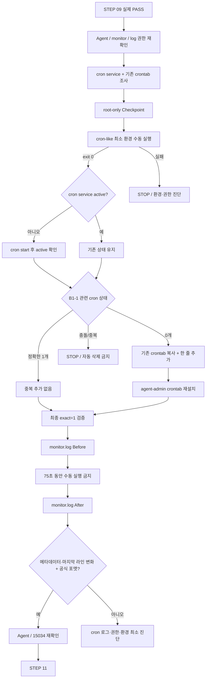

# B1-1 모듈 06 — STEP 10 크론(cron) 자동 실행

> [← 모듈 06 목차](README.md) · [다음: STEP 11 →](02-health-tests.md) · [전체 입문자 가이드](../../BEGINNER-GUIDE.md)

<a id="step-10"></a>
## STEP 10 — agent-admin cron 매분 자동 실행 검증

## ① 왜 하는가

공식 B1-1은 `monitor.sh`를 사람이 수동으로 실행하는 데서 끝내지 않고 **`agent-admin` 계정의 crontab으로 매분 자동 실행**하도록 등록하고, 등록 뒤 **1~2분 내 `/var/log/agent-app/monitor.log`에 새 라인이 실제로 누적되는지 확인**하도록 요구합니다.

cron은 로그인 터미널보다 환경변수와 `PATH`가 제한적이고, 기존 사용자 crontab에 다른 작업이 이미 있을 수 있습니다. 따라서 단순히 `crontab -e`를 열어 같은 줄을 반복해서 붙이면 중복 실행, 기존 작업 손상, 복구 불가 문제가 생길 수 있습니다.

이 STEP은 **STEP 09 실제 PASS 확인 → Agent/monitor/권한 재확인 → cron 서비스와 기존 crontab 조사 → root-only 체크포인트 → cron과 비슷한 최소 환경에서 수동 사전 실행 → cron 서비스 활성 상태 확보 → 기존 항목을 보존하는 정확히 1개 등록 → 등록 결과 재검증 → monitor.log Before → 75초 대기 → After 변화와 공식 로그 포맷 확인 → Agent 상태 유지 확인 → 필요 시 체크포인트 기반 복구** 순서로 진행합니다.

> 이번 STEP의 PASS는 “crontab 줄이 존재한다”만으로 결정하지 않습니다. **정확히 한 개의 매분 항목 + cron 서비스 active + 실제 1~2분 내 monitor.log의 새로운 Runtime 라인**이 모두 확인되어야 합니다.

## ② 무엇을 하는가

1. STEP 09의 실제 격리 회전 검증을 이미 통과했는지 확인하고, Agent 1개와 TCP `15034`, Runtime `monitor.sh`, `env.sh`, 로그 쓰기 권한을 다시 점검합니다.
2. `cron` 서비스의 현재 active/enabled 상태와 `agent-admin` 기존 crontab 존재 여부를 읽기 전용으로 확인합니다.
3. 기존 crontab 전체 내용은 화면에 뿌리지 않고, B1-1 관련 경로를 가진 항목의 **개수**만 먼저 확인합니다.
4. 기존 사용자 crontab은 `/root` 아래 mode `0600`의 root-only 파일로 백업합니다. crontab 안에 민감한 환경값이 있을 가능성을 고려해 `/tmp` 평문 백업을 만들지 않습니다.
5. 실제 cron과 비슷한 최소 환경(`env -i`)에서 동일한 Bash 실행 본문을 `agent-admin`으로 한 번 수동 실행해 환경·권한·PATH 문제를 cron 등록 전에 찾습니다.
6. `cron` 서비스가 이미 active면 그대로 두고, inactive면 시작한 뒤 active를 확인합니다. 시작 전 상태를 체크포인트에 기록합니다.
7. R01 기준 cron 한 줄이 이미 정확히 1개이면 중복 추가하지 않습니다. 관련 항목이 전혀 없을 때만 기존 crontab 복사본 뒤에 정확한 한 줄을 추가해 전체 crontab을 재설치합니다.
8. 기존 B1-1 관련 줄이 있으나 형식이 다르거나, 중복이 있으면 자동 삭제·필터링하지 않고 STOP하여 해당 줄을 로컬에서 확인합니다.
9. 최종 crontab에서 정확한 B1-1 항목이 1개인지 다시 확인합니다.
10. `monitor.log`의 Before 메타데이터와 마지막 라인을 기록한 뒤 **수동 monitor 실행이나 STEP 11 시험을 하지 않고 75초** 기다립니다.
11. After 메타데이터·마지막 라인이 바뀌고 새 라인이 공식 포맷인지 확인합니다.
12. cron 실행 뒤에도 Agent process 1개와 TCP `15034`가 유지되는지 확인합니다.
13. 실패하면 `cron` 서비스 로그, 정확한 crontab 개수, `agent-admin` 권한과 최소 환경 수동 실행을 순서대로 진단합니다.
14. 등록을 철회해야 하면 시작 전 crontab이 있었는지 여부에 따라 root-only 백업을 복원하거나, 원래 crontab이 없었던 경우에만 전체 crontab 제거를 검토합니다.

## ③ 이번 단계에서 알아야 할 용어

- **크론(cron)** — 정해진 시간 규칙에 따라 명령을 자동 실행하는 Linux 스케줄러 서비스입니다.
- **크론탭(crontab)** — 사용자별 cron 일정과 실행 명령을 저장하는 작업 목록입니다.
- **스케줄 표현식(Cron Schedule Expression)** — `* * * * *`처럼 분·시·일·월·요일 실행 시점을 지정하는 다섯 필드입니다.
- **최소 실행 환경(Minimal Environment)** — 로그인 프로필에 의존하지 않고 필요한 환경값만 가진 제한된 실행 환경입니다.
- **중복 작업(Duplicate Job)** — 같은 작업이 여러 번 등록되어 같은 시점에 반복 실행되는 상태입니다.
- **멱등적 등록(Idempotent Registration)** — 이미 올바른 항목이 있으면 다시 추가하지 않아 반복 수행해도 중복을 만들지 않는 등록 방식입니다.
- **체크포인트(Checkpoint)** — 기존 crontab과 서비스 상태를 보존해 문제가 생겼을 때 원래 상태로 복구할 수 있게 하는 지점입니다.
- **표준 출력(Standard Output, stdout)** — 프로그램의 일반 출력 스트림입니다.
- **표준 오류(Standard Error, stderr)** — 오류·경고 메시지를 위한 별도 출력 스트림입니다.
- **리다이렉션(Redirection)** — `>`, `2>&1`처럼 출력이 향할 위치를 바꾸는 Shell 기능입니다.

## ④ 필요한 핵심 개념



### 공식 요구와 R01 구현을 구분

```text
공식 요구
→ agent-admin crontab
→ 매분 실행
→ 1~2분 내 monitor.log 새 라인 자동 누적

R01 구현 선택
→ cron 명령 안에서 PATH를 명시
→ /bin/bash -c로 env.sh를 명시적으로 읽음
→ stdout/stderr를 /dev/null로 보내 별도 cron.log 무한 증가를 만들지 않음
```

`/dev/null` 출력 폐기는 공식 요구사항이 아니라 R01 운영 선택입니다. cron 동작 증거는 `monitor.log`의 실제 증가와 필요 시 `journalctl -u cron` 같은 서비스 로그로 확인합니다.

## ⑤ 실행할 명령어 또는 코드

### 📍 실행 위치(Context)

```text
Host       : OrbStack Ubuntu 24.04 또는 WSL2 Ubuntu 24.04
Terminal A : STEP 07부터 유지 중인 Agent foreground Terminal
Terminal B : Ubuntu Bash — cron 점검·등록·검증
Repository : $HOME/codyssey/codyssey-basic-system-monitor
권한       : 일반 사용자 + crontab/service 조회·변경 줄에서만 sudo
venv       : 해당 없음
```

### A. STEP 09 이후 Runtime Gate 재확인 — 읽기 전용

```bash
cd "$HOME/codyssey/codyssey-basic-system-monitor"
pwd
git branch --show-current
git status --short

AGENT_COUNT="$(pgrep -x agent-app | wc -l)"
printf '[INFO] agent-app count=%s\n' "$AGENT_COUNT"
ps -C agent-app -o user=,uid=,pid=,comm=
sudo ss -lntp | grep ':15034'

sudo cmp -s training/round-01-clear/monitor.sh /opt/agent-app/bin/monitor.sh \
  && echo '[PASS] Runtime monitor matches Repository Reference' \
  || echo '[STOP] Runtime monitor differs from Repository Reference'

sudo runuser -u agent-admin -- test -r /opt/agent-app/env.sh \
  && echo '[PASS] agent-admin can read env.sh' \
  || echo '[STOP] agent-admin cannot read env.sh'

sudo runuser -u agent-admin -- test -x /opt/agent-app/bin/monitor.sh \
  && echo '[PASS] agent-admin can execute monitor.sh' \
  || echo '[STOP] agent-admin cannot execute monitor.sh'

sudo runuser -u agent-admin -- test -w /var/log/agent-app \
  && echo '[PASS] agent-admin can write log directory' \
  || echo '[STOP] agent-admin cannot write log directory'

sudo test -s /var/log/agent-app/monitor.log \
  && echo '[PASS] production monitor.log exists and is non-empty' \
  || echo '[STOP] production monitor.log missing or empty'
```

정상 기준:

```text
STEP 09 실제 Runtime PASS를 이미 확인
agent-app count = 1
user = agent-admin
uid != 0
TCP 15034 LISTEN
Runtime monitor = Repository Reference
agent-admin이 env.sh read / monitor execute / log dir write 가능
production monitor.log 존재 + non-empty
```

STEP 09의 격리 회전 시험을 실제로 수행하지 않았다면 문서만 준비된 상태이므로 cron Runtime PASS를 이어서 기록하지 않습니다.

### B. cron 서비스와 기존 `agent-admin` crontab 조사 — 읽기 전용

```bash
command -v crontab
sudo systemctl is-active cron || true
sudo systemctl is-enabled cron || true

if sudo crontab -u agent-admin -l >/dev/null 2>&1; then
    echo '[INFO] agent-admin already has a crontab'
else
    echo '[INFO] agent-admin has no existing crontab'
fi
```

B1-1 R01에서 사용할 정확한 cron 한 줄을 Shell 변수로 고정합니다.

```bash
CRON_LINE="* * * * * PATH=/usr/local/sbin:/usr/local/bin:/usr/sbin:/usr/bin:/sbin:/bin /bin/bash -c 'set -e; . /opt/agent-app/env.sh; exec /opt/agent-app/bin/monitor.sh' >/dev/null 2>&1"
```

현재 crontab에 **정확히 같은 줄**이 몇 개인지, `/opt/agent-app`의 B1-1 env/monitor 경로를 가진 관련 줄이 몇 개인지 개수만 확인합니다.

```bash
EXACT_COUNT="$(sudo crontab -u agent-admin -l 2>/dev/null \
  | grep -Fxc "$CRON_LINE" || true)"

RELATED_COUNT="$(sudo crontab -u agent-admin -l 2>/dev/null \
  | grep -Ec '(/opt/agent-app/env\.sh|/opt/agent-app/bin/monitor\.sh)' || true)"

printf '[INFO] exact B1-1 cron lines=%s\n' "$EXACT_COUNT"
printf '[INFO] related B1-1 cron lines=%s\n' "$RELATED_COUNT"
```

판정:

```text
EXACT=1, RELATED=1
→ 이미 정확히 등록됨. 새 항목을 추가하지 않음.

EXACT=0, RELATED=0
→ 신규 등록 가능 후보. Checkpoint 이후 한 줄만 추가.

그 외
→ 중복 또는 이전 형식/충돌 가능성. 자동 삭제·교체 금지, STOP.
```

충돌/중복일 때 필요한 경우 **B1-1 관련 줄만 로컬에서** 확인합니다.

```bash
sudo crontab -u agent-admin -l 2>/dev/null \
  | grep -nE '(/opt/agent-app/env\.sh|/opt/agent-app/bin/monitor\.sh)' || true
```

기존 crontab 전체를 채팅·Evidence에 붙이지 않습니다. 사용자 crontab은 미션 외 작업이나 민감한 명령을 포함할 수 있습니다.

### C. 기존 crontab과 cron 서비스 상태 체크포인트

```bash
STAMP="$(date +%Y%m%d%H%M%S)"
CRON_BAK="$(sudo mktemp /root/b1-1-agent-admin-crontab.before.XXXXXX)"
CRON_NEW="$(sudo mktemp /root/b1-1-agent-admin-crontab.new.XXXXXX)"
CRON_CHECKPOINT="/tmp/b1-1-cron-checkpoint.${STAMP}.txt"

if sudo crontab -u agent-admin -l >/dev/null 2>&1; then
    CRON_EXISTED=yes
    sudo crontab -u agent-admin -l 2>/dev/null \
      | sudo tee "$CRON_BAK" >/dev/null
else
    CRON_EXISTED=no
    sudo truncate -s 0 "$CRON_BAK"
fi

sudo chmod 0600 "$CRON_BAK" "$CRON_NEW"

CRON_SERVICE_BEFORE="$(sudo systemctl is-active cron 2>/dev/null || true)"
CRON_ENABLED_BEFORE="$(sudo systemctl is-enabled cron 2>/dev/null || true)"

printf 'STAMP=%s\nCRON_EXISTED=%s\nCRON_BAK=%s\nCRON_NEW=%s\nCRON_SERVICE_BEFORE=%s\nCRON_ENABLED_BEFORE=%s\nEXACT_COUNT_BEFORE=%s\nRELATED_COUNT_BEFORE=%s\n' \
  "$STAMP" "$CRON_EXISTED" "$CRON_BAK" "$CRON_NEW" \
  "$CRON_SERVICE_BEFORE" "$CRON_ENABLED_BEFORE" \
  "$EXACT_COUNT" "$RELATED_COUNT" \
  > "$CRON_CHECKPOINT"

sudo stat -c '%U %G %a %s %n' "$CRON_BAK" "$CRON_NEW"
printf '[CHECKPOINT] %s\n' "$CRON_CHECKPOINT"
```

> 실제 crontab 백업 내용은 `/root`의 mode `0600` 파일에 둡니다. `/tmp` 체크포인트에는 **백업 경로·존재 여부·서비스 상태·개수**만 기록합니다. `CRON_BAK`을 `cat`하여 공개하지 않습니다.

### D. cron과 비슷한 최소 환경에서 수동 사전 실행

먼저 `agent-admin`의 실제 home을 계정 DB에서 얻습니다.

```bash
AGENT_ADMIN_HOME="$(getent passwd agent-admin | cut -d: -f6)"
printf '[INFO] agent-admin home=%s\n' "$AGENT_ADMIN_HOME"
```

home이 비어 있지 않은 것을 확인한 뒤, 일반 로그인 환경을 지운 최소 환경에서 cron 실행 본문을 한 번 테스트합니다.

```bash
sudo -u agent-admin env -i \
  HOME="$AGENT_ADMIN_HOME" \
  PATH=/usr/local/sbin:/usr/local/bin:/usr/sbin:/usr/bin:/sbin:/bin \
  SHELL=/bin/sh \
  /bin/bash -c 'set -e; . /opt/agent-app/env.sh; exec /opt/agent-app/bin/monitor.sh'

PRECRON_RC=$?
printf '[INFO] cron-like manual test exit=%s\n' "$PRECRON_RC"
```

정상 기준은 `PRECRON_RC=0`입니다. 이 실행은 실제 `monitor.log`에 한 줄을 추가할 수 있지만 **cron 자동 실행 증거는 아닙니다.** cron 등록 전에 제한된 환경에서도 같은 실행 본문이 정상인지 확인하는 사전 시험입니다.

`PRECRON_RC != 0`이면 crontab을 등록하지 않고 환경·권한·Agent 상태를 먼저 해결합니다.

### E. cron 서비스 active 확보

```bash
if sudo systemctl is-active --quiet cron; then
    echo '[PASS] cron service is already active'
else
    echo '[INFO] cron service is inactive; starting it for B1-1 Runtime'
    sudo systemctl start cron
fi

sudo systemctl is-active cron
```

`active`가 확인되어야 합니다. `systemctl start cron`은 현재 서비스를 시작하지만 enable/disable 부팅 정책을 바꾸지는 않습니다. `is-enabled` 결과는 별도로 기록해 두고, 공식 요구에 없는 부팅 정책을 임의 변경하지 않습니다.

### F. 정확한 B1-1 항목 1개만 등록 — 기존 다른 항목 보존

먼저 B 단계에서 구한 개수를 다시 사용합니다.

```bash
if [ "$EXACT_COUNT" -eq 1 ] && [ "$RELATED_COUNT" -eq 1 ]; then
    echo '[PASS] exact B1-1 cron entry already exists; no duplicate added'
elif [ "$EXACT_COUNT" -eq 0 ] && [ "$RELATED_COUNT" -eq 0 ]; then
    sudo cp -a "$CRON_BAK" "$CRON_NEW"
    sudo sh -c 'printf "\n%s\n" "$1" >> "$2"' sh "$CRON_LINE" "$CRON_NEW"

    NEW_EXACT_COUNT="$(sudo grep -Fxc "$CRON_LINE" "$CRON_NEW" || true)"
    printf '[INFO] exact lines in staged crontab=%s\n' "$NEW_EXACT_COUNT"

    if [ "$NEW_EXACT_COUNT" -eq 1 ]; then
        sudo crontab -u agent-admin "$CRON_NEW"
        echo '[PASS] B1-1 cron entry installed for agent-admin'
    else
        echo '[STOP] staged crontab does not contain exactly one B1-1 entry'
    fi
else
    echo '[STOP] conflicting or duplicate B1-1-related cron entry detected; no automatic edit performed'
fi
```

이 방식은 기존 crontab이 있을 때 **백업 복사본 전체를 그대로 유지한 뒤 마지막에 한 줄만 추가**합니다. 기존 항목을 `grep -v`로 자동 삭제하거나 전체 crontab을 새 B1-1 한 줄로 덮어쓰지 않습니다.

### G. 등록 결과 재검증 — 정확히 1개

```bash
FINAL_EXACT_COUNT="$(sudo crontab -u agent-admin -l 2>/dev/null \
  | grep -Fxc "$CRON_LINE" || true)"

FINAL_RELATED_COUNT="$(sudo crontab -u agent-admin -l 2>/dev/null \
  | grep -Ec '(/opt/agent-app/env\.sh|/opt/agent-app/bin/monitor\.sh)' || true)"

printf '[INFO] final exact B1-1 cron lines=%s\n' "$FINAL_EXACT_COUNT"
printf '[INFO] final related B1-1 cron lines=%s\n' "$FINAL_RELATED_COUNT"

if [ "$FINAL_EXACT_COUNT" -eq 1 ] && [ "$FINAL_RELATED_COUNT" -eq 1 ]; then
    echo '[PASS] exactly one B1-1 cron entry is installed'
else
    echo '[STOP] B1-1 cron entry is missing, duplicated, or conflicting'
fi

sudo crontab -u agent-admin -l 2>/dev/null \
  | grep -F "$CRON_LINE" || true
```

마지막 출력에는 B1-1의 non-secret cron 한 줄만 보입니다. 전체 사용자 crontab은 Evidence에 복사하지 않습니다.

등록이 정상이라면 staging 파일은 더 이상 필요하지 않습니다. 정확한 `mktemp` 경로 패턴을 확인한 뒤 staging 복사본만 제거합니다.

```bash
case "$CRON_NEW" in
    /root/b1-1-agent-admin-crontab.new.*)
        sudo rm -f -- "$CRON_NEW"
        ;;
    *)
        echo '[STOP] unexpected staging path; nothing removed'
        ;;
esac
```

복구용 `CRON_BAK`은 STEP 15 CLEAR 전까지 유지합니다.

### H. 공식 1~2분 자동 실행 검증 — Before

여기서부터 After 확인까지는 **수동으로 `monitor.sh`를 실행하지 않고 STEP 11도 시작하지 않습니다.** 그래야 로그 변화가 cron 실행과 연결됩니다.

```bash
MONITOR_LOG="/var/log/agent-app/monitor.log"

CRON_BEFORE_TIME="$(date '+%Y-%m-%d %H:%M:%S')"
CRON_BEFORE_META="$(sudo stat -c '%s:%Y' "$MONITOR_LOG")"
CRON_BEFORE_LAST="$(sudo tail -n 1 "$MONITOR_LOG")"

printf '[INFO] cron observation start=%s\n' "$CRON_BEFORE_TIME"
printf '[INFO] monitor.log before meta=%s\n' "$CRON_BEFORE_META"
sudo tail -n 1 "$MONITOR_LOG"
```

`%s:%Y`는 byte 크기와 마지막 수정 시각(epoch seconds)입니다. 마지막 라인은 monitor의 고정 형식이며 Secret 값을 포함하면 안 됩니다.

### I. 75초 기다린 뒤 After 확인

```bash
sleep 75

CRON_AFTER_TIME="$(date '+%Y-%m-%d %H:%M:%S')"
CRON_AFTER_META="$(sudo stat -c '%s:%Y' "$MONITOR_LOG")"
CRON_AFTER_LAST="$(sudo tail -n 1 "$MONITOR_LOG")"

printf '[INFO] cron observation end=%s\n' "$CRON_AFTER_TIME"
printf '[INFO] monitor.log after meta=%s\n' "$CRON_AFTER_META"
sudo tail -n 3 "$MONITOR_LOG"
```

Before와 After를 비교합니다.

```bash
if [ "$CRON_BEFORE_META" != "$CRON_AFTER_META" ] \
   && [ "$CRON_BEFORE_LAST" != "$CRON_AFTER_LAST" ]; then
    echo '[PASS] monitor.log changed automatically during the cron observation window'
else
    echo '[STOP] automatic monitor.log growth was not confirmed'
fi
```

최신 라인이 공식 포맷인지도 다시 확인합니다.

```bash
printf '%s\n' "$CRON_AFTER_LAST" \
  | grep -Eq '^\[[0-9]{4}-[0-9]{2}-[0-9]{2} [0-9]{2}:[0-9]{2}:[0-9]{2}\] PID:[0-9]+ CPU:[0-9]+([.][0-9]+)?% MEM:[0-9]+([.][0-9]+)?% DISK_USED:[0-9]+([.][0-9]+)?%$' \
  && echo '[PASS] cron-produced latest monitor.log line has official format' \
  || echo '[STOP] latest monitor.log line format mismatch'
```

`75초`는 특정 초에 등록해도 다음 분 경계를 한 번 이상 지나도록 하기 위한 R01 관찰값입니다. 공식 요구는 **등록 후 1~2분 내 새 라인 누적 확인**입니다.

### J. cron 실행 후 Agent 상태 유지 재확인

```bash
pgrep -x agent-app | wc -l
ps -C agent-app -o user=,uid=,pid=,comm=
sudo ss -lntp | grep ':15034'
sudo systemctl is-active cron
```

정상 기준:

```text
agent-app count = 1
user = agent-admin
TCP 15034 LISTEN
cron service = active
```

### K. 자동 실행 실패 시 최소 진단

먼저 crontab 자체를 다시 개수로 확인합니다.

```bash
sudo crontab -u agent-admin -l 2>/dev/null \
  | grep -Fxc "$CRON_LINE" || true
sudo systemctl status cron --no-pager
```

최근 cron 서비스 기록을 봅니다.

```bash
sudo journalctl -u cron --since '5 minutes ago' --no-pager | tail -n 80
```

Ubuntu 환경에 `/var/log/syslog`가 있고 cron 기록이 그쪽에도 남는 경우 보조로 확인할 수 있습니다.

```bash
sudo test -r /var/log/syslog \
  && sudo grep 'CRON' /var/log/syslog | tail -n 50 \
  || true
```

`agent-admin`의 환경·권한을 다시 확인합니다.

```bash
sudo runuser -u agent-admin -- test -r /opt/agent-app/env.sh \
  && echo '[PASS] env.sh readable' \
  || echo '[FAIL] env.sh unreadable'

sudo runuser -u agent-admin -- test -x /opt/agent-app/bin/monitor.sh \
  && echo '[PASS] monitor executable' \
  || echo '[FAIL] monitor not executable'

sudo runuser -u agent-admin -- test -w /var/log/agent-app \
  && echo '[PASS] log directory writable' \
  || echo '[FAIL] log directory not writable'
```

그리고 D의 **cron-like 최소 환경 수동 실행**을 다시 수행해 cron 스케줄 문제와 실행 본문 문제를 분리합니다. 수동 실행이 성공하지만 cron만 실패하면 service/crontab 쪽을, 수동 실행도 실패하면 env.sh/권한/Agent 쪽을 먼저 봅니다.

> 실패했다고 `chmod 777`, Root cron으로 변경, `sudo`를 cron 한 줄 안에 삽입, 동일 cron 줄 반복 추가로 우회하지 않습니다.

### L. 실패 시 체크포인트 기반 Recovery

체크포인트에는 Secret이나 crontab 내용 자체가 없습니다.

```bash
cat "$CRON_CHECKPOINT"
```

#### 시작 전에 `agent-admin` crontab이 있었던 경우

`CRON_EXISTED=yes`이고 `CRON_BAK`이 이번 STEP의 root-only 백업이라는 것을 확인한 뒤 기존 전체 crontab을 복원합니다.

```bash
sudo crontab -u agent-admin "$CRON_BAK"
```

#### 시작 전에 crontab이 없었던 경우

`CRON_EXISTED=no`였다는 체크포인트를 확인하고, 이번 STEP에서 처음 만든 crontab 전체를 철회해야 할 때만 다음을 사용합니다.

```bash
sudo crontab -u agent-admin -r
```

`crontab -r`은 해당 사용자의 **전체 crontab을 제거**하므로 `CRON_EXISTED=no`라는 시작 상태가 확실할 때만 사용합니다.

복구 후 B1-1 관련 항목 수를 다시 확인합니다.

```bash
sudo crontab -u agent-admin -l 2>/dev/null \
  | grep -Ec '(/opt/agent-app/env\.sh|/opt/agent-app/bin/monitor\.sh)' || true
```

이번 STEP 시작 전 cron 서비스가 inactive였고 **B1-1 전체 변경을 철회해 원래 외부 환경으로 되돌리는 경우에만** 서비스 원복을 검토합니다.

```bash
sudo systemctl stop cron
```

이 명령은 `CRON_SERVICE_BEFORE`가 inactive였다는 체크포인트를 확인한 전체 rollback에서만 사용합니다. B1-1 최종 상태에서 cron 자동 실행을 유지하려면 cron 서비스는 active여야 합니다.

> Recovery를 이유로 `monitor.log`의 실제 Runtime 기록을 삭제하지 않습니다. 이미 생성된 관제 로그는 수행 이력이며, crontab 복구와 별개입니다.

## ⑥ 명령어와 코드에 입문자가 이해할 수 있는 주석

### cron 서비스와 기존 crontab 조사

- `command -v crontab`
  - `crontab` 명령이 설치되어 현재 `PATH`에서 실행 가능한지 확인합니다.
- `systemctl is-active cron`
  - cron 서비스가 현재 실제 실행 중인지 확인합니다.
- `systemctl is-enabled cron`
  - 부팅 시 자동 시작 설정을 읽기 전용으로 확인합니다. 이 STEP은 공식 요구에 없는 enable 정책을 무조건 변경하지 않습니다.
- `crontab -u agent-admin -l`
  - `-u agent-admin`은 대상 사용자를 지정하고, `-l`은 그 사용자의 현재 작업 목록을 읽습니다.
  - 다른 사용자의 crontab을 조회하므로 관리자 권한이 필요합니다.

### 정확한 cron 한 줄

- `* * * * *`
  - 첫 번째 `*`: 모든 분
  - 두 번째 `*`: 모든 시
  - 세 번째 `*`: 모든 일(day of month)
  - 네 번째 `*`: 모든 월
  - 다섯 번째 `*`: 모든 요일(day of week)
  - 결과적으로 **매분** 실행됩니다.
- `PATH=/usr/local/sbin:/usr/local/bin:/usr/sbin:/usr/bin:/sbin:/bin`
  - cron의 제한된 기본 `PATH`에 의존하지 않고 `pgrep`, `ss`, `ps`, `df`, `ufw`, `systemctl` 같은 명령 탐색 경로를 명시합니다.
- `/bin/bash -c '...'`
  - cron의 바깥 실행 셸에 의존하지 않고 실제 실행 본문을 Bash로 처리합니다.
- `set -e`
  - `env.sh`를 읽는 과정이 실패하면 잘못된 환경으로 monitor를 계속 실행하지 않습니다.
- `. /opt/agent-app/env.sh`
  - 현재 Bash 프로세스에 R01의 non-secret 환경변수를 읽습니다. `.`은 `source`와 같은 역할의 POSIX 표기입니다.
- `exec /opt/agent-app/bin/monitor.sh`
  - Bash 프로세스를 실제 monitor 실행으로 교체합니다.
- `>/dev/null`
  - cron 실행의 일반 콘솔 출력을 별도 파일로 계속 쌓지 않고 버립니다.
- `2>&1`
  - 표준 오류(fd 2)를 이미 `/dev/null`로 향한 표준 출력(fd 1)과 같은 곳으로 보냅니다.
- 이 R01 선택은 별도 `cron.log`가 무한히 커지는 부수 로그 문제를 만들지 않기 위한 것입니다. 오류 조사 시 수동 최소환경 실행과 cron service journal을 사용합니다.

### 기존 항목 개수 검사

- `grep -Fxc "$CRON_LINE"`
  - `-F`는 정규식이 아닌 고정 문자열로 비교하고, `-x`는 줄 전체가 같아야 하며, `-c`는 일치 줄 수만 출력합니다.
  - 정확한 항목이 1개인지 판단할 때 사용합니다.
- `grep -Ec '(...env.sh|...monitor.sh)'`
  - 이전 형식 또는 중복 가능성이 있는 B1-1 관련 줄의 개수를 확인합니다.
- 개수만 먼저 보는 이유
  - 사용자 crontab 전체 내용을 불필요하게 화면·Evidence에 노출하지 않으면서 중복 여부를 판정하기 위해서입니다.

### root-only 체크포인트

- `mktemp /root/...XXXXXX`
  - root만 접근하는 `/root`에 충돌 가능성이 낮은 고유 파일을 만듭니다.
- `tee "$CRON_BAK" >/dev/null`
  - 기존 crontab 내용을 root-only 백업 파일에 기록하면서 화면에는 출력하지 않습니다.
- `chmod 0600`
  - root만 읽기·쓰기 가능하게 합니다.
- `/tmp/b1-1-cron-checkpoint...txt`
  - 실제 crontab 내용이 아니라 백업 경로, 존재 여부, 서비스 상태, 개수 같은 비민감 메타데이터만 둡니다.

### 최소 환경 수동 사전 실행

- `getent passwd agent-admin | cut -d: -f6`
  - 계정 DB의 colon 구분 필드 중 home 경로를 얻습니다.
- `env -i`
  - 현재 사용자의 로그인 환경을 상속하지 않고 거의 빈 환경에서 시작합니다.
- `HOME=...`, `PATH=...`, `SHELL=/bin/sh`
  - cron 환경에서 필요한 최소 기본값을 명시합니다.
- `/bin/bash -c ...`
  - 실제 cron 한 줄과 같은 실행 본문을 Bash로 수행합니다.
- `PRECRON_RC=$?`
  - 수동 사전 실행의 실제 종료 코드를 저장합니다. `0`이어야 등록으로 진행합니다.

### cron 서비스 상태 변경

- `systemctl is-active --quiet cron`
  - 화면 출력 없이 종료 코드로 active 여부를 확인합니다.
- `systemctl start cron`
  - 서비스가 inactive인 경우 현재 Runtime에서 cron을 시작합니다.
  - 부팅 enable 설정 자체를 바꾸는 명령은 아닙니다.
- 서비스 시작 전 상태를 체크포인트에 기록한 이유
  - 전체 rollback 시 원래 inactive였는지 구분하기 위해서입니다.

### 기존 crontab을 보존하면서 한 줄 추가

- `cp -a "$CRON_BAK" "$CRON_NEW"`
  - 기존 전체 crontab 백업을 staging 파일로 복사합니다.
- `printf "\n%s\n" "$1" >> "$2"`
  - 기존 내용 끝에 줄바꿈과 정확한 B1-1 한 줄만 추가합니다.
- `crontab -u agent-admin "$CRON_NEW"`
  - staging 파일 전체를 `agent-admin`의 새 crontab으로 설치합니다.
  - 이 명령은 사용자 crontab 전체를 교체하므로 **CRON_NEW가 기존 백업 + 정확한 한 줄인지 검증한 뒤에만** 실행합니다.
- `grep -v` 자동 삭제를 사용하지 않는 이유
  - 비슷한 문자열을 가진 다른 작업까지 잘못 제거하는 것을 막기 위해서입니다.

### 1~2분 실제 자동 실행 검증

- `stat -c '%s:%Y' monitor.log`
  - active 로그의 byte 크기와 수정 시각을 함께 기록합니다.
  - 로그 회전 가능성 때문에 줄 수 하나만 비교하는 것보다 Before/After 변화를 보기 쉽습니다.
- `tail -n 1`
  - 관찰 시작 시점의 최신 라인을 저장합니다.
- `sleep 75`
  - Shell을 약 75초 기다리게 해 적어도 다음 분 경계를 지나도록 합니다.
  - 기다리는 동안 수동 monitor 실행이나 STEP 11을 하지 않아야 자동 변화와 cron을 연결하기 쉽습니다.
- `CRON_BEFORE_LAST != CRON_AFTER_LAST`
  - 최신 Runtime 라인의 timestamp를 포함한 실제 내용이 달라졌는지 확인합니다.
- 공식 정규식 검사
  - cron이 만들어 낸 최신 라인도 수동 실행과 동일한 공식 `PID/CPU/MEM/DISK_USED` 포맷이어야 합니다.

### 실패 진단

- `systemctl status cron --no-pager`
  - cron service 현재 상태와 최근 메시지를 화면 페이저 없이 확인합니다.
- `journalctl -u cron --since '5 minutes ago'`
  - 최근 5분의 cron service journal을 확인합니다.
- `/var/log/syslog`
  - 환경에 따라 cron 이벤트가 syslog에도 남을 수 있어 보조 진단에 사용합니다.
- 최소 환경 수동 실행
  - cron 스케줄러 문제와 실제 monitor 실행 본문 문제를 분리하는 핵심 검사입니다.

### Recovery

- `crontab -u agent-admin "$CRON_BAK"`
  - 시작 전에 기존 crontab이 있었다면 root-only 전체 백업으로 원래 내용을 복원합니다.
- `crontab -u agent-admin -r`
  - 사용자의 전체 crontab을 제거합니다. 시작 전에 **crontab이 전혀 없었다는 체크포인트가 있을 때만** 사용합니다.
- `systemctl stop cron`
  - 이번 STEP 시작 전 서비스가 inactive였고 전체 작업을 원래 외부 상태로 rollback할 때만 검토합니다.
- `monitor.log` 삭제 금지
  - cron 설정 복구와 이미 생성된 실제 관제 이력 삭제는 별개이므로 Runtime 로그를 지워 실패를 숨기지 않습니다.

### 재실행 안전성

STEP 10은 실제 사용자 crontab과 system service 상태를 변경할 수 있으므로 전체를 무조건 반복하지 않습니다.

```text
Agent / ss / stat / 권한 / service / 개수 조회              → 🟢 SAFE TO RERUN
CRON_LINE 변수 정의 / exact·related count                  → 🟢 SAFE TO RERUN
root-only crontab Checkpoint 생성                           → 🟡 기존 crontab 민감성 인지 후
cron-like 수동 사전 실행                                   → 🟡 실제 monitor.log 한 줄 append 가능
systemctl start cron                                       → 🟡 Checkpoint 후, inactive일 때만
정확한 기존 항목 1개 발견                                  → 🟢 중복 추가 없이 유지
staging crontab 생성                                       → 🟡 root-only 경로에서만
crontab -u agent-admin CRON_NEW                            → 🔴 전체 crontab 교체이므로 staged 내용 검증 후
75초 관찰                                                  → 🟢 상태 변경 없음, 단 수동 monitor 실행 금지
crontab 복원                                               → 🔴 CRON_BAK / CRON_EXISTED 확인 후
crontab -r                                                 → 🔴 원래 crontab이 없었을 때만
systemctl stop cron                                        → 🔴 원래 inactive였던 전체 rollback에서만
```

> **STOP 기준:** STEP 09 실제 Runtime PASS 미확인, Agent count/user/15034 이상, Runtime monitor와 Repository Reference 불일치, `agent-admin` env/monitor/log 권한 실패, 기존 B1-1 related cron이 중복·충돌 상태, root-only 백업 실패, cron-like 수동 실행 `exit != 0`, cron service active 미확인, staged crontab의 exact count가 1이 아님, 최종 exact/related count가 1/1이 아님, 75초 관찰 후 monitor.log 변화 미확인, 최신 라인 공식 포맷 실패 중 하나라도 발생하면 STEP 11로 진행하지 않습니다.

## ⑦ 예상되는 정상 결과

등록 상태:

```text
cron service = active
agent-admin crontab의 B1-1 exact line = 1개
B1-1 related line = 1개
중복 없음
```

R01 cron 한 줄:

```text
* * * * * PATH=... /bin/bash -c 'set -e; . /opt/agent-app/env.sh; exec /opt/agent-app/bin/monitor.sh' >/dev/null 2>&1
```

위 표시는 구조 설명용이며 실제 등록된 전체 PATH 문자열은 이 STEP의 `CRON_LINE`과 정확히 일치해야 합니다.

자동 실행 관찰:

```text
Before time / meta / last line
          ↓
75초 동안 수동 monitor 실행 없음
          ↓
After time / meta / last line
          ↓
monitor.log metadata 변화
latest line 변화
latest line 공식 포맷 PASS
```

그리고:

```text
agent-app process count = 1 유지
user = agent-admin 유지
TCP 15034 LISTEN 유지
```

## ⑧ 그 결과가 의미하는 것

공식 요구의 세 요소가 실제 Runtime에서 연결된 것입니다.

```text
agent-admin 사용자 스케줄
        +
* * * * * 매분
        +
제한된 cron 환경에서 env.sh 명시 적용
        ↓
monitor.sh 자동 실행
        ↓
/var/log/agent-app/monitor.log 실제 신규 라인
```

즉 단순한 crontab 설정 화면이 아니라 **스케줄 등록 → cron service → 실제 실행 → 실제 로그 변화**까지 증명합니다. 또한 기존 crontab을 root-only로 체크포인트하고 중복·충돌을 자동 삭제하지 않으므로 미션 외 사용자 작업을 덜 훼손하는 방식입니다.

이 STEP이 실제로 성공해도 Process/Port failure `exit 1`, 강제 Warning 경로, 통합 검증(Verification), Evidence 정리는 아직 남아 있으므로 전체 B1-1 CLEAR는 아닙니다.

## ⑨ 자주 발생하는 오류와 해결 방법

- `crontab: command not found` → STEP 02 `cron` 패키지 설치 상태 확인. 임의 다른 scheduler로 공식 cron 요구를 대체하지 않음.
- `cron` service inactive → 체크포인트 후 `systemctl start cron`, 다시 `is-active`. 서비스 시작 실패 원인을 `status/journalctl`로 확인.
- `EXACT=0`, `RELATED=1` → 이전 형식의 B1-1 cron일 가능성. 자동 삭제하지 말고 관련 한 줄을 로컬에서 확인하고 현재 의도와 비교.
- `EXACT=2` 또는 `RELATED>1` → 중복 가능성. 더 추가하지 않고 STOP. 어떤 줄이 이전 작업인지 확인 후 최소 수정 계획 수립.
- root-only backup 생성 실패 → crontab 변경 금지. `/root` filesystem/권한/공간을 확인.
- `PRECRON_RC=1` → cron 등록 문제가 아니라 실행 본문이 제한 환경에서 실패한 것. 콘솔의 첫 `[FAIL]`, Agent/15034, env.sh, PATH, log 권한을 확인.
- `crontab`은 정확한데 monitor.log가 안 변함 → `systemctl status cron`, `journalctl -u cron`, 권한 검사, 최소 환경 수동 실행 순서로 확인.
- cron이 실행되지만 Firewall `[WARNING]`이 예상됨 → hard failure가 아니며 monitor는 계속 로그를 써야 함. 명시 PATH에 `/usr/sbin`이 포함되어 현재 Reference의 UFW fallback 판정 경로를 사용할 수 있게 함.
- `Permission denied` → `agent-admin`의 `agent-core` membership, env.sh read, monitor execute, `/var/log/agent-app` write를 STEP 05/08 기준으로 확인. cron 안에 `sudo`를 넣어 우회하지 않음.
- Before/After 최신 줄이 같음 → 관찰 중 수동 실행 여부, cron service active, exact entry, journal을 확인. 같은 줄을 또 추가하지 않음.
- Before/After meta는 변했는데 last line이 같음 → 다른 writer/회전/mtime 변화 가능성을 조사. 자동 PASS 처리하지 않음.
- `monitor.log`가 회전됨 → active 줄 수는 줄 수 있으므로 단순 `wc -l`만으로 판단하지 않음. 최신 라인·mtime·공식 포맷과 `.1` 상태를 함께 확인.
- cron output을 `/var/log/agent-app/cron.log`에 계속 쌓고 싶음 → 공식 필수 사항은 아님. 별도 로그 보존정책 없이 무한 누적되는 추가 로그를 기본 R01로 만들지 않음.
- `crontab -e` 편집 중 실수 → 이번 R01은 수동 editor보다 checkpoint + staged file 설치를 우선. 기존 다른 항목을 보존할 수 있음.
- Recovery 필요 → `CRON_EXISTED=yes`면 backup 전체 복원, `no`였을 때만 `crontab -r`. 시작 상태를 확인하지 않고 `-r` 금지.

## ⑩ 완료 확인

- [ ] STEP 09 실제 10MB/10개 격리 회전 PASS를 이미 확인
- [ ] Agent process count=1 / user=`agent-admin` / TCP 15034 정상 유지
- [ ] Runtime monitor = Repository Reference
- [ ] `agent-admin` env.sh read 가능
- [ ] `agent-admin` monitor.sh execute 가능
- [ ] `agent-admin` `/var/log/agent-app` write 가능
- [ ] production `monitor.log` 존재 + non-empty
- [ ] `crontab` 명령 존재
- [ ] cron service 시작 전 active/enabled 상태 확인
- [ ] 기존 `agent-admin` crontab 존재 여부 확인
- [ ] exact/related B1-1 cron line count 확인
- [ ] 기존 crontab 전체 내용을 공개하지 않음
- [ ] root-only `CRON_BAK` 생성 및 mode `600`
- [ ] `/tmp` checkpoint에는 crontab 내용이 아닌 메타데이터만 기록
- [ ] cron-like 최소 환경 수동 실행 `PRECRON_RC=0`
- [ ] cron service active
- [ ] 기존 exact 1개면 중복 추가 안 함
- [ ] related 0개일 때만 기존 crontab + 정확한 한 줄 staged install
- [ ] 관련 중복/충돌이 있으면 자동 삭제하지 않고 STOP
- [ ] 최종 exact B1-1 cron line = 1
- [ ] 최종 related B1-1 cron line = 1
- [ ] cron 실행 계정 = `agent-admin`
- [ ] `* * * * *` 매분 스케줄
- [ ] cron line에서 PATH 명시
- [ ] `/bin/bash -c`로 `env.sh` 명시 적용
- [ ] cron command 안에 `sudo` 없음
- [ ] 별도 무제한 `cron.log`를 기본으로 만들지 않음
- [ ] Before 시간/메타데이터/마지막 라인 기록
- [ ] 75초 관찰 중 수동 monitor 실행·STEP 11 시험 안 함
- [ ] After 메타데이터가 Before와 달라짐
- [ ] After 최신 라인이 Before와 달라짐
- [ ] After 최신 라인이 공식 로그 포맷
- [ ] cron 실행 후 Agent process 1개 유지
- [ ] cron 실행 후 TCP 15034 LISTEN 유지
- [ ] 실패 시 service journal + 최소 환경 수동 실행으로 원인 분리
- [ ] Recovery가 필요하면 `CRON_EXISTED`와 root-only backup 기준으로 최소 복구
- [ ] `crontab -r`은 시작 시 crontab이 없었던 경우에만 사용
- [ ] Runtime 로그를 Recovery 이유로 삭제하지 않음
- [ ] **실제 1~2분 자동 로그 증가를 확인하기 전에는 cron Runtime PASS로 기록하지 않음**

---

## 다음 이동

[← 모듈 06 목차](README.md) · [다음: STEP 11 →](02-health-tests.md) · [전체 입문자 가이드](../../BEGINNER-GUIDE.md)
