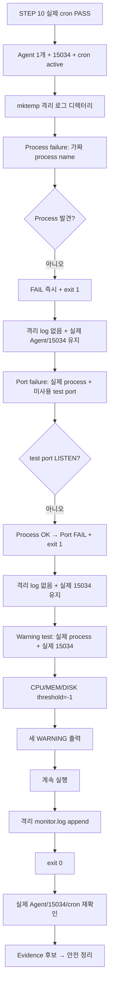

# B1-1 모듈 06 — STEP 11 실패 경로와 경고 전용 경로 검증

> [← STEP 10](01-cron.md) · [모듈 06 목차](README.md) · [다음: 모듈 07 →](../07-verification-evidence/README.md) · [전체 입문자 가이드](../../BEGINNER-GUIDE.md)

<a id="step-11"></a>
## STEP 11 — Health 실패와 Warning-only 분기 격리 검증

## ① 왜 하는가

공식 B1-1은 `monitor.sh`에서 **Agent 프로세스가 없거나 TCP `15034`가 LISTEN 상태가 아니면 `exit 1`로 실패**해야 하고, 반대로 CPU·메모리·Root 디스크 사용률이 임계값을 넘으면 `[WARNING]`만 출력한 뒤 **계속 실행**해야 합니다. 정상 실행만 확인하면 이 두 정책이 실제로 분리되어 있는지 증명하기 어렵습니다.

실제 Agent를 종료하거나 실제 `15034` 소켓을 막고 시험하면 STEP 07~10에서 확보한 정상 Runtime을 손상시킬 수 있습니다. 따라서 이 STEP은 **실제 Agent/15034/cron 상태를 유지한 채, 현재 자식 프로세스에만 환경변수를 재정의(Environment Override)** 하여 실패·경고 분기를 격리 검증합니다.

또한 STEP 10 이후에는 cron이 production `/var/log/agent-app/monitor.log`를 매분 계속 갱신할 수 있으므로, STEP 11의 수동 시험 로그는 `mktemp`로 만든 별도 디렉터리에 기록합니다. 이렇게 해야 cron의 정상 production writer와 수동 분기 시험을 서로 섞지 않고 판정할 수 있습니다.

> 이 STEP은 실제 UFW를 끄지 않습니다. 공식 정책상 Firewall 비활성은 Warning-only이지만, 그 분기를 강제로 확인하려고 정상 방화벽을 비활성화하는 것은 미션 최종 보안 상태를 불필요하게 훼손합니다. Firewall active 상태는 STEP 04/08/10과 통합 검증에서 확인하고, STEP 11의 강제 Warning Runtime 시험은 CPU/MEM/DISK 임계값 분기에 집중합니다.

## ② 무엇을 하는가

1. STEP 10의 **실제 cron Runtime PASS**가 끝났는지 확인하고, Agent 1개·user=`agent-admin`·TCP `15034`·cron active·Runtime monitor 동일성을 다시 확인합니다.
2. 이번 시험 전용 `mktemp` 디렉터리를 `agent-admin` 소유로 생성하여 production 로그와 분리합니다.
3. Process failure 시험 전 `definitely-not-running-b1-1`이라는 가짜 프로세스 이름이 실제로 존재하지 않는지 확인합니다.
4. 실제 Agent는 그대로 둔 채 `AGENT_PROCESS_NAME`만 가짜 값으로 덮어써 `Process Health` 실패를 유도하고 종료 코드가 정확히 `1`인지 확인합니다.
5. Process failure가 자원 수집·로그 append 전에 중단되는 현재 구현과 일치하도록 격리 `monitor.log`가 생성되지 않았는지 확인합니다.
6. 실제 Agent/15034가 그대로 유지되는지 다시 확인합니다.
7. Port failure용 높은 포트 `65534`가 현재 LISTEN 중이 아닌지 먼저 확인합니다. 사용 중이면 임의로 계속하지 않고 다른 미사용 포트를 먼저 찾습니다.
8. 실제 `AGENT_PROCESS_NAME=agent-app`은 유지한 채 `AGENT_PORT`만 미사용 포트로 덮어써 Process는 `[OK]`, Port는 `[FAIL]`, 종료 코드는 `1`인지 확인합니다.
9. Port failure 후에도 격리 로그가 생기지 않았고 실제 Agent/15034가 정상인지 확인합니다.
10. Warning 시험에서는 실제 Process/Port를 유지하고 `CPU_WARN_THRESHOLD`, `MEM_WARN_THRESHOLD`, `DISK_WARN_THRESHOLD`만 이번 자식 프로세스에서 `-1`로 낮춥니다.
11. CPU/MEM/DISK 세 경고가 모두 실제 출력되고, 스크립트가 계속 진행해 격리 `monitor.log`를 공식 포맷으로 append하며 종료 코드가 `0`인지 확인합니다.
12. 모든 시험 뒤 실제 Agent 1개·user=`agent-admin`·TCP `15034`·cron active가 그대로인지 확인합니다.
13. Evidence 후보를 먼저 확보한 뒤 예상 패턴의 임시 `monitor.log*`만 삭제하고 빈 시험 디렉터리를 제거합니다.

## ③ 이번 단계에서 알아야 할 용어

- **실패 경로(Failure Path)** — 정상 조건이 깨졌을 때 의도한 오류 처리로 이동하는 실행 흐름입니다.
- **경고 전용 경로(Warning-only Path)** — 이상 징후를 알리되 프로세스를 실패로 종료하지 않는 흐름입니다.
- **종료 코드(Exit Code)** — 프로그램이 호출자에게 성공/실패를 숫자로 전달하는 값입니다. 현재 공식 Health failure 기준은 `1`, 정상/Warning-only 완료는 `0`입니다.
- **환경변수 재정의(Environment Override)** — 파일을 수정하지 않고 특정 프로세스 실행에서만 기존 환경값을 임시로 바꾸는 방법입니다.
- **격리 시험(Isolated Test)** — 실제 운영 대상이나 로그 대신 별도 안전 경로에서 같은 구현의 분기를 재현하는 시험입니다.
- **시험 픽스처(Test Fixture)** — 특정 분기를 재현하기 위해 준비한 입력·상태입니다. 여기서는 가짜 프로세스 이름, 미사용 포트, 낮춘 임계값이 해당합니다.
- **하드 실패(Hard Failure)** — 뒤 동작을 계속하면 결과를 신뢰할 수 없어 즉시 실패 종료하는 상태입니다.
- **부작용(Side Effect)** — 파일 쓰기, 프로세스 종료, 설정 변경처럼 실행 외부 상태를 바꾸는 동작입니다.

## ④ 필요한 핵심 개념



### 왜 실제 Agent를 멈추지 않는가

```text
좋지 않은 시험
→ 실제 agent-app 종료
→ Process failure 확인
→ 다시 Agent Boot
→ cron/monitor 상태까지 재복구 필요

R01 격리 시험
→ 실제 agent-app은 계속 실행
→ AGENT_PROCESS_NAME만 가짜 값
→ monitor.sh 내부 Process failure 분기만 재현
```

Port도 같은 원리입니다.

```text
실제 15034를 닫지 않음
→ AGENT_PORT만 현재 LISTEN하지 않는 높은 포트로 임시 변경
→ 실제 Agent 서비스 상태는 보존
```

### Warning 시험에서 시스템 자원을 일부러 과부하시키지 않는 이유

실제 CPU를 20% 이상 만들거나 메모리를 10% 이상 소비하거나 디스크를 80% 이상 채우는 방식은 불필요하고 위험합니다. 현재 R01 Reference는 시험을 위해 threshold 값을 환경변수로 덮어쓸 수 있으므로:

```text
실제 CPU/MEM/DISK를 위험하게 올림  X
threshold를 이번 실행에서만 -1로 낮춤 O
```

으로 같은 Warning 분기를 안전하게 재현합니다. `-1`은 **R01 시험용 값**일 뿐 공식 기본 임계값을 변경하는 것이 아닙니다. `env.sh`와 `monitor.sh` 기본값은 그대로 유지합니다.

## ⑤ 실행할 명령어 또는 코드

### 📍 실행 위치(Context)

```text
Host       : OrbStack Ubuntu 24.04 또는 WSL2 Ubuntu 24.04
Terminal A : STEP 07부터 유지 중인 Agent foreground Terminal
Terminal B : Ubuntu Bash — STEP 11 분기 격리 검증
Repository : $HOME/codyssey/codyssey-basic-system-monitor
권한       : 일반 사용자 + 실제 agent-admin 실행/소켓 상세 확인에 필요한 sudo
venv       : 해당 없음
전제       : STEP 10 실제 cron 자동 실행 PASS 완료
```

### A. STEP 10 이후 실제 Runtime Gate 재확인 — 읽기 전용

```bash
cd "$HOME/codyssey/codyssey-basic-system-monitor"
pwd
git branch --show-current
git status --short

AGENT_COUNT="$(pgrep -x agent-app | wc -l)"
printf '[INFO] agent-app count=%s\n' "$AGENT_COUNT"
ps -C agent-app -o user=,uid=,pid=,comm=
sudo ss -lntp | grep ':15034'
sudo systemctl is-active cron

sudo cmp -s training/round-01-clear/monitor.sh /opt/agent-app/bin/monitor.sh \
  && echo '[PASS] Runtime monitor matches Repository Reference' \
  || echo '[STOP] Runtime monitor differs from Repository Reference'
```

정상 기준:

```text
STEP 10 실제 cron 자동 로그 증가 PASS를 이미 확인
agent-app count = 1
user = agent-admin
uid != 0
TCP 15034 LISTEN
cron = active
Runtime monitor = Repository Reference
```

하나라도 다르면 분기 시험으로 강행하지 않습니다. 먼저 해당 이전 STEP의 Runtime을 정상화합니다.

### B. 이번 STEP 전용 격리 로그 디렉터리 생성

```bash
BRANCH_TEST_DIR="$(sudo -u agent-admin mktemp -d /tmp/b1-1-monitor-branches.XXXXXX)"
printf '[INFO] branch test dir=%s\n' "$BRANCH_TEST_DIR"

case "$BRANCH_TEST_DIR" in
    /tmp/b1-1-monitor-branches.*)
        echo '[PASS] isolated branch-test path confirmed'
        ;;
    *)
        echo '[STOP] unexpected test path; do not run branch tests'
        ;;
esac

sudo chown agent-admin:agent-core "$BRANCH_TEST_DIR"
sudo chmod 0770 "$BRANCH_TEST_DIR"
sudo stat -c '%U %G %a %n' "$BRANCH_TEST_DIR"

BRANCH_TEST_LOG="$BRANCH_TEST_DIR/monitor.log"
```

이 경로는 STEP 11 수동 시험 전용입니다. STEP 10에서 등록한 cron은 계속 production `/var/log/agent-app/monitor.log`를 사용할 수 있으므로 두 writer가 서로 다른 로그를 사용하게 됩니다.

### C. Process failure 시험 전 가짜 프로세스 이름 충돌 확인

```bash
FAKE_PROCESS_NAME='definitely-not-running-b1-1'

if pgrep -x "$FAKE_PROCESS_NAME" >/dev/null 2>&1; then
    echo '[STOP] fake process name unexpectedly exists; choose another unique name'
else
    echo '[PASS] fake process name is not running'
fi
```

가짜 이름이 실제로 존재한다면 Process failure가 재현되지 않으므로 다른 고유 문자열로 바꾼 뒤 다시 확인합니다. 실제 `agent-app`은 건드리지 않습니다.

### D. Process failure 실행 — 실제 Agent는 그대로 유지

```bash
if PROCESS_OUTPUT="$(
  sudo -u agent-admin -H env BRANCH_TEST_DIR="$BRANCH_TEST_DIR" /bin/bash -c '
    set +x
    source /opt/agent-app/env.sh
    export AGENT_LOG_DIR="$BRANCH_TEST_DIR"
    export AGENT_PROCESS_NAME="definitely-not-running-b1-1"
    exec /opt/agent-app/bin/monitor.sh
  ' 2>&1
)"; then
    PROCESS_RC=0
else
    PROCESS_RC=$?
fi

printf '%s\n' "$PROCESS_OUTPUT"
printf '[INFO] process_failure_exit=%s\n' "$PROCESS_RC"
```

필수 판정:

```bash
printf '%s\n' "$PROCESS_OUTPUT" \
  | grep -Fq '[FAIL] Agent process not found' \
  && echo '[PASS] process failure message confirmed' \
  || echo '[STOP] expected process failure message missing'

if [ "$PROCESS_RC" -eq 1 ]; then
    echo '[PASS] process health failure exits 1'
else
    echo '[STOP] process health failure did not exit 1'
fi
```

현재 Reference는 Process Health에서 실패하면 자원 수집과 로그 append 전에 종료합니다. 따라서 새 격리 디렉터리에서는 아직 `monitor.log`가 생기지 않아야 합니다.

```bash
sudo test ! -e "$BRANCH_TEST_LOG" \
  && echo '[PASS] process failure stopped before log append' \
  || echo '[STOP] unexpected isolated monitor.log after process failure'
```

### E. Process failure 이후 실제 Agent/15034가 손상되지 않았는지 확인

```bash
pgrep -x agent-app | wc -l
ps -C agent-app -o user=,uid=,pid=,comm=
sudo ss -lntp | grep ':15034'
```

정상 기준은 기존과 동일하게 **1개 / `agent-admin` / TCP 15034 LISTEN**입니다. 이 시험은 실제 Agent를 종료하거나 포트를 닫지 않았어야 합니다.

### F. Port failure용 시험 포트가 실제 미사용인지 확인

기본 후보는 `65534`입니다.

```bash
TEST_PORT=65534

if sudo ss -lnt | awk -v port=":${TEST_PORT}" 'NR > 1 && $4 ~ (port "$" ) {found=1} END {exit !found}'; then
    echo "[STOP] TCP $TEST_PORT is already LISTEN; choose and verify another unused high port"
else
    echo "[PASS] TCP $TEST_PORT is not LISTEN and can be used as the failure fixture"
fi
```

`65534`가 실제로 사용 중이면 그대로 강행하지 않습니다. 예를 들어 `65533`처럼 다른 높은 포트를 선택한 뒤 **같은 `ss` 검사로 먼저 미사용임을 확인**합니다.

### G. Port failure 실행 — Process는 실제 Agent를 사용

```bash
if PORT_OUTPUT="$(
  sudo -u agent-admin -H env BRANCH_TEST_DIR="$BRANCH_TEST_DIR" TEST_PORT="$TEST_PORT" /bin/bash -c '
    set +x
    source /opt/agent-app/env.sh
    export AGENT_LOG_DIR="$BRANCH_TEST_DIR"
    export AGENT_PORT="$TEST_PORT"
    exec /opt/agent-app/bin/monitor.sh
  ' 2>&1
)"; then
    PORT_RC=0
else
    PORT_RC=$?
fi

printf '%s\n' "$PORT_OUTPUT"
printf '[INFO] port_failure_exit=%s\n' "$PORT_RC"
```

Process Health는 실제 `agent-app`을 그대로 사용하므로 먼저 `[OK] Process found`가 나와야 하고 그 다음 시험 포트에서 실패해야 합니다.

```bash
printf '%s\n' "$PORT_OUTPUT" \
  | grep -Fq '[OK] Process found' \
  && echo '[PASS] process health remained OK during port test' \
  || echo '[STOP] process health failed before port branch'

printf '%s\n' "$PORT_OUTPUT" \
  | grep -Fq "[FAIL] TCP ${TEST_PORT} is not LISTEN" \
  && echo '[PASS] port failure message confirmed' \
  || echo '[STOP] expected port failure message missing'

if [ "$PORT_RC" -eq 1 ]; then
    echo '[PASS] port health failure exits 1'
else
    echo '[STOP] port health failure did not exit 1'
fi
```

Port failure도 자원 수집·로그 append 전에 종료하므로, Process 시험과 마찬가지로 격리 로그는 아직 없어야 합니다.

```bash
sudo test ! -e "$BRANCH_TEST_LOG" \
  && echo '[PASS] port failure stopped before log append' \
  || echo '[STOP] unexpected isolated monitor.log after port failure'
```

### H. Port failure 이후 실제 Agent/15034 재확인

```bash
pgrep -x agent-app | wc -l
ps -C agent-app -o user=,uid=,pid=,comm=
sudo ss -lntp | grep ':15034'
```

시험용 `AGENT_PORT` 값은 자식 Bash 안에서만 사용되었으므로 실제 Agent가 LISTEN 중인 `15034`와 `env.sh`의 기본 `AGENT_PORT=15034`는 바뀌지 않아야 합니다.

### I. CPU/MEM/DISK Warning-only 분기 강제 검증

이제 실제 Process와 실제 TCP `15034`가 정상인 상태에서 세 threshold만 이번 실행에서 낮춥니다.

```bash
if WARNING_OUTPUT="$(
  sudo -u agent-admin -H env BRANCH_TEST_DIR="$BRANCH_TEST_DIR" /bin/bash -c '
    set +x
    source /opt/agent-app/env.sh
    export AGENT_LOG_DIR="$BRANCH_TEST_DIR"
    export CPU_WARN_THRESHOLD=-1
    export MEM_WARN_THRESHOLD=-1
    export DISK_WARN_THRESHOLD=-1
    exec /opt/agent-app/bin/monitor.sh
  ' 2>&1
)"; then
    WARNING_RC=0
else
    WARNING_RC=$?
fi

printf '%s\n' "$WARNING_OUTPUT"
printf '[INFO] warning_test_exit=%s\n' "$WARNING_RC"
```

세 자원 경고를 각각 확인합니다. Firewall 관련 Warning은 환경에 따라 별도로 보일 수 있으므로 단순 `[WARNING]` 총 개수가 아니라 **세 threshold 문구를 각각 검사**합니다.

```bash
printf '%s\n' "$WARNING_OUTPUT" | grep -Fq 'CPU threshold exceeded' \
  && echo '[PASS] CPU warning branch' \
  || echo '[STOP] CPU warning missing'

printf '%s\n' "$WARNING_OUTPUT" | grep -Fq 'MEM threshold exceeded' \
  && echo '[PASS] MEM warning branch' \
  || echo '[STOP] MEM warning missing'

printf '%s\n' "$WARNING_OUTPUT" | grep -Fq 'DISK_USED threshold exceeded' \
  && echo '[PASS] DISK warning branch' \
  || echo '[STOP] DISK warning missing'

if [ "$WARNING_RC" -eq 0 ]; then
    echo '[PASS] warning-only path continued and exited 0'
else
    echo '[STOP] warning-only path did not exit 0'
fi
```

### J. Warning 이후 격리 monitor.log append와 공식 포맷 검증

세 Warning이 나와도 스크립트는 계속 실행되어 격리 로그를 만들어야 합니다.

```bash
sudo test -s "$BRANCH_TEST_LOG" \
  && echo '[PASS] warning test appended isolated monitor.log' \
  || echo '[STOP] warning test did not append isolated monitor.log'

sudo tail -n 1 "$BRANCH_TEST_LOG"

sudo tail -n 1 "$BRANCH_TEST_LOG" \
  | grep -Eq '^\[[0-9]{4}-[0-9]{2}-[0-9]{2} [0-9]{2}:[0-9]{2}:[0-9]{2}\] PID:[0-9]+ CPU:[0-9]+([.][0-9]+)?% MEM:[0-9]+([.][0-9]+)?% DISK_USED:[0-9]+([.][0-9]+)?%$' \
  && echo '[PASS] warning test log matches official format' \
  || echo '[STOP] warning test log format mismatch'
```

이 결과가 바로 **Warning은 실패가 아니라 관제 메시지이며 이후 logging까지 계속된다**는 Runtime 증거입니다.

### K. 모든 분기 시험 후 실제 서비스 상태 재확인

```bash
pgrep -x agent-app | wc -l
ps -C agent-app -o user=,uid=,pid=,comm=
sudo ss -lntp | grep ':15034'
sudo systemctl is-active cron
sudo cmp -s training/round-01-clear/monitor.sh /opt/agent-app/bin/monitor.sh \
  && echo '[PASS] Runtime monitor still matches Repository Reference' \
  || echo '[STOP] Runtime monitor drift detected'
```

정상 기준:

```text
agent-app count = 1
user = agent-admin
TCP 15034 LISTEN
cron = active
Runtime monitor = Repository Reference
```

production `/var/log/agent-app/monitor.log`는 STEP 10 cron 때문에 이 STEP 수행 중에도 자연스럽게 증가할 수 있습니다. 따라서 **STEP 11은 production 로그의 Before/After 동일성을 성공 조건으로 사용하지 않습니다.** 수동 분기 시험의 기록은 `BRANCH_TEST_DIR`로 격리합니다.

### L. Evidence 후보 확보 후 격리 파일 안전 정리

정리 전에 시험 로그의 파일명·크기와 마지막 실제 라인을 확인합니다.

```bash
sudo find "$BRANCH_TEST_DIR" -maxdepth 1 -type f -name 'monitor.log*' \
  -printf '%f %s bytes\n' | sort -V
sudo tail -n 1 "$BRANCH_TEST_LOG"
```

필요한 Evidence 후보를 확보한 뒤에만 예상 경로의 `monitor.log*` 파일을 삭제하고 빈 디렉터리를 제거합니다.

```bash
case "$BRANCH_TEST_DIR" in
    /tmp/b1-1-monitor-branches.*)
        sudo find "$BRANCH_TEST_DIR" -mindepth 1 -maxdepth 1 \
          -type f -name 'monitor.log*' -delete
        sudo rmdir "$BRANCH_TEST_DIR"
        ;;
    *)
        echo '[STOP] unexpected branch-test path; nothing deleted'
        ;;
esac
```

`rmdir`이 실패하면 예상하지 않은 파일이 있다는 뜻일 수 있으므로 디렉터리를 `rm -rf`로 통째로 지우지 않습니다. `sudo ls -la "$BRANCH_TEST_DIR"`로 남은 항목부터 확인합니다.

## ⑥ 명령어와 코드에 입문자가 이해할 수 있는 주석

### Runtime Gate

- `pgrep -x agent-app | wc -l`
  - 실제 Agent가 정확히 한 개인지 다시 확인합니다.
- `ps -C agent-app -o user=,uid=,pid=,comm=`
  - 그 프로세스가 여전히 `agent-admin`으로 실행되는지 확인합니다.
- `ss -lntp | grep ':15034'`
  - 실제 서비스 포트가 계속 LISTEN인지 확인합니다.
- `systemctl is-active cron`
  - STEP 10의 cron 자동 실행 기반이 유지되는지 확인합니다.
- `cmp -s`
  - 시험 중 Runtime `monitor.sh`를 직접 수정하지 않았는지 Repository Reference와 비교합니다.

### 격리 디렉터리

- `mktemp -d /tmp/b1-1-monitor-branches.XXXXXX`
  - 각 실행마다 고유한 시험 디렉터리를 만듭니다.
- `sudo -u agent-admin`
  - 실제 monitor 실행 계정이 직접 쓸 수 있는 임시 경로를 만듭니다.
- `chown agent-admin:agent-core`, `chmod 0770`
  - 시험 로그를 core 역할 안에서 관리하고 others 접근을 막습니다.
- `BRANCH_TEST_LOG=.../monitor.log`
  - production `/var/log/agent-app/monitor.log`와 수동 시험 로그를 명시적으로 분리합니다.

### Process failure

- `FAKE_PROCESS_NAME='definitely-not-running-b1-1'`
  - 실제 시스템에 존재하지 않아야 하는 시험 전용 process name입니다.
- `pgrep -x "$FAKE_PROCESS_NAME"`
  - 시험 전에 정말 대상 프로세스가 없는지 확인합니다.
- `export AGENT_PROCESS_NAME=...`
  - `env.sh` 파일을 수정하지 않고 이번 자식 Bash 안에서만 monitor가 찾을 process name을 바꿉니다.
- 실제 `agent-app` 프로세스는 종료하지 않습니다.

### 종료 코드와 출력 보존

- `if OUTPUT="$(command 2>&1)"; then ... else RC=$?; fi`
  - command의 stdout/stderr를 변수에 모으면서 성공/실패 종료 코드를 별도로 저장합니다.
  - 실패가 예상되는 시험을 `|| true`로 뭉개지 않고 실제 `1`을 판정할 수 있습니다.
- `2>&1`
  - stderr도 stdout과 함께 캡처해 `[FAIL]` 메시지를 한 결과에서 확인합니다.
- `printf '%s\n' "$OUTPUT"`
  - 캡처한 비밀값 없는 monitor 시험 출력을 화면에 다시 보여 줍니다.
- Secret 값은 이 출력에 포함시키지 않으며, `env.sh`에도 실제 Secret 값은 없습니다.

### Port failure

- `TEST_PORT=65534`
  - 흔히 미사용인 높은 포트를 기본 후보로 사용하지만 **미사용이라고 가정하지 않고 먼저 `ss`로 검사**합니다.
- `awk -v port=":${TEST_PORT}" ...`
  - `ss -lnt`의 local address가 해당 포트로 끝나는 LISTEN 소켓이 있는지 확인합니다.
- `export AGENT_PORT="$TEST_PORT"`
  - 실제 `15034` 소켓은 건드리지 않고 monitor의 검사 대상 포트만 이번 실행에서 바꿉니다.
- Process name은 바꾸지 않으므로 Port 시험에서 Process Health가 먼저 `[OK]`여야 Port 분기를 제대로 시험한 것입니다.

### Warning-only

- `CPU_WARN_THRESHOLD=-1`
- `MEM_WARN_THRESHOLD=-1`
- `DISK_WARN_THRESHOLD=-1`
  - 실제 자원 사용률은 음수가 될 수 없으므로 현재 구현에서 세 비교가 모두 `value > -1`을 만족해 Warning을 재현합니다.
  - 이 값은 **시험 프로세스에만 적용**되고 공식 기본값 `20/10/80`을 바꾸지 않습니다.
- 세 Warning 문자열을 각각 찾는 이유
  - Firewall Warning이 추가로 나타날 수 있으므로 `[WARNING]`이라는 단어 총 개수만 세면 자원별 분기를 정확히 증명하기 어렵습니다.
- `WARNING_RC=0`
  - Warning이 발생해도 프로그램이 실패 종료하지 않았다는 핵심 판정입니다.
- 격리 `monitor.log` 생성과 고정 포맷
  - 경고 후에도 resource 수집 → logging → 정상 종료까지 계속됐다는 별도 증거입니다.

### Firewall Warning 분기를 강제로 만들지 않는 이유

공식 구현은 Firewall active 상태를 확인하지 못하면 Warning만 출력하고 종료하지 않아야 합니다. 하지만 현재 최종 Runtime의 UFW를 일부러 disable하면 STEP 04의 보안 상태를 깨뜨립니다.

따라서 R01에서는:

```text
Firewall active Runtime 확인
→ STEP 04 / STEP 08 / STEP 10 / verify.sh

Firewall inactive 시 Warning-only 구현 구조 확인
→ Reference source review

강제 Warning Runtime 분기 시험
→ CPU / MEM / DISK threshold override
```

로 책임을 분리합니다. 방화벽을 끈 실제 장애 실험이 공식 제출에 별도로 요구되지 않는 한, 보안 설정을 파괴해서 Warning 하나를 더 얻지 않습니다.

### 정리와 재실행 안전성

```text
Agent / Port / cron / cmp 조회                         → 🟢 SAFE TO RERUN
mktemp 격리 경로 생성                                  → 🟢 새 고유 경로 생성
가짜 process name 존재 여부 확인                       → 🟢 SAFE TO RERUN
Process failure env override 실행                       → 🟡 실제 monitor failure branch 실행
미사용 test port 조회                                  → 🟢 SAFE TO RERUN
Port failure env override 실행                          → 🟡 실제 monitor failure branch 실행
Warning threshold override 실행                         → 🟡 격리 로그 1줄 append
실제 Agent/15034 종료·차단                              → 🚫 사용하지 않음
UFW disable로 Warning 강제                             → 🚫 사용하지 않음
env.sh / monitor.sh 기본값 직접 수정                   → 🚫 사용하지 않음
find -delete / rmdir                                   → 🔴 Evidence 확보 + 정확한 임시 경로 확인 후
```

> **STOP 기준:** STEP 10 실제 cron Runtime PASS 미확인, Agent count가 1이 아님, Agent user가 `agent-admin`이 아님, 실제 TCP 15034 미확인, cron inactive, Runtime monitor와 Reference 불일치, 임시 경로 패턴 이상, 가짜 process name이 실제 존재, Process failure 메시지 누락, Process failure `exit != 1`, Process failure 뒤 격리 log 생성, 실제 Agent/15034 손상, test port가 이미 LISTEN인데 강행, Port 시험에서 Process Health 먼저 실패, Port failure 메시지 누락, Port failure `exit != 1`, Port failure 뒤 격리 log 생성, CPU/MEM/DISK Warning 중 하나라도 누락, Warning test `exit != 0`, Warning 격리 log 미생성/포맷 불일치, 시험 후 실제 Agent/15034/cron 이상 중 하나라도 발생하면 STEP 12로 진행하지 않습니다.

## ⑦ 예상되는 정상 결과

Process failure:

```text
가짜 process name = 실제로 없음
[FAIL] Agent process not found ...
process_failure_exit = 1
격리 monitor.log = 없음
실제 agent-app = 1개 유지
실제 TCP 15034 = LISTEN 유지
```

Port failure:

```text
TEST_PORT = 사전에 미사용 확인
[OK] Process found ...
[FAIL] TCP <TEST_PORT> is not LISTEN
port_failure_exit = 1
격리 monitor.log = 없음
실제 TCP 15034 = LISTEN 유지
```

Warning-only:

```text
Process Health = [OK]
TCP 15034 Health = [OK]
CPU threshold Warning = 확인
MEM threshold Warning = 확인
DISK_USED threshold Warning = 확인
warning_test_exit = 0
격리 monitor.log = 생성됨
마지막 라인 = 공식 고정 포맷
```

전체 시험 후:

```text
agent-app process count = 1
user = agent-admin
TCP 15034 LISTEN
cron = active
Runtime monitor = Repository Reference
```

## ⑧ 그 결과가 의미하는 것

`monitor.sh`가 단순히 정상 환경에서만 동작하는 것이 아니라 **실패와 경고를 서로 다른 운영 정책으로 처리**한다는 것을 실제 Runtime 분기로 증명합니다.

```text
Process 없음
→ 서비스 자체를 신뢰할 수 없음
→ 즉시 exit 1
→ 이후 logging 없음

Process 정상 + Port 없음
→ 서비스가 요청을 받을 준비가 아님
→ 즉시 exit 1
→ 이후 logging 없음

Process + Port 정상 + 자원 임계값 초과
→ 서비스는 살아 있음
→ WARNING
→ 자원 측정/로그 기록 계속
→ exit 0
```

그리고 이 세 시험을 실제 Agent 종료, 실제 `15034` 차단, UFW 비활성화 없이 수행하므로 **시험 때문에 정상 Runtime을 망가뜨리지 않는 검증 구조**가 됩니다.

## ⑨ 자주 발생하는 오류와 해결 방법

- Process 시험이 `exit=0` → 가짜 이름이 실제 존재하는지 `pgrep -x`부터 확인. `monitor.sh`를 수정하기 전에 fixture가 정말 실패 조건인지 확인.
- Process 시험에서 격리 `monitor.log`가 생김 → 시험 디렉터리가 새 경로가 맞는지, 이전 Warning 시험 로그가 남아 있는지 확인. 시험 순서를 Process → Port → Warning으로 유지.
- Port `65534`가 이미 LISTEN → 다른 높은 포트를 선택하고 동일한 `ss` 검사로 미사용을 먼저 확인. 점유 프로세스를 죽여 자리를 만들지 않음.
- Port 시험에서 `Process not found`가 먼저 발생 → 실제 Agent가 사라졌거나 `AGENT_PROCESS_NAME`이 이전 Shell에서 잘못 유지된 것인지 확인. 각 시험은 독립 child shell이므로 outer shell의 불필요한 export를 만들지 않음.
- Port 시험 `exit=0` → 실제 `TEST_PORT`가 LISTEN인지 재확인하고 command output을 확인. 임의로 다른 오류를 숨기지 않음.
- Warning 시험에서 CPU Warning만 없음 → `WARNING_OUTPUT` 원문과 현재 설치본/Reference 동일성 확인. 실제 CPU를 억지로 올리지 않음.
- Warning 시험에서 `exit=1` → Warning 분기 전에 Process/Port Health가 실패했을 가능성이 큼. 첫 `[FAIL]`, 실제 Agent, 실제 15034를 먼저 확인.
- Warning은 3개인데 격리 로그가 없음 → log dir write 권한과 `BRANCH_TEST_DIR` 전달을 확인. Root로 monitor 실행해 우회하지 않음.
- Firewall `[WARNING]`이 함께 보임 → 자원 Warning 시험의 실패가 아님. STEP 04의 UFW 실제 상태와 현재 Reference firewall 판정을 별도로 조사하되, UFW를 끄거나 광범위 NOPASSWD sudo를 추가하지 않음.
- production `monitor.log`가 시험 중 바뀜 → STEP 10 cron이 active라면 자연스러운 변화일 수 있음. STEP 11의 수동 시험 로그는 격리 경로로 판정하므로 production mtime 변화만으로 실패 처리하지 않음.
- cleanup `rmdir` 실패 → 예상하지 않은 파일이 남았는지 `ls -la`로 확인. `rm -rf`로 강제 삭제하지 않음.
- 시험 중 실제 Agent가 사라짐 → STEP 12 금지. Terminal A와 STEP 07으로 돌아가 실제 Agent Runtime부터 복구.

## ⑩ 완료 확인

- [ ] STEP 10 실제 cron 자동 실행 Runtime PASS를 이미 확인
- [ ] Agent process count=1 / user=`agent-admin` / TCP 15034 정상
- [ ] cron service active
- [ ] Runtime monitor = Repository Reference
- [ ] `mktemp -d /tmp/b1-1-monitor-branches.XXXXXX` 사용
- [ ] 임시 경로 owner=`agent-admin`, group=`agent-core`, mode=`770`
- [ ] fake process name 실제 미존재 확인
- [ ] 실제 Agent를 종료하지 않고 Process failure 재현
- [ ] Process failure `[FAIL]` 확인
- [ ] Process failure `exit=1`
- [ ] Process failure 뒤 격리 monitor.log 없음
- [ ] Process 시험 후 실제 Agent/15034 유지
- [ ] Port test candidate가 실제 미사용인지 사전 확인
- [ ] 실제 15034를 닫지 않고 Port failure 재현
- [ ] Port 시험에서 Process Health `[OK]`
- [ ] Port failure `[FAIL]` 확인
- [ ] Port failure `exit=1`
- [ ] Port failure 뒤 격리 monitor.log 없음
- [ ] Port 시험 후 실제 Agent/15034 유지
- [ ] CPU threshold Warning 확인
- [ ] MEM threshold Warning 확인
- [ ] DISK_USED threshold Warning 확인
- [ ] Warning test `exit=0`
- [ ] Warning 이후 격리 monitor.log 실제 append
- [ ] Warning test 로그 마지막 라인 공식 포맷
- [ ] UFW를 일부러 disable하지 않음
- [ ] `env.sh` / `monitor.sh` 공식 기본값을 수정하지 않음
- [ ] 모든 시험 후 Agent process count=1 유지
- [ ] 모든 시험 후 user=`agent-admin` 유지
- [ ] 모든 시험 후 TCP 15034 LISTEN 유지
- [ ] 모든 시험 후 cron active 유지
- [ ] Runtime monitor와 Reference 동일성 유지
- [ ] Evidence 후보 확보 후 예상 임시 로그만 안전 정리
- [ ] **실제 세 분기 시험을 실행하기 전에는 STEP 11 Runtime PASS로 기록하지 않음**

---

## 다음 이동

[← STEP 10](01-cron.md) · [모듈 06 목차](README.md) · [다음: 모듈 07 →](../07-verification-evidence/README.md) · [전체 입문자 가이드](../../BEGINNER-GUIDE.md)
