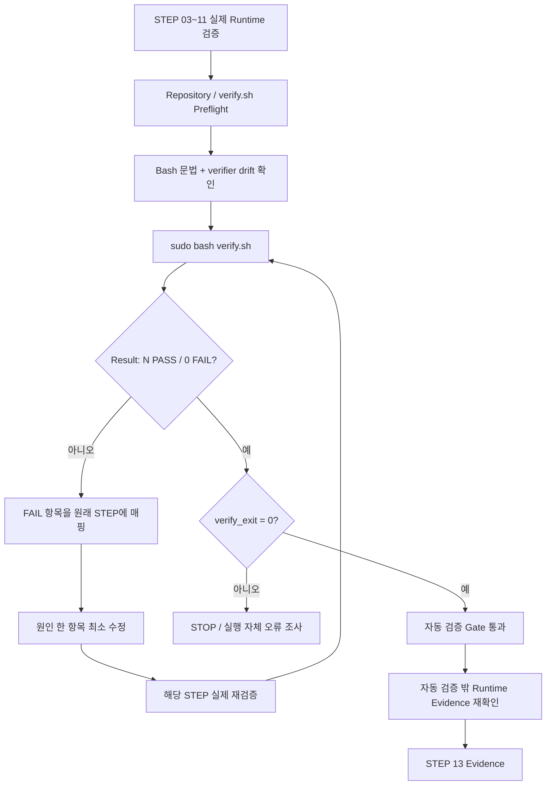

# B1-1 모듈 07 — STEP 12 통합 검증(Integrated Verification)

> [← 모듈 07 목차](README.md) · [다음: STEP 13 →](02-evidence.md) · [전체 입문자 가이드](../../BEGINNER-GUIDE.md)

<a id="step-12"></a>
## STEP 12 — 통합 `verify.sh` 검증(Verification)

## ① 왜 하는가

STEP 03~11에서는 SSH, UFW, 사용자·그룹·ACL, Agent, `monitor.sh`, 로그 회전, cron, 실패·Warning 분기를 각각 실제 Runtime 관점에서 나누어 검증합니다. 마지막에는 이 설정들이 서로 모순 없이 **동시에 현재 시스템에 남아 있는지** 한 번에 다시 확인해야 누락과 회귀를 줄일 수 있습니다.

R01의 `environment/verify.sh`는 이 목적의 **통합 자동 검증 스크립트(Integrated Verification Script)** 입니다. SSH 최종 적용 설정, UFW 정책, 역할별 유효 접근, non-secret 환경변수, Secret 파일의 메타데이터, `monitor.sh` 설치 정책, Agent/포트, 현재 로그 형식·개수, cron 등록, Git Secret-pattern 추적 여부를 `[PASS]`/`[FAIL]`로 모아서 확인합니다.

다만 `verify.sh`가 `0 FAIL`이라고 해서 B1-1 전체가 자동으로 CLEAR가 되는 것은 아닙니다. 공식 평가에는 실제 새 SSH 세션, Agent Boot Sequence 5단계 `[OK]`와 `Agent READY`, 실제 cron 자동 로그 증가, 10MB/10개 회전 동작, 실패/Warning 분기, 설명형 평가와 Evidence처럼 **이 스크립트 하나만으로 재현할 수 없는 항목**도 포함됩니다. 공식 Evaluation도 설정·Runtime·증빙·설명까지 함께 요구합니다.

> STEP 12의 성공 의미는 **“현재 `verify.sh`가 자동으로 확인하도록 설계된 항목에서 0 FAIL”**입니다. STEP 03~11의 실제 Runtime Evidence를 대체하지 않으며, STEP 13 Evidence와 STEP 14 Evaluation Q&A가 끝나기 전에는 B1-1을 CLEAR로 기록하지 않습니다.

## ② 무엇을 하는가

1. STEP 11까지 필요한 실제 Runtime 검증을 완료했는지 먼저 확인합니다.
2. B1-1 Repository root, 현재 Branch, working tree를 확인합니다.
3. 현재 실행할 `verify.sh`가 Repository의 추적 파일이며, 로컬/스테이징 변경으로 검증 기준 자체가 임의 수정되지 않았는지 확인합니다.
4. `verify.sh`의 Bash shebang과 문법을 실행 전에 정적으로 확인합니다.
5. `sudo bash .../verify.sh`를 실행하되 모든 `[PASS]`/`[FAIL]` 출력을 그대로 확인하고 실제 종료 코드를 보존합니다.
6. 최종 `Result: N PASS / 0 FAIL`과 `verify_exit=0`을 모두 확인합니다. `N`은 스크립트가 발전하면 달라질 수 있으므로 고정 숫자로 외우지 않습니다.
7. `[FAIL]`이 하나라도 있거나 종료 코드가 0이 아니면 STEP 13으로 넘어가지 않고, 실패 항목을 소유한 원래 STEP으로 돌아가 원인 하나만 수정합니다.
8. `verify.sh`의 자동 검증 범위와 **자동 검증 밖의 Runtime/Evidence 항목**을 구분합니다.
9. 실패를 없애기 위해 실제 시스템 대신 `verify.sh`의 판정문이나 출력만 수정하지 않습니다.
10. Secret은 이 STEP에서도 값 자체를 읽거나 출력하지 않습니다.

## ③ 이번 단계에서 알아야 할 용어

- **통합 검증(Integrated Verification)** — 여러 개별 설정을 하나의 검증 흐름에서 다시 확인해 현재 전체 상태의 일관성을 점검하는 과정입니다.
- **자동 검증 범위(Automated Verification Scope)** — 스크립트가 명령과 종료 코드로 직접 판정할 수 있도록 구현된 범위입니다.
- **유효 접근(Effective Access)** — 파일의 mode/ACL 모양이 아니라 실제 사용자 신분으로 최종 읽기·쓰기·실행이 가능한 상태입니다.
- **종료 코드(Exit Code)** — 프로그램이 호출자에게 성공 또는 실패 상태를 숫자로 전달하는 값입니다. 현재 `verify.sh`는 FAIL이 0개일 때만 `0`으로 끝납니다.
- **검증 기준선(Verification Baseline)** — 무엇을 PASS/FAIL로 판단할지 정한 현재 Repository의 기준 스크립트·공식 요구사항입니다.
- **검증 범위 밖 항목(Out-of-scope for Automated Verification)** — 자동 스크립트만으로는 현재 실제 수행 여부를 충분히 증명할 수 없어 별도 Runtime 관찰이나 Evidence가 필요한 항목입니다.
- **회귀(Regression)** — 이전 단계에서 정상으로 만들었던 상태가 이후 변경 때문에 다시 깨지는 현상입니다.
- **거짓 통과(False Pass)** — 실제 요구사항은 충족하지 않았는데 검사 기준이나 증거 해석이 잘못되어 PASS로 기록하는 상태입니다.

## ④ 필요한 핵심 개념



### `verify.sh`가 확인하는 것과 확인하지 못하는 것

현재 R01 `verify.sh`의 실제 소스를 기준으로 범위를 구분합니다.

| 구분 | 현재 `verify.sh`가 자동 확인 | 별도 STEP/Evidence가 필요한 부분 |
|---|---|---|
| SSH | `sshd -T`의 `port 20022`, `PermitRootLogin no`, TCP 20022 LISTEN | STEP 03의 **별도 macOS Terminal 실제 새 SSH 세션** |
| UFW | active, default deny incoming, 20022/15034 ALLOW, 추가 ALLOW IN 없음 | STEP 04 적용 후 실제 SSH 연결 유지 |
| 사용자/그룹 | 사용자·그룹 존재와 mission membership | 기존 계정 충돌 여부를 판단한 STEP 05 체크포인트 |
| 권한 | `runuser` 기반 공유/보안 디렉터리 유효 접근 | ACL 구조·Default ACL의 상세 Evidence |
| 환경/Secret | non-secret `env.sh` 값, Secret 존재·non-empty·owner/group/mode | Secret **실제 값은 읽지 않음**; STEP 07 Boot 동작으로 적합성 확인 |
| `monitor.sh` | owner/group/mode, Bash 문법, admin 실행 가능, test 읽기 차단 | STEP 08 정상 실행 `monitor_exit=0`과 실제 콘솔 Health/Resource 출력 |
| Agent | 프로세스 존재, non-root 여부, TCP 15034 LISTEN | STEP 07의 Boot 5/5, `Agent READY`, R01 user=`agent-admin`, 공식 `0.0.0.0:15034` 바인드 |
| 로그 | production `monitor.log` non-empty, 최신 라인 포맷 | STEP 08 실제 append 시점 연결 |
| 로그 보존 | 현재 `monitor.log*` 파일 수 `<=10` | STEP 09의 정확한 10MB 경계, `.1~.9` 이동, old `.9` 제거 동작 |
| cron | `agent-admin` crontab에 매분 `monitor.sh` 항목 존재 | STEP 10의 cron service active + **1~2분 실제 자동 로그 증가** |
| 실패/Warning | 통합 스크립트가 직접 재실행하지 않음 | STEP 11 Process/Port `exit 1`, CPU/MEM/DISK Warning-only `exit 0` |
| Secret 추적 | Git 추적 파일명에서 `.env`, `*.key`, `*.pem`, `secrets/` 패턴 검사 | 값 자체 검색·출력 금지; 실제 Evidence에 민감정보가 없는지도 별도 확인 |
| 평가 설명 | 자동 확인하지 않음 | STEP 14 Evaluation Q&A |
| Evidence 완결성 | 자동 확인하지 않음 | STEP 13 Evidence + STEP 15 CLEAR Gate |

따라서:

```text
verify.sh 0 FAIL
≠
B1-1 CLEAR

verify.sh 0 FAIL
+
STEP 03~11 실제 Runtime PASS
+
필수 Evidence
+
Evaluation 설명 가능
=
STEP 15 CLEAR 판단 후보
```

## ⑤ 실행할 명령어 또는 코드

### 📍 실행 위치(Context)

```text
Host       : OrbStack Ubuntu 24.04 또는 WSL2 Ubuntu 24.04
Terminal A : STEP 07부터 유지 중인 Agent foreground Terminal
Terminal B : Ubuntu Bash — 통합 검증 실행
Repository : $HOME/codyssey/codyssey-basic-system-monitor
권한       : 일반 사용자 + verify.sh 실행에서 sudo
venv       : 해당 없음
전제       : STEP 11 실제 Runtime 분기 검증까지 PASS
```

### A. Repository와 `verify.sh` 실행 전 점검(Preflight)

```bash
cd "$HOME/codyssey/codyssey-basic-system-monitor"
pwd
git branch --show-current
git status --short

VERIFY_SCRIPT="training/round-01-clear/environment/verify.sh"

test -f "$VERIFY_SCRIPT" \
  && echo '[PASS] verify.sh exists' \
  || echo '[STOP] verify.sh missing'

head -n 1 "$VERIFY_SCRIPT"

grep -qx '#!/usr/bin/env bash' "$VERIFY_SCRIPT" \
  && echo '[PASS] verify.sh Bash shebang confirmed' \
  || echo '[STOP] unexpected verify.sh shebang'

bash -n "$VERIFY_SCRIPT" \
  && echo '[PASS] verify.sh Bash syntax' \
  || echo '[STOP] verify.sh Bash syntax failed'
```

여기까지는 실제 시스템 설정을 변경하지 않는 정적 확인입니다.

### B. 검증 기준 스크립트의 로컬 변경 여부 확인

현재 `main` 기준 `verify.sh`에 working-tree 또는 staged 변경이 있는지 확인합니다.

```bash
if git diff --quiet -- "$VERIFY_SCRIPT" \
   && git diff --cached --quiet -- "$VERIFY_SCRIPT"; then
    echo '[PASS] verify.sh has no local or staged drift'
else
    echo '[STOP] verify.sh differs from the current checked-out Git baseline'
fi
```

`git status --short`에 다른 파일 변경이 있더라도 그 변경의 출처를 모르면 먼저 확인합니다. 특히 `verify.sh` 자체가 임의 수정된 상태라면 **그 수정본으로 시스템을 PASS 판정하지 않습니다.**

> `git reset --hard`, `git checkout --`, `git clean`으로 변경을 무조건 지우지 않습니다. 변경 이유를 확인하고 현재 R01 기준과 일치하는 검증 스크립트를 사용합니다.

### C. 통합 `verify.sh` 실제 실행

A/B가 정상이고 STEP 11까지 실제 Runtime PASS가 확인된 상태에서 실행합니다.

```bash
if sudo bash "$VERIFY_SCRIPT"; then
    VERIFY_RC=0
else
    VERIFY_RC=$?
fi

printf '[INFO] verify_exit=%s\n' "$VERIFY_RC"
```

실행 중 출력되는 `[PASS]`와 `[FAIL]`을 숨기거나 `grep`으로 PASS만 추려 보지 않습니다.

현재 `verify.sh`는 개별 검사 실패를 `FAIL` 카운터에 누적하고 마지막에:

```text
Result: <PASS개수> PASS / <FAIL개수> FAIL
```

을 출력합니다. 그리고 FAIL이 `0`일 때만 종료 코드 `0`을 반환하도록 구현되어 있습니다.

### D. 최종 판정

필수 성공 조건은 둘 다입니다.

```text
Result: N PASS / 0 FAIL
verify_exit=0
```

`N`은 현재 스크립트의 검사 항목 수에 따라 달라질 수 있으므로 특정 숫자를 문서에 하드코딩하지 않습니다.

아래 중 하나라도 발생하면 STOP입니다.

```text
[FAIL] 한 개 이상
Result의 FAIL > 0
verify_exit != 0
sudo/명령 자체 오류
검증 중 Secret 실제 값이 예상치 않게 화면에 노출됨
```

### E. FAIL을 원래 STEP으로 되돌려 진단

`verify.sh` 자체를 먼저 수정하지 않고 실패 문자열을 다음 소유 STEP에 매핑합니다.

| `verify.sh` 실패 범주 | 먼저 돌아갈 STEP |
|---|---|
| command missing | STEP 02 |
| SSH effective port / PermitRootLogin / TCP 20022 | STEP 03 |
| UFW active/default/rule/extra ALLOW | STEP 04 |
| user/group/membership/directory/effective access | STEP 05 |
| `env.sh` / Secret 존재·owner·group·mode | STEP 06 |
| Agent process / non-root / TCP 15034 | STEP 07 |
| `monitor.sh` owner/group/mode/syntax/access, `monitor.log` 포맷 | STEP 08 |
| monitor log file count | STEP 09 |
| `agent-admin` cron entry | STEP 10 |
| Process/Port failure 또는 Warning-only 동작 | STEP 11에서 별도 실제 검증 |
| tracked Secret-pattern file | 해당 Git 추적 경로의 **파일명/용도만** 먼저 확인 후 Secret 정책에 따라 최소 수정 |

예를 들어 UFW FAIL이 났다고 `verify.sh`에서 UFW 검사를 삭제하거나, Agent user 관련 FAIL이 났다고 PASS 문자열을 바꾸면 안 됩니다. **실제 Runtime 상태가 공식 Mission/R01 의도와 다른 것인지 먼저 확인**합니다.

반대로 `verify.sh`의 판정 조건 자체가 공식 Mission/Evaluation과 충돌한다고 의심되면 시스템을 억지로 바꾸지 않습니다. 공식 Source of Truth와 현재 검증 코드를 다시 비교한 뒤 verifier 자체의 문제인지 판정합니다.

### F. 자동 검증 Gate 통과 후 남은 항목 확인

`0 FAIL` 이후에도 STEP 13으로 넘어가기 전에 다음 실제 수행이 이미 끝났는지 확인합니다.

```text
STEP 03  실제 새 Mission SSH 세션
STEP 07  Boot Sequence 5/5 + Agent READY + 공식 bind
STEP 08  monitor 정상 실행 + exit 0 + 실제 append
STEP 09  10MB / 10개 실제 격리 회전
STEP 10  cron 1~2분 자동 monitor.log 증가
STEP 11  Process/Port failure exit 1 + Warning-only exit 0
```

하나라도 실제로 실행하지 않았다면:

```text
verify.sh = 0 FAIL
Documentation = 준비됨
하지만 해당 Runtime Evidence = 미완료
→ STEP 13으로 강행하지 않고 빠진 Runtime STEP 수행
```

입니다.

## ⑥ 명령어와 코드에 입문자가 이해할 수 있는 주석

### Repository / verifier Preflight

- `cd "$HOME/codyssey/codyssey-basic-system-monitor"`
  - B1-1 Repository root로 이동하여 다른 clone이나 Host 공유 경로의 verifier를 실행하는 실수를 줄입니다.
- `pwd`
  - 실제 현재 작업 디렉터리를 확인합니다.
- `git branch --show-current`
  - 현재 체크아웃한 Branch를 확인합니다.
- `git status --short`
  - 로컬 수정·추가·삭제가 있는지 확인합니다. 예상 밖 변경을 자동 삭제하지 않습니다.
- `VERIFY_SCRIPT=".../verify.sh"`
  - 이후 모든 검사와 실행이 같은 verifier 파일을 가리키도록 경로를 변수로 고정합니다.
- `test -f "$VERIFY_SCRIPT"`
  - 검증 스크립트가 실제 일반 파일로 존재하는지 확인합니다.
- `head -n 1`
  - 첫 줄의 shebang을 눈으로 확인합니다.
- `grep -qx '#!/usr/bin/env bash'`
  - `-q`는 일치 내용을 출력하지 않고 종료 코드만 사용하고, `-x`는 줄 전체가 Bash shebang과 정확히 같은지 확인합니다.
- `bash -n "$VERIFY_SCRIPT"`
  - `verify.sh`의 검사 로직을 실제 수행하지 않고 Bash 문법만 검사합니다.

### verifier drift 확인

- `git diff --quiet -- "$VERIFY_SCRIPT"`
  - 현재 working tree의 `verify.sh`가 Git 기준본과 다른지 종료 코드로 확인합니다.
- `git diff --cached --quiet -- "$VERIFY_SCRIPT"`
  - staging area에 올라간 `verify.sh` 변경도 별도로 확인합니다.
- `&&`
  - 두 검사 모두 성공할 때만 “local/staged drift 없음”으로 판정합니다.
- 이 검사는 파일을 원복하지 않습니다. 단지 현재 검증 기준이 Git 기준본과 같은지 읽습니다.

### 실제 통합 검증 실행

- `sudo bash "$VERIFY_SCRIPT"`
  - `verify.sh`를 Bash로 실행합니다.
  - `sudo`가 필요한 이유는 `/etc/ssh`의 최종 적용 설정, UFW 상태, 다른 Mission 사용자 신분의 `runuser` 접근 시험, 시스템 경로의 파일 메타데이터처럼 일반 사용자만으로는 충분히 확인하기 어려운 항목이 있기 때문입니다.
  - `sudo`는 이 verifier에서 **설정을 변경하기 위한 권한이 아니라 시스템 수준 상태를 읽고 사용자별 접근을 시험하기 위한 권한**입니다.
- `if ...; then ... else ... fi`
  - verifier 성공/실패를 숨기지 않고 실제 종료 코드를 변수에 보존합니다.
- `VERIFY_RC=$?`
  - 실패한 `sudo bash verify.sh`의 종료 코드를 바로 저장합니다.
- `printf '[INFO] verify_exit=%s\n' ...`
  - 자동 검증 최종 종료 코드를 명시적으로 보여 줍니다.
- `|| true`를 verifier 전체 뒤에 붙이지 않습니다.
  - 그렇게 하면 실제 실패 종료 코드를 성공처럼 바꿔 버릴 수 있기 때문입니다.

### 현재 `verify.sh` 내부의 주요 읽기 검사

현재 구현은 다음 계열의 명령을 사용합니다.

```text
sshd -T
ufw status verbose
id / getent
runuser ... test
grep
stat
pgrep / ps
ss
tail
find
crontab -l
git ls-files
```

이들은 현재 상태·파일명·메타데이터·유효 접근을 확인합니다. `verify.sh`는 SSH/UFW/사용자/그룹/cron을 생성·수정·삭제하지 않고 `monitor.sh`도 실행하지 않습니다.

Secret 파일은:

```text
존재하는가?
비어 있지 않은가?
owner/group/mode가 맞는가?
```

만 확인하고 실제 Secret 내용은 읽어 출력하지 않습니다.

### `Result`와 종료 코드

현재 verifier는 각 성공에서 `PASS`를, 각 실패에서 `FAIL`을 증가시킵니다.
마지막의 의미는 다음과 같습니다.

```text
FAIL = 0
→ Result: N PASS / 0 FAIL
→ verifier exit 0

FAIL > 0
→ Result: ... / N FAIL
→ verifier non-zero exit
```

따라서 화면의 마지막 Summary와 Shell의 실제 종료 코드를 함께 확인하면, 단순히 중간 `[PASS]` 몇 줄만 보고 통과로 오판하는 것을 줄일 수 있습니다.

### 재실행 안전성

STEP 12의 `verify.sh` 자체는 시스템 설정을 변경하지 않는 검증 전용 스크립트이므로 **🟢 SAFE TO RERUN**입니다.

```text
pwd / git / test / head / grep / bash -n             → 🟢 SAFE TO RERUN
git diff --quiet                                      → 🟢 SAFE TO RERUN
sudo bash verify.sh                                   → 🟢 검증 전용, 시스템 설정 변경 없음
Result / exit code 확인                               → 🟢 SAFE TO RERUN
FAIL 원인 확인용 해당 STEP 조회 명령                 → 🟢/🟡/🔴 해당 STEP 기준 따름
FAIL을 고치기 위한 시스템 변경                       → 이 STEP에서 즉흥 수행하지 않음
```

STEP 10 cron이 이미 active라면 `verify.sh`와 무관하게 production `monitor.log`가 매분 자연스럽게 증가할 수 있습니다. 이것은 verifier가 로그를 쓴 것이 아닙니다.

> **STOP 기준:** STEP 11 실제 Runtime PASS 미확인, Repository/Branch가 예상과 다름, `verify.sh` missing, local/staged verifier drift의 출처 불명, Bash 문법 실패, 예상하지 않은 shebang, `sudo bash verify.sh` 실행 오류, `[FAIL]` 1개 이상, `Result` FAIL > 0, `verify_exit != 0`, 검증 중 민감정보 노출, verifier 판정과 공식 Source of Truth의 모순 의심 중 하나라도 있으면 STEP 13으로 진행하지 않습니다.

## ⑦ 예상되는 정상 결과

실제 숫자는 검사 항목 수에 따라 달라질 수 있습니다.

```text
[PASS] ...
[PASS] ...
...
Result: N PASS / 0 FAIL
[INFO] verify_exit=0
```

그리고 화면 전체에서 숨겨진 FAIL이 없어야 합니다.

`verify.sh`는 `set -u`를 사용하지만 개별 검사 실패를 즉시 중단시키는 방식이 아니라 FAIL을 누적하여 마지막 Summary까지 보여 주도록 작성되어 있으므로, **실패 항목이 있다면 먼저 그 항목을 모두 읽고 원래 STEP에 연결**합니다.

## ⑧ 그 결과가 의미하는 것

`Result: N PASS / 0 FAIL`과 `verify_exit=0`이 함께 확인되면 **현재 시점의 자동 검증 가능 범위**에서 B1-1 환경이 일관된 상태라는 강한 확인 신호가 됩니다.

하지만 의미를 넘겨 해석하면 안 됩니다.

```text
통합 자동 검증 PASS
= STEP 12 Verification Gate 후보

통합 자동 검증 PASS
≠ Boot Evidence
≠ 실제 새 SSH 접속 Evidence
≠ cron 자동 증가 Evidence
≠ 10MB/10개 실제 회전 Evidence
≠ 실패/Warning 분기 Evidence
≠ 설명형 평가 PASS
≠ B1-1 CLEAR
```

따라서 STEP 12 뒤의 올바른 흐름은:

```text
STEP 12  verify 0 FAIL
    ↓
STEP 13  실제 Evidence 정리
    ↓
STEP 14  Evaluation Q&A
    ↓
STEP 15  공식 Mission + Evaluation + Runtime + Evidence 종합 CLEAR Gate
```

입니다.

## ⑨ 자주 발생하는 오류와 해결 방법

- `verify.sh missing` → 다른 파일을 임의로 대신 실행하지 말고 현재 Branch/Repository와 Git 상태를 확인합니다.
- `bash -n` FAIL → Runtime 설정을 바꾸지 말고 verifier 자체의 문법 오류를 먼저 해결한 뒤 다시 정적 검증합니다.
- local/staged verifier drift → `reset --hard`부터 하지 말고 왜 바뀌었는지 확인합니다. 현재 R01 기준 변경인지 미완성 로컬 수정인지 구분합니다.
- `command missing` → STEP 02의 Common Base/Mission Package 분류로 돌아갑니다.
- SSH FAIL → STEP 03 effective config와 20022 LISTEN부터 다시 확인합니다. 새 SSH 연결 성공은 별도 Evidence로 유지합니다.
- UFW FAIL → STEP 04 규칙과 기본 정책을 확인합니다. UFW를 `reset`하여 통과시키지 않습니다.
- user/group/effective access FAIL → STEP 05 `id → stat → getfacl → runuser test` 순서로 최소 원인을 찾습니다.
- env/Secret FAIL → STEP 06 경로·owner/group/mode를 확인합니다. Secret 값을 `cat`하여 비교하지 않습니다.
- Agent/TCP FAIL → STEP 07 Terminal A와 Process/Port를 정상화합니다. Root 실행이나 출처 불명 PID 강제 종료로 우회하지 않습니다.
- monitor/log FAIL → STEP 08 Reference/Runtime 동일성, 권한, 실제 로그 포맷을 확인합니다.
- log count FAIL → STEP 09 회전 정책과 현재 production 로그 세대를 확인합니다. 실제 로그를 무작정 삭제해 개수만 줄이지 않습니다.
- cron entry FAIL → STEP 10 exact/related count와 기존 crontab 체크포인트를 확인합니다. 같은 줄을 반복 추가하지 않습니다.
- tracked Secret-pattern file FAIL → `git ls-files`에 나타난 **경로와 파일명**부터 확인하고 실제 민감정보 파일이면 추적 제거·Secret 교체 여부를 안전하게 판단합니다. 내용을 화면에 출력하지 않습니다.
- 중간에 PASS가 많고 FAIL 하나만 있음 → 전체 PASS가 아닙니다. 마지막 `0 FAIL` 전까지 STEP 13으로 가지 않습니다.
- `verify_exit=0`인데 과거 STEP 실제 Runtime을 하지 않음 → 자동 검증 범위만 통과한 것입니다. 빠진 STEP의 실제 Runtime을 수행한 뒤 Evidence를 만듭니다.
- verifier가 공식 요구보다 더 강하거나 다른 조건을 요구한다고 의심됨 → 시스템을 그 조건에 억지로 맞추기 전에 공식 Mission/Evaluation과 verifier 코드를 다시 비교합니다.
- Secret 또는 민감정보가 터미널에 예상치 않게 보임 → 해당 화면을 Evidence로 사용하지 않고 노출 경로를 먼저 제거합니다.

## ⑩ 완료 확인

- [ ] STEP 11 실제 Runtime 분기 검증까지 완료
- [ ] B1-1 Repository root 확인
- [ ] 현재 Branch / working tree 확인
- [ ] `verify.sh` 존재
- [ ] Bash shebang 확인
- [ ] `bash -n verify.sh` PASS
- [ ] `verify.sh` local/staged drift 없음 또는 변경 출처를 명확히 이해함
- [ ] `sudo bash verify.sh` 실제 실행
- [ ] 모든 `[PASS]`/`[FAIL]` 출력을 숨기지 않고 확인
- [ ] `Result: N PASS / 0 FAIL`
- [ ] `verify_exit=0`
- [ ] FAIL을 verifier 출력 수정으로 숨기지 않음
- [ ] Secret 실제 값을 읽거나 출력하지 않음
- [ ] STEP 03 새 SSH 세션 Evidence가 별도로 존재
- [ ] STEP 07 Boot 5/5 / Agent READY / 공식 bind Evidence가 별도로 존재
- [ ] STEP 09 10MB/10개 실제 회전 Evidence가 별도로 존재
- [ ] STEP 10 cron 1~2분 자동 증가 Evidence가 별도로 존재
- [ ] STEP 11 실패/Warning 분기 Evidence가 별도로 존재
- [ ] 자동 검증 PASS와 B1-1 CLEAR를 구분함
- [ ] **실제 `verify.sh` 실행 전에는 Verification PASS로 기록하지 않음**
- [ ] **STEP 13 Evidence 정리 전에는 Mission CLEAR로 기록하지 않음**

---

[← 모듈 07 목차](README.md) · [다음: STEP 13 →](02-evidence.md) · [전체 입문자 가이드](../../BEGINNER-GUIDE.md)
