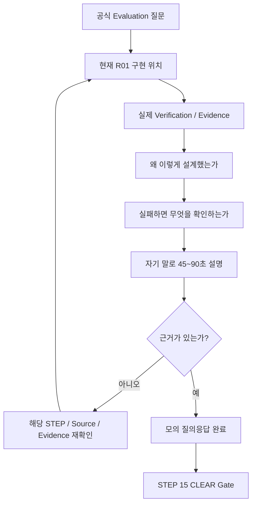

# B1-1 모듈 07 — STEP 14 평가 질의응답(Evaluation Q&A)

> [← STEP 13](02-evidence.md) · [모듈 07 목차](README.md) · [다음: 모듈 08 →](../08-final-clear/README.md)

<a id="step-14"></a>
## STEP 14 — 평가 질의응답(Evaluation Q&A) 학습·모의 설명

## ① 왜 하는가

공식 B1-1 평가는 설정이 존재하고 프로그램이 동작하는지만 확인하지 않습니다. **왜 그렇게 구현했는지, 어떤 명령으로 확인했는지, 장애가 발생하면 어떤 순서로 진단할지 자기 말로 설명할 수 있는지**도 평가합니다.

STEP 03~13에서 실제 실행 환경(Runtime), 검증(Verification), 증빙 자료(Evidence)를 준비했다면 STEP 14에서는 그 결과를 평가 질문과 연결합니다. 목표는 기준 답안을 외우는 것이 아니라 다음 네 요소를 한 답변 안에서 연결하는 것입니다.

```text
공식 요구사항
→ 현재 R01의 실제 구현
→ 실제 검증/Evidence
→ 설계 이유 또는 장애 대응
```

`docs/evaluation-qa.md`는 설명을 준비하기 위한 **기준 답안(Reference Answer)** 입니다. 실제 자신의 환경에서 확인하지 않은 PID, 시간, 상태, 성공 결과를 만들어 내는 자료가 아닙니다.

> STEP 14의 성공 의미는 **공식 Evaluation의 설명형 항목을 현재 R01 구현과 실제 Evidence를 근거로 자기 말로 설명할 수 있는 상태**입니다. 아직 실제 Runtime/Evidence가 없다면 답안 연습은 할 수 있지만 평가 준비 완료로 표시하지 않습니다.

## ② 무엇을 하는가

1. 공식 `b1-1-evaluation.md`를 다시 읽어 평가 항목 1~4의 범위를 확인합니다.
2. `docs/evaluation-qa.md`의 기준 답안을 읽되 그대로 암기하지 않습니다.
3. 평가 항목 2~4의 공식 설명형 질문 11개를 현재 R01 구현과 연결합니다.
4. 방화벽, 유효 접근, `verify.sh`처럼 평가 답변을 보강하는 추가 질문 3개도 함께 연습합니다.
5. 각 질문에 **요구사항 → 구현 → 검증/Evidence → 이유/장애 대응** 순서로 답합니다.
6. 실제 PID·시간·로그 수치처럼 실행마다 달라지는 값은 자신의 현재 Evidence를 보고 설명합니다.
7. 답변 중 모르는 부분이 나오면 기준 답안을 더 꾸며 말하지 않고 해당 STEP 또는 실제 소스 코드로 돌아가 확인합니다.
8. Secret, Password, API Key, Token, Private Key 값은 평가 설명에서도 말하거나 화면에 보여 주지 않습니다.
9. 내부 모의평가 점수는 학습용으로만 사용하고 공식 평가 점수나 통과 기준으로 오해하지 않습니다.
10. 공식 설명형 질문 전부를 근거와 함께 설명할 수 있을 때 STEP 15 CLEAR Gate로 이동합니다.

## ③ 이번 단계에서 알아야 할 용어

- **설명형 평가(Explanation-based Evaluation)** — 결과뿐 아니라 구현 이유, 명령 선택, 운영 원리, 장애 대응을 말로 설명하는 평가입니다.
- **근거 기반 답변(Evidence-grounded Answer)** — 추측이나 암기가 아니라 실제 코드·설정·명령 출력·Evidence를 근거로 하는 답변입니다.
- **위협 모델(Threat Model)** — 무엇을 보호하고 어떤 공격 또는 오용을 줄이려는지 구조적으로 설명하는 관점입니다.
- **최소 권한(Least Privilege)** — 사용자와 프로세스에 업무 수행에 필요한 최소 권한만 부여하는 원칙입니다.
- **오탐(False Positive)** — 실제 대상이 아닌데도 조건에 걸려 정상 대상처럼 잘못 판정하는 현상입니다.
- **상태 점검 실패(Health Failure)** — 핵심 서비스가 정상 제공되지 않아 성공으로 계속 처리하면 안 되는 상태입니다.
- **경고 전용(Warning-only)** — 이상 징후는 알리지만 관제를 계속 수행하여 상태와 추세를 기록하는 처리 방식입니다.
- **파싱(Parsing)** — 명령 출력에서 필요한 값을 규칙에 따라 추출해 프로그램이 사용할 수 있는 형태로 만드는 과정입니다.
- **로그 회전(Log Rotation)** — 로그가 무한히 커지지 않도록 크기·개수·기간 기준으로 이전 로그를 순환 보존하는 방식입니다.
- **장애 대응(Incident Response)** — 장애를 확인하고 영향을 줄이며 원인을 찾아 복구·재발 방지로 이어가는 절차입니다.

## ④ 필요한 핵심 개념



### 평가 답변의 기본 4층 구조

모든 질문을 기계적으로 같은 문장으로 말할 필요는 없지만, 다음 네 층을 의식하면 답변이 단순 암기에서 실제 엔지니어링 설명으로 바뀝니다.

```text
1층 — 요구사항
무엇을 만족해야 하는가?

2층 — 구현
현재 R01에서는 어떤 파일·사용자·그룹·명령·정책으로 구현했는가?

3층 — 검증/Evidence
실제로 어떤 명령과 결과로 확인했는가?

4층 — 이유/대응
왜 그 방식을 선택했고, 실패하면 어떤 순서로 진단하는가?
```

### 공식 Evaluation과 `evaluation-qa.md` 연결

| 공식 평가 | 공식 질문 핵심 | 기준 답안 연결 | 반드시 자신의 결과와 연결할 부분 |
|---|---|---|---|
| 항목 1 | SSH/UFW/계정/Agent/monitor/log/cron/회전 실제 동작 | Q1~Q14 전반 | STEP 13 실제 Evidence |
| 항목 2-1 | `pgrep`/`ps`, `ss` 선택 이유 | Q5 | 실제 Process/PID, TCP 15034 확인 방식 |
| 항목 2-2 | CPU/MEM/DISK 추출·파싱, 로그 포맷 | Q6 | 현재 `monitor.sh`와 실제 로그 한 줄 |
| 항목 2-3 | `agent-dev` 소유, `agent-admin` 실행, cron 권한 | Q4 | 실제 owner/group/mode와 그룹 membership |
| 항목 2-4 | 10MB/10개 로그 관리 | Q9 | STEP 09 실제 회전 결과 |
| 항목 3-1 | SSH 포트/Root 차단의 위협 모델 | Q1 | STEP 03 실제 effective config와 새 연결 |
| 항목 3-2 | `agent-core` 제한과 최소 권한 | Q3, Q13 | 실제 ACL/effective access |
| 항목 3-3 | Health Failure와 Warning 분리 | Q7 | STEP 11 실제 exit code와 Warning 결과 |
| 항목 3-4 | `>`와 `>>` 차이 | Q8 | `monitor.log` append 구현 |
| 항목 4-1 | Nginx 등 다른 서비스로 확장 | Q11 | Process/Port/Log/Threshold의 변경 지점 |
| 항목 4-2 | Process는 있으나 Port가 없음 | Q10 | 실제 진단 순서와 `ss` 사용 |
| 항목 4-3 | 로그 폭증·Disk Full 위험 대응 | Q12 | 단기/중기 대응과 Evidence 보존 |
| 보강 | 20022/15034만 허용하는 이유 | Q2 | STEP 04 실제 UFW 정책 |
| 보강 | `ls -l` 외 실제 사용자 접근 검사 이유 | Q13 | `runuser ... test` 결과 |
| 보강 | `verify.sh`가 sudo지만 검증 전용인 이유 | Q14 | STEP 12의 읽기 전용 검증 범위 |

공식 질문의 문구와 판단 기준은 `b1-1-evaluation.md`가 우선합니다. `evaluation-qa.md`는 이를 설명하기 위한 R01 학습 보조 자료입니다.

## ⑤ 실행할 명령어 또는 코드

### 📍 실행 위치(Context)

```text
Host       : OrbStack Ubuntu 24.04 또는 WSL2 Ubuntu 24.04
Terminal   : Ubuntu Bash
Repository : $HOME/codyssey/codyssey-basic-system-monitor
권한       : 일반 사용자
venv       : 해당 없음
전제       : STEP 13의 실제 Evidence가 준비되어 있으면 가장 좋음
```

STEP 14 자체는 시스템 설정을 변경하지 않습니다. 평가 문서·기준 답안·현재 구현·Evidence를 읽고 연결하는 단계입니다.

### A. Repository와 학습 자료 확인

```bash
cd "$HOME/codyssey/codyssey-basic-system-monitor"
pwd
git branch --show-current
git status --short

EVAL_FILE="b1-1-evaluation.md"
QA_FILE="training/round-01-clear/docs/evaluation-qa.md"
MAP_FILE="training/round-01-clear/docs/requirements-mapping.md"
EVIDENCE_DIR="training/round-01-clear/evidence"

test -f "$EVAL_FILE" && echo '[PASS] official evaluation markdown exists' || echo '[STOP] evaluation markdown missing'
test -f "$QA_FILE" && echo '[PASS] evaluation Q&A reference exists' || echo '[STOP] evaluation Q&A reference missing'
test -f "$MAP_FILE" && echo '[PASS] requirement mapping exists' || echo '[STOP] requirement mapping missing'
test -d "$EVIDENCE_DIR" && echo '[PASS] evidence directory exists' || echo '[STOP] evidence directory missing'
```

`git status --short`에 예상하지 않은 변경이 있으면 없애지 말고 출처를 먼저 확인합니다. STEP 14는 학습 단계이므로 working tree를 정리한다는 이유로 `git reset --hard` 또는 `git clean`을 사용하지 않습니다.

### B. 공식 Evaluation 다시 읽기

```bash
sed -n '1,260p' "$EVAL_FILE"
```

먼저 공식 평가 질문을 그대로 읽습니다. 기준 답안을 먼저 보면 질문보다 답안 문구를 외우기 쉬우므로 **공식 Evaluation → 기준 답안** 순서를 권장합니다.

### C. R01 기준 답안 읽기

```bash
sed -n '1,320p' "$QA_FILE"
```

읽으면서 다음 세 종류를 구분합니다.

```text
고정 원리
→ 최소 권한, Process와 Port의 차이, >와 >> 차이 등

현재 R01 구현
→ /opt/agent-app, canonical agent-app, UFW, 자체 log rotation 등

실행마다 달라지는 값
→ PID, 시간, 실제 CPU/MEM, 실제 로그 크기/시각 등
```

실행마다 달라지는 값은 기준 답안에서 만들어 내지 않고 자신의 Evidence를 사용합니다.

### D. Requirement Mapping으로 답변 근거 위치 확인

```bash
sed -n '1,260p' "$MAP_FILE"
```

각 질문을 읽을 때 `R01~R22` 중 어떤 요구사항·검증·Evidence와 연결되는지 확인합니다.

### E. 공식 설명형 질문 11개 모의 답변

각 질문은 먼저 **자료를 보지 않고 45~90초 정도 자기 말로 설명**한 뒤, 막힌 부분만 공식 Evaluation·현재 소스·기준 답안·Evidence로 확인합니다.

#### 질문 1 — Process와 Port 확인 명령

```text
왜 Process 식별에 pgrep/ps를 사용했고,
Port 확인에 ss를 사용했는가?
```

반드시 포함할 핵심:

```text
pgrep -x → 정확한 process name 식별 / 오탐 감소
ps       → PID의 실행 사용자와 CPU/MEM 확인
ss       → 실제 TCP socket LISTEN 상태 확인
Process 존재와 Port LISTEN은 서로 다른 상태
```

#### 질문 2 — CPU/MEM/DISK와 로그 포맷

```text
CPU, MEM, Root Disk 사용률을 어디서 어떻게 읽고,
왜 로그 포맷을 고정했는가?
```

반드시 포함할 핵심:

```text
Agent PID → ps의 %CPU / %MEM
Root filesystem → df -P /
필요한 필드 → awk 등으로 parsing
고정 로그 포맷 → 시간순 비교, 자동 parsing, 장애 추적에 유리
```

#### 질문 3 — 소유자와 실행자 분리

```text
왜 monitor.sh owner는 agent-dev이고
cron 실행자는 agent-admin인가?
```

반드시 포함할 핵심:

```text
작성/관리 책임과 운영 실행 책임 분리
agent-dev:agent-core + 750
agent-admin은 agent-core 소속이므로 read/execute
agent-test는 접근 차단
```

#### 질문 4 — 10MB / 10개 로그 회전

```text
현재 monitor.sh는 10MB / 10개 정책을 어떻게 구현하고
어떻게 안전하게 검증했는가?
```

반드시 포함할 핵심:

```text
active monitor.log 포함 총 10개
rotation은 .1 ~ .9
가장 오래된 세대 제거 → 뒤로 이동 → active를 .1 → 새 active
운영 로그 대신 STEP 09 격리 디렉터리에서 실제 동작 검증
```

#### 질문 5 — SSH 보안의 위협 모델

```text
SSH를 20022로 옮기고 Root 원격 로그인을 막는 것이
왜 보안에 도움이 되는가?
```

반드시 포함할 핵심:

```text
포트 변경만으로 강한 보안 완성은 아님
자동화된 기본 22 스캔/공격 노출을 줄이는 보조 효과
Root 직접 원격 인증 차단이 더 중요한 통제
일반 사용자 → 필요한 작업만 sudo → 최소 권한/감사 추적
```

#### 질문 6 — `agent-core`와 최소 권한

```text
왜 api_keys와 log 디렉터리는 agent-core에만 허용했는가?
```

반드시 포함할 핵심:

```text
agent-common = admin/dev/test 공유 영역
agent-core   = admin/dev 운영 핵심 영역
agent-test는 upload에는 접근하지만 Secret/log 핵심 영역은 차단
mode/ACL뿐 아니라 runuser 기반 실제 접근으로 검증
```

#### 질문 7 — 실패와 Warning의 차이

```text
왜 Process/Port 실패는 exit 1이고
Firewall/자원 임계값은 Warning-only인가?
```

반드시 포함할 핵심:

```text
Process/Port 없음 → 핵심 서비스 Health Failure
→ 정상 관제로 기록하면 안 됨 → exit 1

Firewall 상태 또는 자원 임계값 → 운영 위험 신호
→ 경고를 남기되 관제를 계속하여 추세/후속 상태 기록
```

#### 질문 8 — `>`와 `>>`

```text
`>`와 `>>`의 차이는 무엇이며
monitor.log에는 왜 `>>`가 필요한가?
```

반드시 포함할 핵심:

```text
>  = 새 출력으로 덮어씀
>> = 기존 파일 뒤에 추가
monitoring history는 누적되어야 하므로 >> 사용
```

#### 질문 9 — Nginx로 확장

```text
Agent 대신 Nginx를 관제한다면 무엇을 바꾸는가?
```

반드시 포함할 핵심:

```text
Process 식별 기준
Service Port
필요한 Log 경로
서비스 특성에 맞는 Threshold

Process → Port → Resource → Warning → Log 구조는 재사용 가능
```

#### 질문 10 — Process는 있는데 Port가 없음

```text
Process는 살아 있는데 TCP Port가 LISTEN하지 않으면
어떤 순서로 확인하는가?
```

권장 진단 순서:

```text
1. pgrep -x / ps로 실제 대상 Process인지 확인
2. Agent 시작 출력에서 Boot/bind 오류 확인
3. ss -lntp로 target port 점유/미바인드 확인
4. AGENT_PORT 확인
5. bind address가 localhost 등에 제한됐는지 확인
6. 원인을 수정한 뒤 정상 종료/재기동
7. 마지막으로 Firewall 외부 접근 정책 확인
```

Firewall은 애플리케이션의 LISTEN socket 자체를 만들어 주지 않는다는 점을 설명할 수 있어야 합니다.

#### 질문 11 — 로그 폭증과 Disk Full 위험

```text
로그가 급격히 증가해 Disk가 가득 찰 위험이 있다면
단기와 중기 대응을 어떻게 나누는가?
```

반드시 포함할 핵심:

```text
단기
→ 증가 원인/오류 확인
→ 장애 분석에 필요한 Evidence 보존
→ 회전/압축/안전한 공간 확보
→ 서비스 영향 완화

중기
→ log level/보존기간/회전기준 재검토
→ Disk monitoring threshold/alert 개선
→ 반복 원인 수정
```

무조건 `rm -rf`로 로그를 지우는 것을 장애 대응으로 설명하지 않습니다.

### F. 보강 질문 3개

공식 설명형 질문을 더 안정적으로 답하기 위해 다음도 자기 말로 설명합니다.

```text
12. 왜 UFW는 20022/tcp와 15034/tcp만 ALLOW IN으로 남겼는가?
13. 왜 ls -l/getfacl만 보지 않고 runuser로 실제 사용자 접근을 다시 검사하는가?
14. 왜 verify.sh는 sudo로 실행하면서도 검증 전용이라고 할 수 있는가?
```

기준 답안은 각각 `evaluation-qa.md`의 Q2, Q13, Q14에 연결됩니다.

### G. 실제 Evidence를 답변에 연결

STEP 13 실제 Evidence가 존재하는 경우 각 답변 끝에 다음처럼 **근거 위치를 말로 연결**합니다.

```text
“이 부분은 STEP 03의 SSH effective config와 실제 20022 새 세션에서 확인했습니다.”
“권한은 stat/getfacl뿐 아니라 agent-test 신분의 test -r/-w 결과로 확인했습니다.”
“로그 회전은 운영 로그를 직접 키우지 않고 STEP 09 격리 시험에서 .1~.9 이동을 확인했습니다.”
```

정확한 Evidence 파일명이 아직 정해지지 않았거나 실제 파일이 없다면 파일명을 만들어 말하지 않습니다. **실제 존재하는 Evidence만 지칭합니다.**

### H. 내부 모의평가 — 공식 점수 아님

공식 평가표에 없는 R01 학습용 자체 점검입니다. 공식 통과 점수로 사용하지 않습니다.

11개 공식 설명형 질문마다 다음처럼 스스로 판정합니다.

```text
0점 → 설명하지 못함
1점 → 원리 또는 기준 답안은 말하지만 자신의 구현/Evidence와 연결하지 못함
2점 → 원리 + 현재 구현 + 실제 검증/Evidence + 필요한 장애 대응까지 설명 가능
```

목표는 총점 숫자보다 **11개 질문 모두 2점 상태**입니다.

```text
11개 × 2점 = 22점
```

이 `22점`은 R01 내부 학습 지표이며 Codyssey 공식 Evaluation 점수가 아닙니다.

### I. 모르는 질문이 발견되었을 때

막힌 질문은 다음 순서로 해결합니다.

```text
공식 b1-1-evaluation.md 질문 재확인
        ↓
해당 STEP의 실제 구현/명령 확인
        ↓
monitor.sh / verify.sh / 설정 파일 확인
        ↓
STEP 13 실제 Evidence 확인
        ↓
evaluation-qa.md 기준 설명과 비교
        ↓
자기 말로 다시 답변
```

기준 답안을 더 길게 외우는 것으로 해결하지 않습니다.

## ⑥ 명령어와 코드에 입문자가 이해할 수 있는 주석

### Repository 확인 명령

- `cd "$HOME/codyssey/codyssey-basic-system-monitor"`
  - 현재 B1-1 Repository root로 이동합니다.
- `pwd`
  - 실제 작업 위치가 예상 Repository인지 확인합니다.
- `git branch --show-current`
  - 현재 학습 기준 Branch를 확인합니다.
- `git status --short`
  - 현재 working tree 변경을 확인합니다. 읽기 명령이며 파일을 삭제하지 않습니다.

### 학습 자료 경로 변수

- `EVAL_FILE=...`
  - 공식 Markdown Evaluation 경로를 한 번 지정하여 이후 같은 파일을 읽습니다.
- `QA_FILE=...`
  - R01 평가 설명 기준 답안 경로입니다.
- `MAP_FILE=...`
  - Requirement와 구현·검증·Evidence의 연결표입니다.
- `EVIDENCE_DIR=...`
  - 실제 R01 Evidence가 위치하는 기본 디렉터리입니다.

### `test -f` / `test -d`

- `test -f 파일`
  - 대상이 실제 일반 파일로 존재하는지 확인합니다.
- `test -d 디렉터리`
  - 대상 디렉터리가 존재하는지 확인합니다.
- `&&`
  - 앞의 확인이 성공하면 `[PASS]`를 출력합니다.
- `||`
  - 앞의 확인이 실패하면 `[STOP]`을 출력합니다.

이 명령은 파일 내용을 바꾸지 않습니다.

### `sed -n '1,260p'`

- `sed`
  - 텍스트를 처리하는 명령입니다.
- `-n`
  - 기본 자동 출력을 끕니다.
- `'1,260p'`
  - 1~260번째 줄만 출력합니다.
- 파일 수정 옵션을 사용하지 않으므로 현재 명령은 **읽기 전용**입니다.

`evaluation-qa.md`는 현재 길이에 맞춰 `1,320p`를 사용하지만 문서가 더 길어지면 필요한 범위를 늘려 읽을 수 있습니다.

### 재실행 안전성

```text
pwd / git branch / git status                         → 🟢 SAFE TO RERUN
파일·디렉터리 test                                    → 🟢 SAFE TO RERUN
sed로 Evaluation/Q&A/Mapping 읽기                     → 🟢 SAFE TO RERUN
Evidence 파일 읽기                                    → 🟡 Secret 없는 검토 자료인지 먼저 확인
기준 답안의 예상값을 실제 Evidence처럼 작성           → 🚫 금지
Secret/Password/API Key/Token 값을 답변·화면에 노출    → 🚫 금지
git reset --hard / git clean으로 학습 전 변경 제거     → 🚫 STEP 14에서 사용하지 않음
```

> **STOP 기준:** 공식 Evaluation과 기준 답안이 서로 다르게 보임, 실제 구현과 기준 답안이 다름, STEP 13 Evidence가 없는데 실제 수행한 것처럼 말하려 함, 설명 중 Secret 값이 필요하다고 판단함 중 하나라도 있으면 추측으로 답을 완성하지 않습니다. 공식 Source of Truth와 해당 STEP을 다시 확인합니다.

## ⑦ 예상되는 정상 결과

STEP 14가 실제로 완료되면 최소한 다음과 같은 설명 흐름이 자연스럽게 나와야 합니다.

```text
질문을 들음
→ 공식 요구사항을 한 문장으로 요약
→ 현재 R01 구현 위치/방법 설명
→ 실제 확인 명령 또는 Evidence 설명
→ 왜 그 방식을 선택했는지 설명
→ 장애 질문이면 진단/복구 순서 설명
```

좋은 답변은 길기보다 **요구사항과 자신의 실제 구현이 정확하게 연결된 답변**입니다.

예를 들어 Process/Port 질문에서 단순히:

```text
“pgrep와 ss를 사용합니다.”
```

로 끝내지 않고 다음 논리를 자기 말로 설명할 수 있어야 합니다.

```text
Process와 socket LISTEN은 다른 상태이므로 둘 다 확인한다.
pgrep -x로 정확한 process name을 찾고,
ps로 PID의 사용자/자원 상태를 확인하며,
ss로 TCP 15034 LISTEN을 별도로 검증한다.
실제 STEP 07/08/11 결과와 연결한다.
```

이 문장은 **설명 구조 예시**이며 실제 Runtime Evidence를 대신하지 않습니다.

## ⑧ 그 결과가 의미하는 것

STEP 14를 통과하면 다음 세 계층이 연결됩니다.

```text
구현할 수 있음
+
실제로 검증할 수 있음
+
왜 그렇게 했는지 설명할 수 있음
```

이 상태는 단순 명령 복사보다 실제 운영 엔지니어링 학습에 가깝습니다.

그러나 STEP 14는 시스템 설정을 새로 검증하는 단계가 아닙니다. 실제 Runtime PASS, STEP 12 `0 FAIL`, STEP 13 Evidence가 없는데 설명만 잘한다고 B1-1을 CLEAR로 판정하지 않습니다.

```text
Evaluation Q&A 준비 완료
≠
Mission CLEAR
```

다음 STEP 15에서 공식 Mission + Evaluation + 실제 Runtime + Verification + Evidence + Secret 정책을 마지막으로 함께 확인합니다.

## ⑨ 자주 발생하는 오류와 해결 방법

- 기준 답안을 문장 그대로 암기함 → 답안마다 자신의 `monitor.sh`, 그룹 구조, 실제 Evidence를 하나 이상 연결합니다.
- 공식 질문보다 Reference 답안을 우선함 → 항상 `b1-1-evaluation.md` 질문을 먼저 읽고 Reference는 보조 설명으로 사용합니다.
- `pgrep`과 `ps`의 역할을 같은 것으로 설명함 → `pgrep`는 PID 탐색, `ps`는 해당 PID의 사용자/CPU/MEM 등 상태 확인으로 구분합니다.
- Process가 있으면 Port도 자동으로 열린다고 설명함 → Process와 socket LISTEN은 별도 상태이며 `ss`로 독립 확인합니다.
- SSH 포트 변경이 강력한 보안의 전부라고 설명함 → 포트 변경은 보조 통제이고 Root 원격 로그인 차단·Firewall·최소 권한과 함께 설명합니다.
- `chmod 750`만 맞으면 최소 권한이 완성됐다고 설명함 → 그룹 membership, 상위 디렉터리 traverse, ACL mask, 실제 `runuser` 접근까지 연결합니다.
- Firewall inactive를 무조건 `exit 1`이라고 답함 → 공식 요구에서는 Warning-only입니다. Process/Port Health Failure와 구분합니다.
- CPU/MEM/DISK Warning 발생 시 monitor를 종료한다고 답함 → 공식 요구는 Warning을 출력하고 계속 실행하는 것입니다.
- `>`와 `>>`를 반대로 설명함 → `>` 덮어쓰기, `>>` append를 실제 `monitor.log` 누적과 연결합니다.
- 로그 회전을 “10개의 백업 + active”라고 설명함 → 현재 R01 구현은 active 포함 총 10개이며 `.1~.9`를 유지합니다.
- Nginx 확장에서 프로세스 이름만 바꾼다고 답함 → Port, Log, Threshold도 서비스 특성에 맞춰 검토합니다.
- Process는 있는데 Port가 없을 때 Firewall부터 설정함 → 먼저 Boot/bind/Port 점유/환경변수/bind address를 확인합니다.
- Disk Full 대응으로 로그 전체 삭제만 제시함 → 분석 Evidence 보존, 단기 공간 확보, 회전/압축, 중기 원인·보존정책 개선으로 나눕니다.
- `verify.sh 0 FAIL`만으로 CLEAR라고 답함 → 실제 Boot, 새 SSH session, cron 증가, 회전, 실패/Warning, Evidence는 별도 Gate입니다.
- 실제 Evidence가 없는데 “확인했습니다”라고 말함 → “문서상 준비됨 / 실제 실행은 아직 미완료”처럼 현재 상태를 정확히 말합니다.
- Secret 값을 알아야 답할 수 있다고 생각함 → Secret의 값은 평가 답변에 필요하지 않습니다. 존재·권한과 Agent Boot 동작만 설명합니다.

## ⑩ 완료 확인

### 공식 구현·동작 항목 연결

- [ ] Evaluation 항목 1의 SSH/UFW/계정·그룹/Agent/monitor/log/cron/rotation을 실제 Evidence와 연결해 설명 가능

### 공식 항목 2 — 구현 방식 및 명령어 설명

- [ ] `pgrep -x`/`ps`/`ss`의 역할과 선택 이유 설명 가능
- [ ] CPU/MEM/DISK 수집·파싱 방식 설명 가능
- [ ] 공식 로그 포맷을 고정한 이유 설명 가능
- [ ] `agent-dev` owner / `agent-admin` executor / `agent-core` 권한 구조 설명 가능
- [ ] cron 실행 권한이 성립하는 이유 설명 가능
- [ ] 10MB/10개 로그 회전 구현과 실제 검증 방식 설명 가능

### 공식 항목 3 — 보안·권한·운영 원리 설명

- [ ] SSH 20022와 Root 원격 로그인 차단을 위협 모델 관점에서 설명 가능
- [ ] `agent-core` 제한을 최소 권한 원칙으로 설명 가능
- [ ] mode/ACL와 실제 유효 접근 검증의 차이를 설명 가능
- [ ] Process/Port Health Failure와 Firewall/자원 Warning-only의 차이를 설명 가능
- [ ] `>`와 `>>`의 차이와 로그 누적에 `>>`가 필요한 이유 설명 가능

### 공식 항목 4 — 응용 및 장애 대응

- [ ] Nginx 등 다른 서비스로 확장할 때 Process/Port/Log/Threshold 변경점을 설명 가능
- [ ] Process가 있지만 Port가 없을 때의 진단 순서를 설명 가능
- [ ] 로그 폭증/Disk Full 위험의 단기 대응과 중기 대응을 설명 가능

### 보강 및 진실성 Gate

- [ ] 20022/15034만 인바운드 허용하는 이유 설명 가능
- [ ] `runuser` 기반 실제 권한 검증 이유 설명 가능
- [ ] `verify.sh`가 sudo로 실행되지만 검증 전용인 이유 설명 가능
- [ ] 기준 답안과 자신의 실제 Runtime 결과를 구분함
- [ ] 실제 PID/시간/수치를 만들어 말하지 않음
- [ ] Secret 값을 말하거나 화면에 출력하지 않음
- [ ] 11개 공식 설명형 질문을 모두 자신의 구현/Evidence와 연결해 설명 가능
- [ ] 내부 0/1/2점 점검을 공식 평가 점수로 오해하지 않음
- [ ] **실제 Evidence가 없으면 Evaluation 준비 완료로 기록하지 않음**
- [ ] **STEP 15 CLEAR Gate 전에는 B1-1을 CLEAR로 기록하지 않음**

---

[← STEP 13](02-evidence.md) · [모듈 07 목차](README.md) · [다음: 모듈 08 →](../08-final-clear/README.md)
