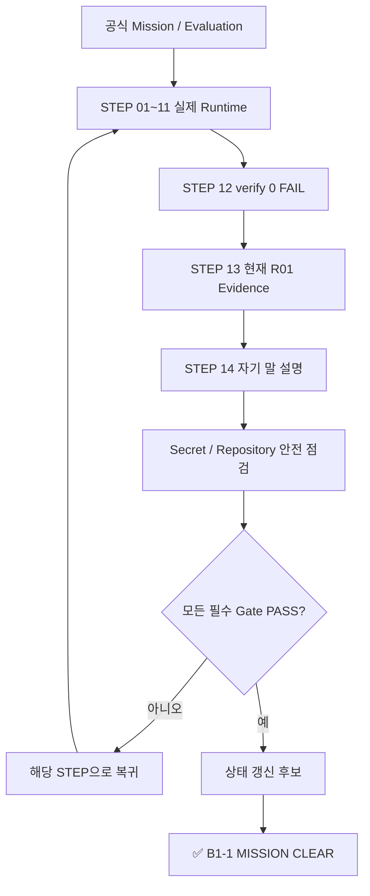

# B1-1 모듈 08 — STEP 15 최종 완료(CLEAR) 판정

> [← 모듈 07](../07-verification-evidence/README.md) · [모듈 08 목차](README.md) · [전체 입문자 가이드](../../BEGINNER-GUIDE.md)

<a id="step-15"></a>
## STEP 15 — B1-1 최종 미션 완료(CLEAR) Gate

## ① 왜 하는가

B1-1의 마지막 단계는 파일이 존재하는지 확인하는 단계가 아니라, **공식 요구사항·실제 실행 환경(Runtime)·검증(Verification)·증빙 자료(Evidence)·설명형 평가·Secret 안전성**이 현재 R01에서 동시에 성립하는지 최종 판정하는 단계입니다.

Reference Build가 완성되어 있고 `verify.sh`가 준비되어 있어도 실제 Ubuntu에서 SSH, UFW, 사용자·그룹·권한, Agent, `monitor.sh`, 로그 회전, cron을 실행하지 않았다면 CLEAR가 아닙니다. 반대로 실제 동작을 한 적이 있더라도 현재 R01 Evidence가 없거나 공식 Evaluation의 설명형 항목을 설명할 수 없다면 역시 CLEAR로 판정하지 않습니다.

> STEP 15는 새로운 기능을 만드는 단계가 아닙니다. STEP 01~14에서 실제로 수행한 결과를 **공식 Source of Truth 기준으로 마지막 교차검증**하고, 모든 Gate가 PASS일 때만 상태를 `✅ B1-1 MISSION CLEAR`로 변경합니다.

## ② 무엇을 하는가

1. 현재 B1-1 Repository, Branch, Commit과 working tree를 확인합니다.
2. 공식 `b1-1-mission.pdf`, `b1-1-mission.md`, `b1-1-evaluation.md`, `agent-app.zip`이 현재 Repository에 있는지 확인합니다.
3. `CHECKLIST.md`의 C Runtime, D Evaluation, E Evidence, F Final CLEAR Gate를 위에서 아래로 다시 확인합니다.
4. STEP 12의 `verify.sh`를 현재 Runtime에서 다시 실행하고 `Result: N PASS / 0 FAIL`과 실제 종료 코드 `0`을 함께 확인합니다.
5. `verify.sh` 하나로 증명할 수 없는 실제 Runtime 항목을 STEP 03~11 Evidence에서 다시 확인합니다.
6. STEP 13의 Evidence가 현재 R01 실행 결과인지, Requirement R01~R22와 연결되는지 확인합니다.
7. STEP 14의 공식 설명형 질문을 자신의 실제 구현과 Evidence를 근거로 설명할 수 있는지 확인합니다.
8. Secret-pattern 파일이 Git 추적 대상에 들어가지 않았는지 **파일명/경로만** 확인하고, Evidence에도 민감정보가 없는지 수동 검토합니다.
9. 필수 항목과 보너스 항목을 구분합니다. 보너스 미수행은 필수 CLEAR 실패 사유로 만들지 않습니다.
10. 하나라도 미확인·FAIL·Evidence 누락이면 CLEAR 표시를 하지 않고 해당 STEP으로 돌아갑니다.
11. 모든 Gate가 실제 PASS인 경우에만 `CHECKLIST.md`, Runtime 상태 문서, Control Tower 상태를 별도 상태 갱신 작업으로 변경합니다.

## ③ 이번 단계에서 알아야 할 용어

- **최종 완료 관문(Final CLEAR Gate)** — 미션 상태를 완료로 변경하기 전 모든 필수 조건을 마지막으로 확인하는 관문입니다.
- **교차검증(Cross-check)** — 하나의 검사 결과만 믿지 않고 공식 요구사항, Runtime 결과, 자동 검증, Evidence를 서로 대조하는 과정입니다.
- **완결성(Completeness)** — 필수 요구사항과 증빙이 빠짐없이 연결된 상태입니다.
- **일관성(Consistency)** — 코드, Runtime, 자동 검증, Evidence, 설명이 서로 모순되지 않는 상태입니다.
- **현재성(Currentness)** — 과거 Round나 예시가 아니라 현재 R01의 실제 결과라는 성질입니다.
- **거짓 통과(False Pass)** — 실제 필수 조건이 미완료인데 문서·출력·상태 표기만 PASS/CLEAR로 만드는 상태입니다.
- **회귀(Regression)** — 앞 단계에서 정상화한 설정이 후속 작업으로 다시 깨진 상태입니다.
- **상태 갱신(Status Update)** — 실제 Gate가 끝난 뒤 Repository/Control Tower의 상태 표기를 사실에 맞게 변경하는 작업입니다.

## ④ 필요한 핵심 개념



### CLEAR를 구성하는 7개 Gate

| Gate | 확인 대상 | PASS의 의미 | 자동 검증만으로 충분한가? |
|---|---|---|---|
| G1 | 공식 Source | Mission/Evaluation 기준 누락 없음 | 아니오 — 사람이 공식 문서를 다시 확인 |
| G2 | 실제 Runtime | SSH/UFW/권한/Agent/monitor/log/cron 실제 동작 | 아니오 |
| G3 | 통합 검증 | `verify.sh`의 `0 FAIL` + exit 0 | 예, 단 자동 검증 범위 안에서만 |
| G4 | Evidence | 현재 R01 실제 결과가 Requirement와 연결됨 | 아니오 |
| G5 | Evaluation | 구현 이유·명령 선택·장애 대응 설명 가능 | 아니오 |
| G6 | Secret/Repository | 민감정보 추적·노출 없음 | 자동 검사 + 수동 검토 모두 필요 |
| G7 | 상태 진실성 | 완료된 Gate만 PASS/CLEAR로 기록 | 아니오 |

따라서 다음 등식은 성립하지 않습니다.

```text
Reference Build 완료 ≠ Runtime PASS
verify.sh 0 FAIL ≠ Evidence Complete
Evidence Complete ≠ Evaluation PASS
Evaluation 설명 가능 ≠ Runtime PASS
문서 STEP 01~15 완성 ≠ B1-1 CLEAR
```

최종적으로는 다음이 모두 필요합니다.

```text
공식 필수 요구사항 충족
+ 실제 Runtime PASS
+ verify.sh 0 FAIL / exit 0
+ 현재 R01 Evidence Complete
+ 공식 Evaluation 설명 가능
+ Secret 노출 없음
= B1-1 CLEAR 후보
```

## ⑤ 실행할 명령어 또는 코드

### 📍 실행 위치(Context)

```text
Primary Host    : macOS
Linux Runtime   : OrbStack Ubuntu 24.04
Secondary       : Windows 11 Pro + WSL2 Ubuntu 24.04
Terminal        : Ubuntu Bash
Repository      : $HOME/codyssey/codyssey-basic-system-monitor
권한            : 일반 사용자 + 검증에 필요한 sudo
venv            : 해당 없음
전제            : STEP 03~14의 실제 수행이 끝난 상태
```

공식 Mission의 개발 환경 기준은 **Ubuntu 22.04 LTS 또는 동등 Linux**입니다. R01의 실제 Primary Runtime은 OrbStack Ubuntu 24.04이며, 버전 이름만으로 동등성을 주장하지 않고 필요한 기능을 실제로 검증합니다.

### A. Repository와 현재 기준선 확인

```bash
cd "$HOME/codyssey/codyssey-basic-system-monitor"
pwd
git branch --show-current
git status --short
git rev-parse HEAD
```

정상 기준:

```text
현재 위치가 B1-1 Repository root
현재 Branch와 Commit을 설명할 수 있음
working tree 변경이 있다면 무엇인지 알고 있음
```

`git status --short`에 변경이 있다고 자동으로 FAIL은 아닙니다. 실제 Evidence를 아직 commit하지 않았을 수도 있기 때문입니다. 다만 **출처를 모르는 변경이 있는 상태에서 CLEAR로 기록하지 않습니다.**

### B. 공식 Source와 최종 점검 문서 확인

```bash
for path in \
  b1-1-mission.pdf \
  b1-1-mission.md \
  b1-1-evaluation.md \
  agent-app.zip \
  training/round-01-clear/CHECKLIST.md \
  training/round-01-clear/docs/requirements-mapping.md \
  training/round-01-clear/docs/evaluation-qa.md \
  training/round-01-clear/evidence/README.md \
  training/round-01-clear/environment/verify.sh; do
    test -e "$path" \
      && printf '[PASS] exists: %s\n' "$path" \
      || printf '[STOP] missing: %s\n' "$path"
done
```

하나라도 `[STOP]`이면 현재 Repository 기준선부터 다시 확인합니다. 다른 파일로 임의 대체하지 않습니다.

### C. `CHECKLIST.md`를 최종 Gate 순서로 읽기

```bash
sed -n '1,320p' training/round-01-clear/CHECKLIST.md
```

특히 다음 구역은 **실제 결과가 있을 때만** 체크되어야 합니다.

```text
C. 공식 필수 요구사항 — Phase C Runtime
D. Evaluation 설명형 항목의 실제 자기 설명
E. Evidence
F. Final CLEAR Gate
```

Reference 설계 항목이 `[x]`인 것과 Runtime 항목이 `[ ]`인 것은 모순이 아닙니다. 전자는 문서·기준 구현 준비, 후자는 실제 환경 검증 상태입니다.

### D. 통합 `verify.sh` 최종 재실행

```bash
VERIFY_SCRIPT="training/round-01-clear/environment/verify.sh"

bash -n "$VERIFY_SCRIPT" \
  && echo '[PASS] verify.sh Bash syntax' \
  || echo '[STOP] verify.sh Bash syntax failed'

if sudo bash "$VERIFY_SCRIPT"; then
    CLEAR_VERIFY_RC=0
else
    CLEAR_VERIFY_RC=$?
fi

printf '[INFO] final_verify_exit=%s\n' "$CLEAR_VERIFY_RC"
```

최종 자동 검증 PASS 조건은 둘 다입니다.

```text
Result: N PASS / 0 FAIL
final_verify_exit=0
```

`N`은 검증 스크립트의 항목 수가 바뀔 수 있으므로 고정 숫자로 외우지 않습니다. `[FAIL]`이 하나라도 있으면 STEP 15를 중단하고 STEP 12의 실패 매핑을 따라 원래 STEP으로 돌아갑니다.

### E. 자동 검증 밖의 실제 Runtime Gate 재확인

`verify.sh 0 FAIL` 뒤에도 다음 실제 Evidence가 존재해야 합니다.

```text
STEP 03  macOS 별도 Terminal에서 Mission SSH 20022 새 세션 성공
STEP 07  Boot Sequence 1/5~5/5 실제 [OK]
STEP 07  Agent READY
STEP 07  user=agent-admin, UID != 0
STEP 07  0.0.0.0:15034 실제 LISTEN
STEP 08  monitor 정상 실행 exit 0 + 실제 로그 append
STEP 09  10MB 경계에서 실제 회전 + active 포함 최대 10개
STEP 10  agent-admin cron 매분 + 1~2분 실제 자동 로그 증가
STEP 11  Process failure exit 1
STEP 11  Port failure exit 1
STEP 11  CPU/MEM/DISK Warning-only + exit 0
```

공식 Agent bind의 성공 기준은 `0.0.0.0:15034`입니다. `[::]:15034`만 확인된 상태를 공식 IPv4 bind 성공으로 임의 해석하지 않습니다.

### F. 현재 Runtime의 읽기 전용 현황 점검

다음 명령은 최종 교차검증을 위한 **상태 조회**입니다. 실패한 설정을 여기서 억지로 수정하지 않습니다.

```bash
sudo sshd -T | awk '$1=="port" || $1=="permitrootlogin"'
sudo ss -lntp | grep ':20022' || true
sudo ufw status verbose

id agent-admin
id agent-dev
id agent-test

pgrep -x agent-app
ps -C agent-app -o user=,uid=,pid=,comm=,args=
sudo ss -lntp | grep ':15034' || true

sudo stat -c '%U %G %a %n' /opt/agent-app/bin/monitor.sh
sudo tail -n 1 /var/log/agent-app/monitor.log

sudo crontab -u agent-admin -l 2>/dev/null \
  | grep -F '/opt/agent-app/bin/monitor.sh' || true
```

이 조회 결과를 STEP 03~11의 실제 Evidence와 대조합니다. 예를 들어 현재 `15034`가 더 이상 LISTEN하지 않는다면 과거 Evidence가 있어도 **현재 최종 상태에 회귀가 발생한 것**이므로 CLEAR로 진행하지 않습니다.

### G. Secret 파일은 메타데이터만 최종 확인

```bash
KEY_FILE="/opt/agent-app/api_keys/t_secret.key"

sudo test -s "$KEY_FILE" \
  && echo '[PASS] Secret file exists and is non-empty' \
  || echo '[STOP] Secret file missing or empty'

sudo stat -c '%U %G %a %s %n' "$KEY_FILE"
```

여기서도 Secret 값은 읽지 않습니다.

```text
cat / head / tail / strings / 값 비교용 grep / checksum 공유
→ 사용하지 않음
```

Secret의 실제 적합성은 제공 Agent의 Boot Sequence가 실제로 통과한 결과와 함께 판단합니다.

### H. Git Secret-pattern 추적 여부 확인

```bash
TRACKED_SECRET_PATHS="$(git ls-files \
  | grep -E '(^|/)(\.env($|\.)|.*\.(key|pem)$|secrets/)' || true)"

if [ -z "$TRACKED_SECRET_PATHS" ]; then
    echo '[PASS] no tracked Secret-pattern paths'
else
    echo '[STOP] tracked Secret-pattern paths require review'
    printf '%s\n' "$TRACKED_SECRET_PATHS"
fi
```

이 검사는 **파일 경로와 이름**만 봅니다. 내용 검색 명령을 추가하지 않습니다.

패턴에 걸린 파일이 항상 실제 Secret이라는 뜻은 아니지만, 하나라도 나오면 용도를 확인한 뒤 CLEAR 여부를 판단합니다. 실제 Secret이면 commit 여부와 원격 노출 여부까지 확인하고 필요한 경우 Secret 교체를 우선합니다.

### I. Evidence 완결성 확인

```bash
EVIDENCE_DIR="training/round-01-clear/evidence"

find "$EVIDENCE_DIR" \
  -maxdepth 2 \
  -type f \
  -printf '%P\n' \
  | sort
```

파일이 많이 보인다고 Evidence Complete가 되는 것은 아닙니다. STEP 13 기준으로 다음이 연결되어야 합니다.

```text
R01~R03  SSH / UFW
R04~R08  사용자·그룹·권한·환경·Secret metadata
R09~R11  Agent user / Boot 5/5 / READY / 15034
R12~R18  monitor 권한 / 정상·실패·Warning / resource / log
R19      10MB / 10개 실제 회전
R20      cron 매분 + 1~2분 자동 증가
R21      verify 0 FAIL + exit 0
R22      Secret 미노출
```

Evidence 파일은 예상 출력이나 과거 Round 자료가 아니라 **현재 R01 실제 실행 결과**여야 합니다.

### J. 공식 Evaluation 최종 확인

```bash
sed -n '1,260p' b1-1-evaluation.md
sed -n '1,320p' training/round-01-clear/docs/evaluation-qa.md
```

공식 Evaluation의 항목 1~4를 확인한 뒤 STEP 14에서 연습한 설명을 자신의 실제 Evidence와 연결합니다.

다음 질문에 답하지 못하면 STEP 15 완료가 아닙니다.

```text
왜 pgrep/ps와 ss를 나누어 사용하는가?
CPU/MEM/DISK를 어떻게 수집·파싱하는가?
왜 agent-dev가 owner이고 agent-admin이 실행하는가?
10MB/10개 회전은 어떻게 동작하는가?
SSH 20022와 Root 원격 차단의 보안 의미는 무엇인가?
왜 api_keys/log는 agent-core로 제한하는가?
왜 Process/Port 실패는 exit 1이고 자원/Firewall은 Warning인가?
>와 >>의 차이는 무엇인가?
Nginx로 바뀌면 무엇을 변경하는가?
Process는 있는데 Port가 없으면 어떤 순서로 진단하는가?
로그 폭증/Disk Full 위험에 어떻게 대응하는가?
```

### K. 보너스와 필수 CLEAR를 분리

공식 Mission의 `report.sh`, 시간 기반 압축·아카이브·삭제는 **보너스 과제**입니다.

```text
필수 B1-1 Gate PASS + 보너스 미수행
→ 필수 CLEAR 판단 가능

필수 Gate 미완료 + 보너스 완료
→ CLEAR 불가
```

보너스를 필수 항목보다 먼저 해결하느라 Runtime CLEAR를 늦추지 않습니다.

### L. 최종 판정 — 자동으로 CLEAR 문자열을 만들지 않음

다음 중 하나라도 남아 있으면 STOP입니다.

```text
공식 필수 요구사항 미확인
현재 Runtime 회귀
verify FAIL 또는 exit != 0
새 SSH 20022 실제 session Evidence 없음
Boot 5/5 / Agent READY 실제 Evidence 없음
0.0.0.0:15034 실제 Evidence 없음
monitor 정상/실패/Warning 실제 Evidence 없음
10MB/10개 실제 회전 Evidence 없음
cron 1~2분 자동 증가 Evidence 없음
Requirement Mapping 누락
Evidence에 민감정보 존재
설명형 Evaluation 미준비
출처를 모르는 working tree 변경
```

반대로 모든 항목이 실제 PASS라면 **그때 별도 상태 갱신 작업**을 수행합니다.

```text
CHECKLIST.md F. Final CLEAR Gate
README / round README Runtime 상태
REFERENCE-STATUS.md Runtime Mission 상태
Control Tower B1-1 상태
```

이 상태 파일들은 실제 Runtime 결과를 만든 뒤에만 갱신합니다. STEP 15 문서를 작성했다는 이유로 지금 미리 `✅ CLEAR`로 변경하지 않습니다.

## ⑥ 명령어와 코드에 입문자가 이해할 수 있는 주석

### Repository 확인

- `cd "$HOME/codyssey/..."`
  - 실제 B1-1 clone의 root로 이동합니다.
- `git branch --show-current`
  - 현재 Branch를 확인합니다.
- `git status --short`
  - 수정·추가·삭제된 파일을 간단히 확인합니다. 자동 삭제하지 않습니다.
- `git rev-parse HEAD`
  - 현재 Evidence와 연결할 Commit SHA를 확인합니다.

### `for path in ...; do ... done`

- 여러 필수 파일을 한 개씩 반복 확인합니다.
- `test -e`는 파일 또는 디렉터리가 존재하는지 확인합니다.
- `[PASS]`와 `[STOP]`은 존재 결과를 읽기 쉽게 표시할 뿐 공식 Runtime PASS를 대신하지 않습니다.

### `sed -n`

- 문서를 읽기 위한 명령입니다.
- `-n`은 기본 출력을 끄고 지정한 `p` 범위만 출력합니다.
- 파일을 수정하지 않습니다.

### 최종 `verify.sh`

- `bash -n`은 스크립트를 실행하지 않고 Bash 문법만 검사합니다.
- `sudo bash "$VERIFY_SCRIPT"`는 SSH/UFW/다른 사용자 접근 같은 시스템 상태를 읽기 위해 관리자 권한으로 verifier를 실행합니다.
- 현재 `verify.sh`는 시스템 설정을 바꾸는 설치 스크립트가 아니라 검증 전용입니다.
- `if ...; then ... else ... fi`를 사용해 verifier 자체의 실제 종료 코드를 보존합니다.

### `awk` / `grep` / `ss`

- `sshd -T`는 sshd의 실제 적용 설정(effective configuration)을 보여 줍니다.
- `awk`는 그중 `port`, `permitrootlogin` 항목만 골라 읽습니다.
- `ss -lntp`는 TCP LISTEN socket과 가능한 경우 process 정보를 확인합니다.
- `grep ':20022'`, `grep ':15034'`는 해당 포트 관련 라인만 찾습니다.

### `stat` / `tail`

- `stat`는 파일 owner/group/mode/size 같은 메타데이터를 확인합니다.
- Secret 파일에는 `stat`만 사용하고 내용을 읽지 않습니다.
- `tail -n 1 monitor.log`는 Secret이 아닌 시스템 모니터링 로그의 최신 한 줄을 확인합니다.

### `git ls-files`

- Git이 현재 추적하는 **파일 경로**를 출력합니다.
- Secret-pattern 검사는 파일 내용이 아니라 위험 가능성이 있는 경로명을 찾습니다.
- 결과가 나오면 내용을 무조건 출력하지 말고 먼저 파일 용도를 확인합니다.

### `find ... -printf '%P\n' | sort`

- Evidence 디렉터리 아래 파일의 상대 경로 목록만 확인합니다.
- `-maxdepth 2`는 탐색 범위를 제한합니다.
- `-type f`는 일반 파일만 선택합니다.
- `sort`는 목록을 정렬합니다.
- 이 명령은 Evidence 파일 내용을 출력하지 않습니다.

### 재실행 안전성(Rerun Safety)

```text
pwd / git branch / git status / rev-parse                   → 🟢 SAFE TO RERUN
test -e / sed / find 파일명 목록                            → 🟢 SAFE TO RERUN
bash -n verify.sh                                            → 🟢 SAFE TO RERUN
sudo bash verify.sh                                          → 🟢 검증 전용, Runtime 전제 확인
sshd -T / ss / ufw status / id / stat / pgrep / ps 조회     → 🟢 SAFE TO RERUN
monitor.log tail                                             → 🟢 읽기 전용
Secret test -s / stat                                        → 🟢 내용 미출력
Git Secret-pattern 경로 확인                                 → 🟢 내용 미출력
CHECKLIST/README 상태를 CLEAR로 변경                         → 🔴 모든 실제 Gate PASS 후에만
reset/clean/rm/ufw/sshd/user/group 설정 변경                 → 🚫 STEP 15에서 즉흥 실행하지 않음
Secret cat/head/tail/strings/checksum 공유                   → 🚫 사용하지 않음
```

> **STOP 기준:** STEP 01~14 중 실제 실행하지 않은 항목이 있음, `verify.sh`에 FAIL이 있음, 현재 Runtime 상태가 Evidence와 다름, 현재 R01 Evidence가 불완전함, Secret/민감정보 노출 가능성이 있음, 공식 Evaluation 설명형 질문을 실제 구현과 연결하지 못함 중 하나라도 있으면 `✅ CLEAR` 상태를 기록하지 않습니다.

## ⑦ 예상되는 정상 결과

STEP 15가 **실제로** 통과하면 다음 상태가 동시에 확인됩니다.

```text
Official Source         = 확인 완료
Runtime                 = PASS
Verification            = Result: N PASS / 0 FAIL + exit 0
Evidence                = 현재 R01 필수 항목 완결
Evaluation              = 공식 항목 1~4 대응 가능
Secret Safety           = 노출 없음
Repository State        = 현재 변경의 출처를 설명 가능
Final CLEAR Gate        = PASS
```

이때만 상태 갱신 후보가 됩니다.

현재 문서에 있는 예시·체크리스트·Reference Build는 위 결과의 **대체 증거가 아닙니다.**

## ⑧ 그 결과가 의미하는 것

B1-1 CLEAR는 단순히 `monitor.sh`를 작성했다는 뜻이 아닙니다.

```text
Linux 보안 설정
+ 역할 기반 권한
+ 제공 Agent 실행
+ Process/Port 관제
+ 자원 수집·Warning
+ 로그 누적·회전
+ cron 자동화
+ 장애 경로 검증
+ Evidence
+ 설명 능력
```

을 하나의 재현 가능한 운영 흐름으로 연결했다는 의미입니다.

단, STEP 15 문서가 완성된 것과 STEP 15 Runtime Gate가 통과한 것은 반드시 구분합니다.

```text
STEP 15 문서 절차 완성
→ Documentation 상태

STEP 15를 실제 Runtime/Evidence로 통과
→ B1-1 CLEAR 상태
```

## ⑨ 자주 발생하는 오류와 해결 방법

- `verify.sh 0 FAIL`만 보고 CLEAR 처리함 → STEP 03 새 SSH session, STEP 07 Boot/READY, STEP 09 회전, STEP 10 cron 증가, STEP 11 실패/Warning, STEP 13 Evidence를 별도로 확인합니다.
- `CHECKLIST.md`의 Reference `[x]`를 Runtime 완료로 해석함 → C/E/F의 실제 항목은 별도입니다.
- 과거 Round 또는 다른 PC의 Evidence를 재사용함 → 현재 R01 Repository/Commit/수집 시각과 연결되는 실제 Evidence로 다시 확인합니다.
- Agent가 과거에는 정상이나 현재 종료됨 → 회귀입니다. STEP 07로 돌아가 정상 상태를 복구·재검증합니다.
- `15034`가 `[::]`에만 보이므로 `0.0.0.0`과 같다고 처리함 → 공식 성공 기준과 실제 bind를 다시 확인합니다.
- UFW 규칙이 20022/15034 외에도 존재함 → 업무상 필요한 기존 서비스라면 이 실습 환경이 공식 최종 정책과 충돌하는 것입니다. 무작정 삭제하지 말고 전용 실습 환경 사용 여부부터 판단합니다.
- Evidence 파일 수가 많아서 Complete라고 판단함 → R01~R22 Requirement Mapping과 실제 증명력을 확인합니다.
- Secret-pattern 파일이 하나 나왔다고 내용을 `cat`함 → 경로/용도부터 확인하고 Secret 값은 출력하지 않습니다.
- Secret 파일이 Git에 올라간 뒤 삭제 commit만 함 → History 노출 가능성이 남습니다. Secret 교체와 History 대응을 별도로 검토합니다.
- working tree를 깨끗하게 만들기 위해 `git reset --hard`/`git clean`을 실행함 → Evidence나 미완료 작업이 손실될 수 있습니다. 변경 출처를 먼저 확인합니다.
- 보너스 과제가 없어 CLEAR를 막음 → 보너스와 필수 요구사항을 분리합니다.
- 보너스가 잘 되어 있으니 필수 Runtime 실패를 무시함 → 필수 Gate가 우선입니다.
- 설명형 평가를 기준 답안 그대로 암기함 → 자신의 실제 `monitor.sh`, 권한 구조, Evidence와 연결해 설명합니다.
- 상태 파일만 `✅ CLEAR`로 수정함 → 거짓 통과입니다. 실제 Gate를 먼저 통과합니다.

## ⑩ 완료 확인

### G1 — 공식 Source

- [ ] `b1-1-mission.pdf` 확인
- [ ] `b1-1-mission.md` 확인
- [ ] `b1-1-evaluation.md` 확인
- [ ] `agent-app.zip` 현재 제공 파일 확인
- [ ] 공식 필수 요구사항과 보너스 요구사항 구분

### G2 — 실제 Runtime

- [ ] Ubuntu 22.04 LTS 또는 동등 Linux 조건을 실제 기능으로 확인
- [ ] R01 Primary OrbStack Ubuntu 24.04에서 systemd/sshd/UFW 실제 동작 확인
- [ ] SSH effective port `20022`
- [ ] `PermitRootLogin no`
- [ ] TCP 20022 LISTEN
- [ ] macOS 별도 Terminal의 실제 Mission SSH 새 세션 성공
- [ ] UFW active / default deny incoming
- [ ] 인바운드 ALLOW는 `20022/tcp`, `15034/tcp`만 존재
- [ ] 사용자 3개 / 그룹 2개 역할 관계 실제 확인
- [ ] upload/api_keys/log 역할별 유효 접근 실제 확인
- [ ] Secret 존재·non-empty·owner/group/mode 확인, 값 미노출
- [ ] Agent 일반 계정 `agent-admin` 실행
- [ ] Boot Sequence 5단계 실제 `[OK]`
- [ ] `Agent READY`
- [ ] `0.0.0.0:15034` 실제 LISTEN
- [ ] `monitor.sh` owner=`agent-dev`, group=`agent-core`, mode=`750`
- [ ] 정상 monitor `exit=0`
- [ ] Process failure `exit=1`
- [ ] Port failure `exit=1`
- [ ] CPU/MEM/DISK Warning-only `exit=0`
- [ ] 공식 포맷 `monitor.log` 실제 append
- [ ] 실제 10MB 경계 회전
- [ ] active 포함 monitor log 최대 10개
- [ ] agent-admin cron 매분 등록
- [ ] 1~2분 실제 자동 `monitor.log` 증가

### G3 — 통합 검증

- [ ] `bash -n environment/verify.sh` PASS
- [ ] `sudo bash environment/verify.sh` 실제 실행
- [ ] `Result: N PASS / 0 FAIL`
- [ ] `final_verify_exit=0`
- [ ] FAIL을 verifier 수정으로 숨기지 않음

### G4 — 증빙 자료(Evidence)

- [ ] 현재 R01 Repository/Branch/Commit/수집 시각 연결
- [ ] R01~R22 Requirement Mapping 연결
- [ ] 새 SSH 세션 Evidence
- [ ] UFW 전체 정책 Evidence
- [ ] 사용자/그룹/ACL/유효 접근 Evidence
- [ ] Boot 5/5 + READY + process user + 15034 Evidence
- [ ] monitor 정상/실패/Warning Evidence
- [ ] 공식 로그 포맷 Evidence
- [ ] 10MB/10개 회전 Evidence
- [ ] cron Before/After Evidence
- [ ] verify 0 FAIL + exit 0 Evidence
- [ ] 예상 출력·과거 Round 자료를 현재 Evidence로 사용하지 않음

### G5 — 공식 Evaluation

- [ ] 평가 항목 1 실제 동작을 Evidence로 설명 가능
- [ ] 평가 항목 2 구현 방식/명령 선택을 설명 가능
- [ ] 평가 항목 3 보안·권한·운영 원리를 설명 가능
- [ ] 평가 항목 4 응용·장애 대응을 설명 가능
- [ ] 실제 PID/시간/수치를 만들어 말하지 않음

### G6 — Secret / Repository 안전

- [ ] Secret 실제 값을 채팅·Git·로그·Evidence에 출력하지 않음
- [ ] `t_secret.key`는 메타데이터만 확인
- [ ] tracked Secret-pattern path 없음 또는 안전성을 명확히 검토함
- [ ] Evidence 수동 민감정보 검토 완료
- [ ] 출처를 모르는 working tree 변경 없음
- [ ] Secret 노출 이력이 있다면 단순 삭제가 아니라 교체/History 대응 검토 완료

### G7 — 최종 상태 진실성

- [ ] `CHECKLIST.md` F Gate를 실제 결과 기준으로 확인
- [ ] 보너스 미수행을 필수 실패로 잘못 처리하지 않음
- [ ] 하나의 필수 FAIL도 남아 있지 않음
- [ ] 실제 Runtime PASS와 Documentation Ready를 구분함
- [ ] Evidence Complete와 `verify.sh 0 FAIL`을 구분함
- [ ] STEP 15 문서 완성과 실제 CLEAR를 구분함
- [ ] 모든 Gate PASS 전에는 상태 문서를 `✅ CLEAR`로 변경하지 않음
- [ ] **모든 Gate가 실제 PASS인 경우에만 `✅ B1-1 MISSION CLEAR`로 상태 갱신**

---

<a id="reference-files"></a>
## Reference 보조 파일

- `REFERENCE-BUILD.md` — Reference 준비 현황
- `REFERENCE-STATUS.md` — 자체감사/Runtime 분리 상태
- `environment/README.md` — Golden Path와 안전 원칙
- `environment/prerequisites.md` — 사전조건
- `environment/versions.md` — 실제 버전 기록
- `environment/setup.sh` — 재현 보조
- `environment/verify.sh` — 검증 전용
- `environment/reset.sh` — 보수적 reset
- `monitor.sh` — 기준 관제 구현
- `docs/requirements-mapping.md` — Requirement/Evidence 연결
- `docs/evaluation-qa.md` — 평가 설명 기준
- `evidence/README.md` — 실제 Evidence 계획

<a id="secret-policy"></a>
## Secret 원칙

실제 `.env`, `*.key`, Password, API Key, Access Token, Private Key는 GitHub·채팅·로그·Evidence에 저장하지 않습니다. 특히 `t_secret.key`는 **값을 보여 주지 않고 존재·소유권·권한만 검증**합니다.

---

[← 모듈 07](../07-verification-evidence/README.md) · [모듈 08 목차](README.md) · [전체 입문자 가이드](../../BEGINNER-GUIDE.md)
